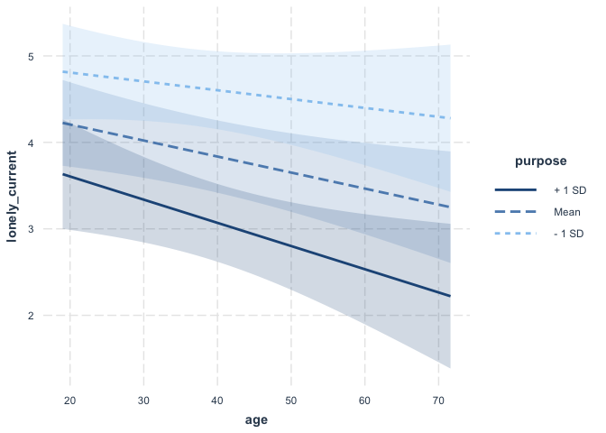
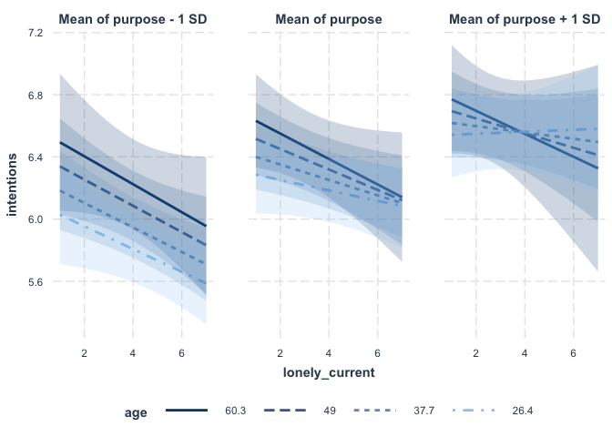

Manuscript Analyses
================
2021-05-18

# load packages

``` r
library("lme4")
library("lmerTest")
library("ggplot2")
library("Rcpp")
library("lm.beta")
library("psych")
library('knitr')
library('tidyverse')
#library(ggsci)
#library(jtools)
library(interactions)
#library(gridExtra)
library(dplyr)
library(tidyr)
library(corrplot)
```

# load data

``` r
df <- read.csv('../data/data_clean_wide.csv', stringsAsFactors = FALSE)
```

# clean data

``` r
#calculate purpose average scores

df$purpose_2r <- ifelse(df$purpose_2 == 6,1,
                           ifelse(df$purpose_2 == 5,2,
                                  ifelse(df$purpose_2 == 4,3,
                                         ifelse(df$purpose_2 == 3,4,
                                                ifelse(df$purpose_2 == 2, 5,
                                                       ifelse(df$purpose_2 == 1,6,
                                                              NA))))))


df$purpose_4r <- ifelse(df$purpose_4 == 6,1,
                        ifelse(df$purpose_4 == 5,2,
                               ifelse(df$purpose_4 == 4,3,
                                      ifelse(df$purpose_4 == 3,4,
                                             ifelse(df$purpose_4 == 2, 5,
                                                    ifelse(df$purpose_4 == 1,6,
                                                           NA))))))

df$purpose_5r <- ifelse(df$purpose_5 == 6,1,
                        ifelse(df$purpose_5 == 5,2,
                               ifelse(df$purpose_5 == 4,3,
                                      ifelse(df$purpose_5 == 3,4,
                                             ifelse(df$purpose_5 == 2, 5,
                                                    ifelse(df$purpose_5 == 1,6,
                                                           NA))))))
df$purpose_6r <- ifelse(df$purpose_6 == 6,1,
                        ifelse(df$purpose_6 == 5,2,
                               ifelse(df$purpose_6 == 4,3,
                                      ifelse(df$purpose_6 == 3,4,
                                             ifelse(df$purpose_6 == 2, 5,
                                                    ifelse(df$purpose_6 == 1,6,
                                                           NA))))))

  

df$purpose = rowMeans(df[,c("purpose_1",  "purpose_2r", "purpose_3" , "purpose_4r",
                 "purpose_5r", "purpose_6r", "purpose_7")])


#calculate intention average scores

#all intention items (1-10)

df$intentions1_7r <- ifelse(df$intentions1_7 == 7,1,
                            ifelse(df$intentions1_7 == 6,2,
                                   ifelse(df$intentions1_7 == 5,3,
                                          ifelse(df$intentions1_7 == 4,4,
                                                 ifelse(df$intentions1_7 == 3, 5,
                                                        ifelse(df$intentions1_7 == 2,6,
                                                               ifelse(df$intentions1_7 == 1,7,
                                                                      NA)))))))
df$intentions1_8r <- ifelse(df$intentions1_8 == 7,1,
                            ifelse(df$intentions1_8 == 6,2,
                                   ifelse(df$intentions1_8 == 5,3,
                                          ifelse(df$intentions1_8 == 4,4,
                                                 ifelse(df$intentions1_8 == 3, 5,
                                                        ifelse(df$intentions1_8 == 2,6,
                                                               ifelse(df$intentions1_8 == 1,7,
                                                                      NA)))))))
df$intentions1_9r <- ifelse(df$intentions1_9 == 7,1,
                            ifelse(df$intentions1_9 == 6,2,
                                   ifelse(df$intentions1_9 == 5,3,
                                          ifelse(df$intentions1_9 == 4,4,
                                                 ifelse(df$intentions1_9 == 3, 5,
                                                        ifelse(df$intentions1_9 == 2,6,
                                                               ifelse(df$intentions1_9 == 1,7,
                                                                      NA)))))))


df$intentions = rowMeans(df[,c("intentions1_1" , "intentions1_2" , "intentions1_3" , "intentions1_4" , 
                               "intentions1_5" , "intentions1_6" , "intentions1_7r" ,  "intentions1_8r" ,  
                               "intentions1_9r" , "intentions1_10")])


#intention, social distancing items only: 2, 4, 6, 10
df$intentions_sd = rowMeans(df[,c("intentions1_2","intentions1_4", "intentions1_6", "intentions1_10")])

#intention hand washing items: 1, 7r, 8r, 9r
df$intentions_hand = rowMeans(df[,c("intentions1_1","intentions1_7r", "intentions1_8r", "intentions1_9r")])

#intention staying home items: 3, 5
df$intentions_home = rowMeans(df[,c("intentions1_3", "intentions1_5")])


# norms

## norms_close all (1-10)

df$norms_close1_7r <- 100-df$norms_close1_7
df$norms_close1_8r <- 100-df$norms_close1_8
df$norms_close1_9r <- 100-df$norms_close1_9

df$norms_close = rowMeans(df[,c("norms_close1_1", "norms_close1_2", "norms_close1_3", "norms_close1_4", 
"norms_close1_5", "norms_close1_6", "norms_close1_7r", "norms_close1_8r",
"norms_close1_9r", "norms_close1_10")])


# norms_close social distancing only (2 4 6 10)
df$norms_close_sd = rowMeans(df[,c("norms_close1_2", "norms_close1_4", "norms_close1_6", "norms_close1_10")])

#norms_close hand washing items: 1, 7r, 8r, 9r
df$norms_close_hand = rowMeans(df[,c("norms_close1_1","norms_close1_7r", "norms_close1_8r", "norms_close1_9r")])

#norms_close staying home items: 3, 5
df$norms_close_home = rowMeans(df[,c("norms_close1_3", "norms_close1_5")])


#belief
## belief_norms (1, 2, 3 (took out 4 in the purpose prereg))
df$beliefs_norms_1r <- ifelse(df$beliefs_norms_1 == 7,1,
                              ifelse(df$beliefs_norms_1 == 6,2,
                                     ifelse(df$beliefs_norms_1 == 5,3,
                                            ifelse(df$beliefs_norms_1 == 4,4,
                                                   ifelse(df$beliefs_norms_1 == 3, 5,
                                                          ifelse(df$beliefs_norms_1 == 2,6,
                                                                 ifelse(df$beliefs_norms_1 == 1,7,
                                                                        NA)))))))


df$beliefs_norms = rowMeans(df[,c("beliefs_norms_1r","beliefs_norms_2","beliefs_norms_3")])
df$beliefs_safe_self = rowMeans(df[,c("beliefs_safe_self_1","beliefs_safe_self_2", "beliefs_safe_self_3", 
                                      "beliefs_safe_self_4", "beliefs_safe_self_5")])
df$beliefs_safe_others = rowMeans(df[,c( "beliefs_safe_others_1","beliefs_safe_others_2", "beliefs_safe_others_3",
                                       "beliefs_safe_others_4", "beliefs_safe_others_5", "beliefs_safe_others_6",
                                       "beliefs_safe_others_7", "beliefs_safe_others_8")])

#clean up the subjective SES scale
df <- within(df, {
  ses_subj <- ifelse(ses_subj_1 == "On", 1,
                     ifelse(ses_subj_2 == "On", 2,
                            ifelse(ses_subj_3 == "On", 3,
                                   ifelse(ses_subj_4 == "On", 4, 
                                          ifelse(ses_subj_5 == "On", 5,
                                                 ifelse(ses_subj_6 == "On", 6, 
                                                        ifelse(ses_subj_7 == "On", 7,
                                                               ifelse(ses_subj_8 == "On", 8, 
                                                                      ifelse(ses_subj_9 == "On", 9,
                                                                             ifelse(ses_subj_10 == "On", 10, NA))))))))))
})


#calculate the relevant data subset
df_raw <- df
df =subset(df,lonely_current!='NA')
df =subset(df,purpose!='NA')
df =subset(df,intentions !='NA')


#winsorize the following variables with outliers +/- 3SD from mean
table(scale(df$purpose))
```

    ## 
    ##      -3.028053278577    -2.59650769049716    -2.30881063177726 
    ##                    1                    1                    1 
    ##    -2.16496210241732    -2.02111357305737    -1.87726504369742 
    ##                    1                    4                    4 
    ##    -1.73341651433747    -1.58956798497753    -1.44571945561758 
    ##                    6                    6                   10 
    ##    -1.30187092625763    -1.15802239689768    -1.01417386753774 
    ##                   15                   28                   33 
    ##   -0.870325338177788    -0.72647680881784   -0.582628279457892 
    ##                   44                   20                   16 
    ##   -0.438779750097944   -0.294931220737997   -0.151082691378049 
    ##                   20                   15                   14 
    ## -0.00723416201810169    0.136614367341846    0.280462896701793 
    ##                   18                   24                   27 
    ##    0.424311426061741    0.568159955421689    0.712008484781637 
    ##                   23                   20                   30 
    ##    0.855857014141585    0.999705543501532     1.14355407286148 
    ##                   29                   22                   19 
    ##     1.28740260222143     1.43125113158137     1.57509966094132 
    ##                   17                   13                    8 
    ##     1.71894819030127 
    ##                   28

``` r
table(scale(df$intentions))
```

    ## 
    ##   -3.73697564910772   -3.29016334323614   -3.17846026676825   -2.84335103736457 
    ##                   1                   1                   2                   1 
    ##   -2.73164796089667   -2.61994488442878   -2.50824180796089   -2.39653873149299 
    ##                   1                   2                   5                   6 
    ##    -2.2848356550251    -2.1731325785572   -2.06142950208931   -1.94972642562142 
    ##                   2                   5                   2                   4 
    ##   -1.83802334915352   -1.72632027268563   -1.61461719621774   -1.50291411974984 
    ##                   5                   8                   7                   7 
    ##   -1.39121104328195   -1.27950796681405   -1.16780489034616   -1.05610181387827 
    ##                   9                  12                   6                  12 
    ##  -0.944398737410374   -0.83269566094248  -0.720992584474587  -0.609289508006693 
    ##                   5                   4                   8                  11 
    ##  -0.497586431538799  -0.385883355070906  -0.274180278603011  -0.162477202135118 
    ##                   6                  19                  11                  11 
    ## -0.0507741256672249  0.0609289508006694   0.172632027268563   0.284335103736457 
    ##                  22                  22                  20                  32 
    ##    0.39603818020435   0.507741256672244   0.619444333140138   0.731147409608031 
    ##                  23                  19                  34                  24 
    ##   0.842850486075925   0.954553562543819 
    ##                  44                 104

``` r
table(scale(df$intentions_sd))
```

    ## 
    ##  -5.67915335266152   -5.4138011354608  -4.08704004945718  -3.55633561505573 
    ##                  3                  1                  1                  1 
    ##  -3.29098339785501  -3.02563118065428  -2.76027896345356  -2.49492674625284 
    ##                  2                  1                  6                  3 
    ##  -2.22957452905211  -1.96422231185139  -1.69887009465067  -1.43351787744994 
    ##                  5                  6                 12                 10 
    ##  -1.16816566024922 -0.902813443048497 -0.637461225847773 -0.372109008647049 
    ##                 16                 16                 16                 37 
    ## -0.106756791446326  0.158595425754398  0.423947642955121  0.689299860155845 
    ##                 50                 51                 65                215

``` r
table(scale(df$intentions_hand)) 
```

    ## 
    ##   -3.29218032067763   -2.72708828024259   -2.53872426676424    -2.3503602532859 
    ##                   1                   1                   9                  13 
    ##   -2.16199623980755   -1.97363222632921   -1.78526821285086   -1.59690419937251 
    ##                  14                  10                  12                   6 
    ##   -1.40854018589417   -1.22017617241582   -1.03181215893748  -0.843448145459131 
    ##                  10                   4                  12                   8 
    ##  -0.655084131980785  -0.466720118502439  -0.278356105024093 -0.0899920915457474 
    ##                  14                  15                  36                  23 
    ##  0.0983719219325985   0.286735935410944    0.47509994888929   0.663463962367636 
    ##                  32                  48                  31                  56 
    ##   0.851827975845982 
    ##                 162

``` r
table(scale(df$intentions_home)) 
```

    ## 
    ##  -4.54564892345137  -4.11577870332619  -3.68590848320101  -3.25603826307583 
    ##                  2                  1                  2                  3 
    ##  -2.82616804295065  -2.39629782282547  -1.96642760270029  -1.53655738257511 
    ##                  1                  7                 40                 17 
    ##  -1.10668716244993 -0.676816942324751 -0.246946722199571  0.182923497925608 
    ##                 20                 22                 37                 53 
    ##  0.612793718050787 
    ##                312

``` r
table(scale(df$norms_close)) 
```

    ## 
    ##    -3.46784116846259    -2.59353015142606    -2.53107936449487 
    ##                    1                    1                    1 
    ##    -2.49985397102928    -2.46862857756369    -2.37495239716692 
    ##                    1                    1                    1 
    ##    -2.31250161023574    -2.28127621677015    -2.25005082330456 
    ##                    1                    1                    1 
    ##    -2.21882542983897    -2.15637464290779     -2.1251492494422 
    ##                    1                    1                    1 
    ##    -2.09392385597661    -2.03147306904543    -2.00024767557983 
    ##                    1                    1                    1 
    ##    -1.96902228211424    -1.93779688864865    -1.90657149518306 
    ##                    2                    1                    1 
    ##    -1.87534610171747    -1.84412070825188    -1.81289531478629 
    ##                    2                    2                    2 
    ##     -1.7816699213207    -1.75044452785511    -1.71921913438952 
    ##                    5                    2                    1 
    ##    -1.68799374092393    -1.65676834745834    -1.62554295399275 
    ##                    3                    1                    7 
    ##    -1.59431756052716    -1.56309216706157    -1.50064138013039 
    ##                    1                    1                    1 
    ##    -1.46941598666479     -1.4381905931992    -1.40696519973361 
    ##                    2                    2                    1 
    ##    -1.37573980626802    -1.34451441280243    -1.31328901933684 
    ##                    2                    3                    4 
    ##    -1.28206362587125    -1.25083823240566    -1.21961283894007 
    ##                    4                    2                    4 
    ##    -1.18838744547448    -1.15716205200889     -1.1259366585433 
    ##                    6                    4                    2 
    ##    -1.09471126507771    -1.06348587161212    -1.03226047814653 
    ##                    4                    5                    1 
    ##    -1.00103508468094   -0.969809691215346   -0.938584297749755 
    ##                    1                    1                    3 
    ##   -0.907358904284165   -0.876133510818574   -0.844908117352983 
    ##                    2                    6                    6 
    ##   -0.813682723887393   -0.782457330421802   -0.751231936956212 
    ##                    5                    2                    2 
    ##   -0.720006543490621   -0.688781150025031    -0.65755575655944 
    ##                    6                    4                    2 
    ##   -0.626330363093849   -0.595104969628259   -0.563879576162668 
    ##                    8                    8                    2 
    ##   -0.532654182697078   -0.501428789231487   -0.470203395765897 
    ##                    5                    7                    8 
    ##   -0.438978002300306   -0.407752608834716   -0.376527215369125 
    ##                    2                    5                    5 
    ##   -0.345301821903534   -0.314076428437944   -0.282851034972353 
    ##                    1                    6                    1 
    ##   -0.251625641506763   -0.220400248041172   -0.189174854575582 
    ##                    5                    4                    3 
    ##   -0.157949461109991   -0.126724067644401  -0.0954986741788099 
    ##                    4                    7                    3 
    ##  -0.0642732807132194  -0.0330478872476288 -0.00182249378203824 
    ##                   11                    3                    3 
    ##   0.0294028996835523   0.0606282931491429   0.0918536866147334 
    ##                    4                    6                   11 
    ##    0.123079080080324    0.154304473545915    0.185529867011505 
    ##                    6                    4                    4 
    ##    0.216755260477096    0.247980653942686    0.279206047408277 
    ##                    9                    7                    3 
    ##    0.310431440873867    0.341656834339458    0.372882227805049 
    ##                    6                    5                    5 
    ##    0.404107621270639     0.43533301473623     0.46655840820182 
    ##                    6                    5                    8 
    ##    0.497783801667411    0.529009195133001    0.560234588598592 
    ##                    6                    3                   10 
    ##    0.591459982064182    0.622685375529773    0.653910768995364 
    ##                    7                    5                    4 
    ##    0.685136162460954    0.716361555926545    0.747586949392135 
    ##                    9                    6                    2 
    ##    0.778812342857726    0.810037736323316    0.841263129788907 
    ##                    4                    7                    7 
    ##    0.872488523254498    0.903713916720088    0.934939310185679 
    ##                    8                    5                    2 
    ##    0.966164703651269     0.99739009711686     1.02861549058245 
    ##                    8                    9                    6 
    ##     1.05984088404804     1.09106627751363     1.12229167097922 
    ##                    5                    5                    6 
    ##     1.15351706444481      1.1847424579104     1.21596785137599 
    ##                    4                    3                   10 
    ##     1.24719324484158     1.27841863830717     1.30964403177277 
    ##                    5                    1                    3 
    ##     1.34086942523836     1.37209481870395     1.40332021216954 
    ##                    4                    5                    3 
    ##     1.43454560563513     1.46577099910072     1.49699639256631 
    ##                    3                    5                   21

``` r
table(scale(df$norms_close_sd)) 
```

    ## 
    ##   -3.73687043099912   -3.33387843603219   -3.13238243854873   -2.99805177355976 
    ##                   1                   1                   2                   1 
    ##   -2.79655577607629   -2.72939044358181   -2.66222511108732   -2.52789444609835 
    ##                   2                   2                   1                   1 
    ##   -2.46072911360386   -2.32639844861488    -2.2592331161204   -2.19206778362591 
    ##                   2                   3                   2                   3 
    ##   -2.12490245113142   -2.05773711863693   -1.99057178614245   -1.92340645364796 
    ##                   1                   1                   1                   5 
    ##   -1.85624112115347   -1.78907578865898    -1.7219104561645   -1.65474512367001 
    ##                   2                   4                   3                   8 
    ##   -1.58757979117552   -1.52041445868104   -1.45324912618655   -1.38608379369206 
    ##                   4                   3                   5                   2 
    ##   -1.31891846119757   -1.25175312870309    -1.1845877962086   -1.11742246371411 
    ##                   5                   5                   3                   4 
    ##   -1.05025713121962  -0.983091798725137   -0.91592646623065  -0.848761133736162 
    ##                   9                   6                   6                   3 
    ##  -0.781595801241675  -0.714430468747188    -0.6472651362527  -0.580099803758213 
    ##                   7                   7                   4                  12 
    ##  -0.512934471263725  -0.445769138769238  -0.378603806274751  -0.311438473780264 
    ##                   7                  13                   9                   7 
    ##  -0.244273141285776  -0.177107808791289  -0.109942476296802 -0.0427771438023142 
    ##                   9                   8                  12                  14 
    ##  0.0243881886921731  0.0915535211866605   0.158718853681148   0.225884186175635 
    ##                  10                  18                   9                  12 
    ##   0.293049518670122    0.36021485116461   0.427380183659097   0.494545516153584 
    ##                  15                  10                  17                  21 
    ##   0.561710848648072   0.628876181142559   0.696041513637046   0.763206846131534 
    ##                  18                  19                  21                  17 
    ##   0.830372178626021   0.897537511120509   0.964702843614996    1.03186817610948 
    ##                  21                  17                   9                   8 
    ##    1.09903350860397    1.16619884109846    1.23336417359295 
    ##                  12                  10                  41

``` r
table(scale(df$norms_close_home)) 
```

    ## 
    ##   -3.78695025107116    -3.4122088088176   -3.28729499473307   -3.16238118064855 
    ##                   1                   2                   1                   1 
    ##   -2.91255355247951   -2.78763973839498   -2.66272592431046   -2.53781211022594 
    ##                   1                   1                   1                   3 
    ##   -2.41289829614142   -2.28798448205689   -2.16307066797237   -1.91324303980333 
    ##                   1                   4                   3                   5 
    ##    -1.7883292257188   -1.66341541163428   -1.53850159754976   -1.41358778346524 
    ##                   7                   9                   4                  19 
    ##   -1.28867396938071   -1.16376015529619   -1.03884634121167  -0.913932527127147 
    ##                   7                  14                  11                   8 
    ##  -0.789018713042624  -0.664104898958102  -0.539191084873579  -0.414277270789057 
    ##                  12                  20                  13                  17 
    ##  -0.289363456704534  -0.164449642620012 -0.0395358285354893  0.0853779855490332 
    ##                  16                  27                  22                  13 
    ##   0.210291799633556   0.335205613718078   0.460119427802601   0.585033241887123 
    ##                  15                  22                  15                  43 
    ##   0.709947055971646   0.834860870056168   0.959774684140691    1.08468849822521 
    ##                  33                  29                  33                  82

``` r
table(scale(df$beliefs_safe_self)) 
```

    ## 
    ##   -3.76466292875148   -3.54651332841921   -3.32836372808694   -3.11021412775467 
    ##                   3                   1                   5                   4 
    ##    -2.8920645274224   -2.67391492709013   -2.45576532675786   -2.23761572642559 
    ##                   2                   4                   3                   4 
    ##   -2.01946612609332   -1.80131652576105   -1.58316692542878   -1.36501732509651 
    ##                   5                   4                   9                  13 
    ##   -1.14686772476424  -0.928718124431967  -0.710568524099698  -0.492418923767427 
    ##                  13                  18                  22                  26 
    ##  -0.274269323435156 -0.0561197231028857   0.162029877229385   0.380179477561655 
    ##                  49                  29                  31                  42 
    ##   0.598329077893925   0.816478678226196 
    ##                  35                 195

``` r
table(scale(df$beliefs_safe_others)) 
```

    ## 
    ##     -4.795301635458   -4.56430504141823    -4.1023118533387   -3.52482036823929 
    ##                   2                   1                   2                   1 
    ##   -3.29382377419952   -3.17832547717964   -3.06282718015976   -2.83183058611999 
    ##                   1                   2                   2                   1 
    ##   -2.71633228910011   -2.60083399208022   -2.48533569506034   -2.36983739804046 
    ##                   1                   1                   2                   2 
    ##   -2.13884080400069   -2.02334250698081   -1.90784420996093   -1.79234591294104 
    ##                   3                   7                   4                   2 
    ##   -1.67684761592116   -1.56134931890128    -1.4458510218814   -1.33035272486151 
    ##                   3                   5                  11                   7 
    ##   -1.21485442784163   -1.09935613082175  -0.983857833801865  -0.868359536781982 
    ##                   5                  11                   8                   9 
    ##  -0.752861239762099  -0.637362942742216  -0.521864645722333   -0.40636634870245 
    ##                   8                  12                  10                  15 
    ##  -0.290868051682567  -0.175369754662685 -0.0598714576428017  0.0556268393770812 
    ##                  11                  29                  13                  19 
    ##   0.171125136396964   0.286623433416847    0.40212173043673   0.517620027456613 
    ##                  20                  25                  13                  16 
    ##   0.633118324476496   0.748616621496378 
    ##                  20                 213

``` r
table(scale(df$house_size_curre))
```

    ## 
    ##  -0.969806983860697  -0.481598404838321 0.00661017418405537   0.494818753206432 
    ##                  90                 131                 135                 100 
    ##   0.983027332228808    1.47123591125118    1.95944449027356    2.44765306929594 
    ##                  38                   8                   8                   4 
    ##    3.42407022734069    8.30615601756445    13.6764503868106 
    ##                   1                   1                   1

``` r
table(scale(df$age))
```

    ## 
    ##   -1.65565932289695   -1.56716807199881   -1.47867682110067   -1.39018557020253 
    ##                   2                   3                   6                  11 
    ##   -1.30169431930439   -1.21320306840625    -1.1247118175081   -1.03622056660996 
    ##                  10                  12                  17                  14 
    ##   -0.94772931571182  -0.859238064813678  -0.770746813915537  -0.682255563017395 
    ##                  17                  19                  11                  30 
    ##  -0.593764312119253  -0.505273061221111   -0.41678181032297  -0.328290559424828 
    ##                  25                  28                  16                  22 
    ##  -0.239799308526686  -0.151308057628544 -0.0628168067304026  0.0256744441677392 
    ##                  22                  20                  21                  10 
    ##   0.114165695065881   0.202656945964023   0.291148196862164   0.379639447760306 
    ##                  17                  15                   9                  12 
    ##   0.468130698658448    0.55662194955659   0.645113200454732   0.733604451352873 
    ##                  14                  11                   7                   9 
    ##   0.822095702251015   0.910586953149157   0.999078204047299    1.08756945494544 
    ##                   4                   9                   9                   6 
    ##    1.17606070584358    1.26455195674172    1.35304320763987    1.44153445853801 
    ##                   4                   6                   5                   8 
    ##    1.53002570943615    1.61851696033429    1.70700821123243    1.79549946213057 
    ##                   7                   9                   4                   7 
    ##    1.88399071302872    1.97248196392686      2.060973214825    2.14946446572314 
    ##                   2                   3                   3                   2 
    ##    2.23795571662128    2.32644696751943    2.41493821841757    2.50342946931571 
    ##                   1                   2                   4                   3 
    ##    2.59192072021385    2.68041197111199    2.76890322201013    2.85739447290828 
    ##                   3                   3                   1                   1 
    ##     3.1228682256027 
    ##                   1

``` r
table(scale(df$norms_close_hand )) #no outlier 
```

    ## 
    ##    -2.54502820609454    -2.48457511223934    -2.42412201838415 
    ##                    1                    1                    1 
    ##    -2.36366892452895    -2.30321583067376    -2.24276273681856 
    ##                    2                    4                    2 
    ##    -2.18230964296336    -2.12185654910817    -2.00095036139777 
    ##                    4                    2                    5 
    ##    -1.94049726754258    -1.88004417368738    -1.81959107983218 
    ##                    4                    4                    4 
    ##    -1.75913798597699    -1.69868489212179     -1.6382317982666 
    ##                    1                    4                    3 
    ##     -1.5777787044114     -1.5173256105562    -1.45687251670101 
    ##                    5                    3                    4 
    ##    -1.39641942284581    -1.33596632899061    -1.27551323513542 
    ##                    7                    5                    5 
    ##    -1.21506014128022    -1.15460704742502    -1.09415395356983 
    ##                    5                   10                    7 
    ##    -1.03370085971463   -0.973247765859436   -0.912794672004239 
    ##                    6                    4                    7 
    ##   -0.852341578149043   -0.791888484293847    -0.73143539043865 
    ##                    9                    5                    1 
    ##   -0.670982296583454   -0.610529202728257   -0.550076108873061 
    ##                    8                   11                   11 
    ##   -0.489623015017865   -0.429169921162668   -0.368716827307472 
    ##                    4                    9                    8 
    ##   -0.308263733452276   -0.247810639597079   -0.187357545741883 
    ##                    6                    7                    9 
    ##   -0.126904451886687  -0.0664513580314901 -0.00599826417629376 
    ##                    9                   16                   13 
    ##   0.0544548296789026    0.114907923534099    0.175361017389295 
    ##                   12                   12                    8 
    ##    0.235814111244492    0.296267205099688    0.356720298954884 
    ##                    9                    6                   10 
    ##    0.417173392810081    0.477626486665277    0.538079580520474 
    ##                   14                   12                   10 
    ##     0.59853267437567    0.658985768230866    0.719438862086063 
    ##                    7                   17                   15 
    ##    0.779891955941259    0.840345049796455    0.900798143651652 
    ##                    6                   11                   13 
    ##    0.961251237506848     1.02170433136204     1.08215742521724 
    ##                    8                   20                   12 
    ##     1.14261051907244     1.20306361292763     1.26351670678283 
    ##                   13                   11                   52

``` r
table(scale(df$beliefs_norms )) #no outlier 
```

    ## 
    ##  -2.92546389793618  -2.62578788540735  -2.32611187287852  -2.02643586034969 
    ##                  3                  2                  6                 14 
    ##  -1.72675984782086  -1.42708383529203   -1.1274078227632  -0.82773181023437 
    ##                 13                 36                 26                 49 
    ##  -0.52805579770554 -0.228379785176709 0.0712962273521204   0.37097223988095 
    ##                 29                 34                 44                 37 
    ##  0.670648252409781   0.97032426493861 
    ##                 37                187

``` r
table(scale(df$lonely_current)) #no outliers
```

    ## 
    ##  -1.20503098368802 -0.714479000564628 -0.223927017441238  0.266624965682152 
    ##                143                 66                 48                 77 
    ##  0.757176948805542   1.24772893192893   1.73828091505232 
    ##                 78                 65                 40

``` r
table(scale(df$lonely_prior))#no outliers
```

    ## 
    ## -0.917138503367216  -0.38196851889673  0.153201465573756  0.688371450044242 
    ##                211                 79                 60                 58 
    ##   1.22354143451473   1.75871141898521    2.2938814034557 
    ##                 53                 35                 21

``` r
table(scale(df$ses_subj))#no outliers
```

    ## 
    ##  -2.15611041843721  -1.64424420481342  -1.13237799118962 -0.620511777565827 
    ##                  4                 33                 66                 71 
    ## -0.108645563942031  0.403220649681764   0.91508686330556   1.42695307692936 
    ##                 69                 94                 72                 25 
    ##   1.93881929055315   2.45068550417695 
    ##                 13                 10

``` r
#replace outliers with +/- 3SD from mean
df=df %>%
mutate(mean = mean(purpose, na.rm = TRUE),
       sd3 = 3*sd(purpose, na.rm = TRUE),
       purpose = ifelse(purpose > mean + sd3, mean + sd3, purpose), # above --> mean - 3 * SD
       purpose = ifelse(purpose < mean - sd3, mean - sd3, purpose))%>% # below --> mean - 3 * SD

mutate(mean = mean(intentions, na.rm = TRUE),
       sd3 = 3*sd(intentions, na.rm = TRUE),
       intentions = ifelse(intentions > mean + sd3, mean + sd3, intentions), # above --> mean - 3 * SD
       intentions = ifelse(intentions < mean - sd3, mean - sd3, intentions))%>% # below --> mean - 3 * SD
  mutate(mean = mean(intentions_sd, na.rm = TRUE),
         sd3 = 3*sd(intentions_sd, na.rm = TRUE),
         intentions_sd = ifelse(intentions_sd > mean + sd3, mean + sd3, intentions_sd), # above --> mean - 3 * SD
         intentions_sd = ifelse(intentions_sd < mean - sd3, mean - sd3, intentions_sd))%>% # below --> mean - 3 * SD
  mutate(mean = mean(intentions_hand, na.rm = TRUE),
         sd3 = 3*sd(intentions_hand, na.rm = TRUE),
         intentions_hand = ifelse(intentions_hand > mean + sd3, mean + sd3, intentions_hand), # above --> mean - 3 * SD
         intentions_hand = ifelse(intentions_hand < mean - sd3, mean - sd3, intentions_hand))%>%
  mutate(mean = mean(intentions_home, na.rm = TRUE),
         sd3 = 3*sd(intentions_home, na.rm = TRUE),
         intentions_home = ifelse(intentions_home > mean + sd3, mean + sd3, intentions_home), # above --> mean - 3 * SD
         intentions_home = ifelse(intentions_home < mean - sd3, mean - sd3, intentions_home))%>%
  mutate(mean = mean(norms_close, na.rm = TRUE),
         sd3 = 3*sd(norms_close, na.rm = TRUE),
         norms_close = ifelse(norms_close > mean + sd3, mean + sd3, norms_close), # above --> mean - 3 * SD
         norms_close = ifelse(norms_close < mean - sd3, mean - sd3, norms_close))%>%
  mutate(mean = mean(norms_close_sd, na.rm = TRUE),
         sd3 = 3*sd(norms_close_sd, na.rm = TRUE),
         norms_close_sd = ifelse(norms_close_sd > mean + sd3, mean + sd3, norms_close_sd), # above --> mean - 3 * SD
         norms_close_sd = ifelse(norms_close_sd < mean - sd3, mean - sd3, norms_close_sd))%>%
  mutate(mean = mean(norms_close_home, na.rm = TRUE),
         sd3 = 3*sd(norms_close_home, na.rm = TRUE),
         norms_close_home = ifelse(norms_close_home > mean + sd3, mean + sd3, norms_close_home), # above --> mean - 3 * SD
         norms_close_home = ifelse(norms_close_home < mean - sd3, mean - sd3, norms_close_home))%>%
  mutate(mean = mean(beliefs_safe_self, na.rm = TRUE),
         sd3 = 3*sd(beliefs_safe_self, na.rm = TRUE),
         beliefs_safe_self = ifelse(beliefs_safe_self > mean + sd3, mean + sd3, beliefs_safe_self), # above --> mean - 3 * SD
         beliefs_safe_self = ifelse(beliefs_safe_self < mean - sd3, mean - sd3, beliefs_safe_self))%>%
  mutate(mean = mean(beliefs_safe_others, na.rm = TRUE),
         sd3 = 3*sd(beliefs_safe_others, na.rm = TRUE),
         beliefs_safe_others = ifelse(beliefs_safe_others > mean + sd3, mean + sd3, beliefs_safe_others), # above --> mean - 3 * SD
         beliefs_safe_others = ifelse(beliefs_safe_others < mean - sd3, mean - sd3, beliefs_safe_others))%>%
  mutate(mean = mean(house_size_curre, na.rm = TRUE),
         sd3 = 3*sd(house_size_curre, na.rm = TRUE),
         house_size_curre = ifelse(house_size_curre > mean + sd3, mean + sd3, house_size_curre), # above --> mean - 3 * SD
         house_size_curre = ifelse(house_size_curre < mean - sd3, mean - sd3, house_size_curre))%>%
  mutate(mean = mean(age, na.rm = TRUE),
         sd3 = 3*sd(age, na.rm = TRUE),
         age = ifelse(age > mean + sd3, mean + sd3, age), # above --> mean - 3 * SD
         age = ifelse(age < mean - sd3, mean - sd3, age))
```

# demographics

``` r
summary(df$age)
```

    ##    Min. 1st Qu.  Median    Mean 3rd Qu.    Max. 
    ##   19.00   30.00   35.00   37.71   44.00   71.61

``` r
sd(df$age)
```

    ## [1] 11.29231

``` r
table (df$gender)
```

    ## 
    ##   1   2   3   4 
    ## 282 232   2   1

``` r
table (df$race)
```

    ## 
    ##   1   2   3   4   5   6 
    ## 362  92  39   7   1  16

``` r
#The current and pre-pandemic levels of loneliness were highly correlated
cor.test(df$lonely_current, df$lonely_prior)
```

    ## 
    ##  Pearson's product-moment correlation
    ## 
    ## data:  df$lonely_current and df$lonely_prior
    ## t = 23.802, df = 515, p-value < 0.00000000000000022
    ## alternative hypothesis: true correlation is not equal to 0
    ## 95 percent confidence interval:
    ##  0.6799688 0.7624147
    ## sample estimates:
    ##       cor 
    ## 0.7237647

``` r
# crombach's alpha
df_purpose <- df_raw[ , c("purpose_1", "purpose_2r", "purpose_3", "purpose_4r", "purpose_5r", "purpose_6r", "purpose_7")]    
alpha(df_purpose)
```

    ## 
    ## Reliability analysis   
    ## Call: alpha(x = df_purpose)
    ## 
    ##   raw_alpha std.alpha G6(smc) average_r S/N    ase mean   sd median_r
    ##       0.81      0.81    0.85      0.38 4.4 0.0098  4.3 0.99     0.39
    ## 
    ##  lower alpha upper     95% confidence boundaries
    ## 0.79 0.81 0.83 
    ## 
    ##  Reliability if an item is dropped:
    ##            raw_alpha std.alpha G6(smc) average_r S/N alpha se var.r med.r
    ## purpose_1       0.79      0.79    0.81      0.38 3.7   0.0108 0.038  0.45
    ## purpose_2r      0.76      0.77    0.81      0.36 3.4   0.0126 0.043  0.39
    ## purpose_3       0.80      0.80    0.83      0.39 3.9   0.0104 0.033  0.45
    ## purpose_4r      0.75      0.76    0.79      0.34 3.1   0.0136 0.040  0.35
    ## purpose_5r      0.81      0.82    0.84      0.43 4.5   0.0098 0.024  0.39
    ## purpose_6r      0.79      0.79    0.82      0.39 3.9   0.0112 0.041  0.39
    ## purpose_7       0.79      0.79    0.81      0.39 3.8   0.0105 0.030  0.39
    ## 
    ##  Item statistics 
    ##              n raw.r std.r r.cor r.drop mean  sd
    ## purpose_1  517  0.65  0.70  0.65   0.54  4.6 1.2
    ## purpose_2r 517  0.78  0.76  0.71   0.66  4.0 1.5
    ## purpose_3  517  0.60  0.65  0.59   0.47  4.6 1.2
    ## purpose_4r 517  0.84  0.82  0.80   0.74  4.1 1.7
    ## purpose_5r 517  0.60  0.55  0.46   0.41  4.4 1.6
    ## purpose_6r 517  0.69  0.66  0.60   0.54  4.0 1.6
    ## purpose_7  517  0.63  0.67  0.63   0.50  4.4 1.3
    ## 
    ## Non missing response frequency for each item
    ##               1    2    3    4    5    6 miss
    ## purpose_1  0.01 0.05 0.09 0.23 0.36 0.25  0.4
    ## purpose_2r 0.04 0.17 0.18 0.15 0.25 0.22  0.4
    ## purpose_3  0.01 0.05 0.11 0.25 0.36 0.22  0.4
    ## purpose_4r 0.08 0.15 0.15 0.12 0.23 0.26  0.4
    ## purpose_5r 0.06 0.12 0.14 0.11 0.23 0.35  0.4
    ## purpose_6r 0.08 0.13 0.17 0.18 0.24 0.20  0.4
    ## purpose_7  0.04 0.07 0.10 0.22 0.33 0.23  0.4

``` r
df_intention <- df_raw[ , c("intentions1_1" , "intentions1_2" , "intentions1_3" , "intentions1_4" , 
                               "intentions1_5" , "intentions1_6" , "intentions1_7r" ,  "intentions1_8r" ,  
                               "intentions1_9r" , "intentions1_10")]    
alpha(df_intention)
```

    ## 
    ## Reliability analysis   
    ## Call: alpha(x = df_intention)
    ## 
    ##   raw_alpha std.alpha G6(smc) average_r S/N   ase mean   sd median_r
    ##       0.82      0.84    0.86      0.35 5.4 0.009  6.2 0.88     0.32
    ## 
    ##  lower alpha upper     95% confidence boundaries
    ## 0.8 0.82 0.84 
    ## 
    ##  Reliability if an item is dropped:
    ##                raw_alpha std.alpha G6(smc) average_r S/N alpha se var.r med.r
    ## intentions1_1       0.80      0.83    0.85      0.35 4.8   0.0098 0.022  0.29
    ## intentions1_2       0.80      0.82    0.84      0.34 4.7   0.0100 0.020  0.31
    ## intentions1_3       0.81      0.84    0.85      0.36 5.1   0.0096 0.022  0.32
    ## intentions1_4       0.80      0.83    0.85      0.35 4.9   0.0098 0.020  0.32
    ## intentions1_5       0.83      0.85    0.86      0.39 5.7   0.0081 0.015  0.34
    ## intentions1_6       0.80      0.82    0.83      0.33 4.5   0.0100 0.018  0.30
    ## intentions1_7r      0.80      0.83    0.85      0.35 5.0   0.0102 0.018  0.32
    ## intentions1_8r      0.80      0.83    0.84      0.35 4.9   0.0102 0.016  0.33
    ## intentions1_9r      0.79      0.82    0.84      0.34 4.7   0.0107 0.017  0.31
    ## intentions1_10      0.80      0.82    0.84      0.34 4.5   0.0101 0.019  0.31
    ## 
    ##  Item statistics 
    ##                  n raw.r std.r r.cor r.drop mean   sd
    ## intentions1_1  865  0.61  0.66  0.60   0.53  6.5 0.99
    ## intentions1_2  865  0.66  0.69  0.66   0.56  6.2 1.28
    ## intentions1_3  865  0.54  0.59  0.51   0.46  6.7 0.97
    ## intentions1_4  865  0.61  0.65  0.60   0.51  6.2 1.28
    ## intentions1_5  865  0.47  0.44  0.34   0.28  6.0 1.80
    ## intentions1_6  865  0.69  0.75  0.73   0.63  6.5 0.96
    ## intentions1_7r 865  0.69  0.62  0.58   0.55  5.3 1.92
    ## intentions1_8r 865  0.69  0.63  0.60   0.56  5.7 1.81
    ## intentions1_9r 865  0.73  0.69  0.67   0.62  6.2 1.71
    ## intentions1_10 865  0.68  0.73  0.71   0.61  6.5 1.01
    ## 
    ## Non missing response frequency for each item
    ##                   1    2    3    4    5    6    7 miss
    ## intentions1_1  0.00 0.01 0.01 0.03 0.07 0.20 0.68    0
    ## intentions1_2  0.02 0.02 0.02 0.04 0.08 0.23 0.59    0
    ## intentions1_3  0.01 0.01 0.02 0.01 0.04 0.08 0.83    0
    ## intentions1_4  0.01 0.02 0.01 0.06 0.09 0.19 0.62    0
    ## intentions1_5  0.07 0.03 0.02 0.04 0.07 0.12 0.66    0
    ## intentions1_6  0.01 0.00 0.01 0.02 0.06 0.23 0.67    0
    ## intentions1_7r 0.05 0.09 0.09 0.09 0.09 0.21 0.38    0
    ## intentions1_8r 0.04 0.06 0.06 0.05 0.06 0.23 0.51    0
    ## intentions1_9r 0.03 0.06 0.04 0.02 0.02 0.09 0.74    0
    ## intentions1_10 0.01 0.01 0.01 0.02 0.06 0.14 0.75    0

# define function to make results table

``` r
make_table = function(model) {
  require(broom)
  require(knitr)
  
  print(data.frame(R2 = summary(model)$r.squared,
             adjusted_R2 = summary(model)$adj.r.squared,
             df = summary(model)$df[2]) %>%
    knitr::kable(format = "pandoc", digits = 2))
    
  print(model %>%
    broom::tidy(conf.int = TRUE) %>%
    mutate(p.value = ifelse(p.value < .001, "< .001", gsub("0.(.*)", ".\\1", sprintf("%.3f", p.value))),
           `95% CI` = sprintf("%.2f, %.2f", conf.low, conf.high),
           term = gsub("as.factor", "", term)) %>%
    select(-contains("conf")) %>%
    rename("b" = estimate,
           "SE" = std.error,
           "t" = statistic,
           "p" = p.value) %>%
    select(term, b, `95% CI`, everything()) %>%
    knitr::kable(format = "pandoc", digits = 2))
}
```

# Purpose in life Predicting Loneliness and COVID-Preventive Intentions

``` r
#H1a. Higher self-reported purpose in life will be associated with less perceived loneliness.

test <- lm(lonely_current ~ purpose+as.factor(condition), data=df)
##summ(test, digits = 3, confint = TRUE)
lm.beta(test)
```

    ## 
    ## Call:
    ## lm(formula = lonely_current ~ purpose + as.factor(condition), 
    ##     data = df)
    ## 
    ## Standardized Coefficients::
    ##                            (Intercept)                                purpose 
    ##                             0.00000000                            -0.37344384 
    ##    as.factor(condition)message control            as.factor(condition)mocking 
    ##                            -0.03283017                            -0.06196151 
    ## as.factor(condition)no message control               as.factor(condition)norm 
    ##                            -0.14561944                            -0.11631820

``` r
summary(test)
```

    ## 
    ## Call:
    ## lm(formula = lonely_current ~ purpose + as.factor(condition), 
    ##     data = df)
    ## 
    ## Residuals:
    ##    Min     1Q Median     3Q    Max 
    ## -4.522 -1.553 -0.017  1.620  4.447 
    ## 
    ## Coefficients:
    ##                                        Estimate Std. Error t value
    ## (Intercept)                             7.15280    0.41345  17.300
    ## purpose                                -0.76668    0.08397  -9.130
    ## as.factor(condition)message control    -0.17264    0.28722  -0.601
    ## as.factor(condition)mocking            -0.34543    0.29694  -1.163
    ## as.factor(condition)no message control -0.62416    0.25460  -2.452
    ## as.factor(condition)norm               -0.64528    0.29660  -2.176
    ##                                                   Pr(>|t|)    
    ## (Intercept)                            <0.0000000000000002 ***
    ## purpose                                <0.0000000000000002 ***
    ## as.factor(condition)message control                 0.5481    
    ## as.factor(condition)mocking                         0.2453    
    ## as.factor(condition)no message control              0.0146 *  
    ## as.factor(condition)norm                            0.0300 *  
    ## ---
    ## Signif. codes:  0 '***' 0.001 '**' 0.01 '*' 0.05 '.' 0.1 ' ' 1
    ## 
    ## Residual standard error: 1.883 on 511 degrees of freedom
    ## Multiple R-squared:  0.1548, Adjusted R-squared:  0.1465 
    ## F-statistic: 18.71 on 5 and 511 DF,  p-value: < 0.00000000000000022

``` r
make_table(test)
```

    ## 
    ## 
    ##    R2   adjusted_R2    df
    ## -----  ------------  ----
    ##  0.15          0.15   511
    ## 
    ## 
    ## term                                 b  95% CI            SE       t  p      
    ## ------------------------------  ------  -------------  -----  ------  -------
    ## (Intercept)                       7.15  6.34, 7.97      0.41   17.30  < .001 
    ## purpose                          -0.77  -0.93, -0.60    0.08   -9.13  < .001 
    ## (condition)message control       -0.17  -0.74, 0.39     0.29   -0.60  .548   
    ## (condition)mocking               -0.35  -0.93, 0.24     0.30   -1.16  .245   
    ## (condition)no message control    -0.62  -1.12, -0.12    0.25   -2.45  .015   
    ## (condition)norm                  -0.65  -1.23, -0.06    0.30   -2.18  .030

``` r
test <- lm(lonely_prior ~ purpose+as.factor(condition), data=df)
##summ(test, digits = 3, confint = TRUE)
lm.beta(test)
```

    ## 
    ## Call:
    ## lm(formula = lonely_prior ~ purpose + as.factor(condition), data = df)
    ## 
    ## Standardized Coefficients::
    ##                            (Intercept)                                purpose 
    ##                             0.00000000                            -0.50041815 
    ##    as.factor(condition)message control            as.factor(condition)mocking 
    ##                            -0.05326567                            -0.04429902 
    ## as.factor(condition)no message control               as.factor(condition)norm 
    ##                            -0.10242154                            -0.06610293

``` r
summary(test)
```

    ## 
    ## Call:
    ## lm(formula = lonely_prior ~ purpose + as.factor(condition), data = df)
    ## 
    ## Residuals:
    ##     Min      1Q  Median      3Q     Max 
    ## -4.3926 -1.0556 -0.3235  1.1292  4.3400 
    ## 
    ## Coefficients:
    ##                                        Estimate Std. Error t value
    ## (Intercept)                             7.03203    0.35535  19.789
    ## purpose                                -0.94171    0.07217 -13.048
    ## as.factor(condition)message control    -0.25675    0.24686  -1.040
    ## as.factor(condition)mocking            -0.22637    0.25521  -0.887
    ## as.factor(condition)no message control -0.40240    0.21883  -1.839
    ## as.factor(condition)norm               -0.33614    0.25493  -1.319
    ##                                                   Pr(>|t|)    
    ## (Intercept)                            <0.0000000000000002 ***
    ## purpose                                <0.0000000000000002 ***
    ## as.factor(condition)message control                 0.2988    
    ## as.factor(condition)mocking                         0.3755    
    ## as.factor(condition)no message control              0.0665 .  
    ## as.factor(condition)norm                            0.1879    
    ## ---
    ## Signif. codes:  0 '***' 0.001 '**' 0.01 '*' 0.05 '.' 0.1 ' ' 1
    ## 
    ## Residual standard error: 1.619 on 511 degrees of freedom
    ## Multiple R-squared:  0.2569, Adjusted R-squared:  0.2496 
    ## F-statistic: 35.33 on 5 and 511 DF,  p-value: < 0.00000000000000022

``` r
make_table(test)
```

    ## 
    ## 
    ##    R2   adjusted_R2    df
    ## -----  ------------  ----
    ##  0.26          0.25   511
    ## 
    ## 
    ## term                                 b  95% CI            SE        t  p      
    ## ------------------------------  ------  -------------  -----  -------  -------
    ## (Intercept)                       7.03  6.33, 7.73      0.36    19.79  < .001 
    ## purpose                          -0.94  -1.08, -0.80    0.07   -13.05  < .001 
    ## (condition)message control       -0.26  -0.74, 0.23     0.25    -1.04  .299   
    ## (condition)mocking               -0.23  -0.73, 0.28     0.26    -0.89  .376   
    ## (condition)no message control    -0.40  -0.83, 0.03     0.22    -1.84  .067   
    ## (condition)norm                  -0.34  -0.84, 0.16     0.25    -1.32  .188

``` r
#H2. Higher self-reported purpose in life will be associated with more positive responses to COVID-19 related measures, including intentions, norms, and beliefs.
test <- lm(intentions~purpose+as.factor(condition), df)
##summ(test, digits = 3, confint = TRUE)
lm.beta(test)
```

    ## 
    ## Call:
    ## lm(formula = intentions ~ purpose + as.factor(condition), data = df)
    ## 
    ## Standardized Coefficients::
    ##                            (Intercept)                                purpose 
    ##                             0.00000000                             0.37468173 
    ##    as.factor(condition)message control            as.factor(condition)mocking 
    ##                            -0.07290048                            -0.05148228 
    ## as.factor(condition)no message control               as.factor(condition)norm 
    ##                            -0.02674378                            -0.00969147

``` r
summary(test)
```

    ## 
    ## Call:
    ## lm(formula = intentions ~ purpose + as.factor(condition), data = df)
    ## 
    ## Residuals:
    ##     Min      1Q  Median      3Q     Max 
    ## -3.1105 -0.4474  0.2195  0.5745  1.5984 
    ## 
    ## Coefficients:
    ##                                        Estimate Std. Error t value
    ## (Intercept)                             4.78177    0.18115  26.397
    ## purpose                                 0.33485    0.03679   9.101
    ## as.factor(condition)message control    -0.16688    0.12584  -1.326
    ## as.factor(condition)mocking            -0.12494    0.13010  -0.960
    ## as.factor(condition)no message control -0.04990    0.11155  -0.447
    ## as.factor(condition)norm               -0.02340    0.12995  -0.180
    ##                                                   Pr(>|t|)    
    ## (Intercept)                            <0.0000000000000002 ***
    ## purpose                                <0.0000000000000002 ***
    ## as.factor(condition)message control                  0.185    
    ## as.factor(condition)mocking                          0.337    
    ## as.factor(condition)no message control               0.655    
    ## as.factor(condition)norm                             0.857    
    ## ---
    ## Signif. codes:  0 '***' 0.001 '**' 0.01 '*' 0.05 '.' 0.1 ' ' 1
    ## 
    ## Residual standard error: 0.8251 on 511 degrees of freedom
    ## Multiple R-squared:  0.1438, Adjusted R-squared:  0.1354 
    ## F-statistic: 17.16 on 5 and 511 DF,  p-value: 0.000000000000001045

``` r
make_table(test)
```

    ## 
    ## 
    ##    R2   adjusted_R2    df
    ## -----  ------------  ----
    ##  0.14          0.14   511
    ## 
    ## 
    ## term                                 b  95% CI           SE       t  p      
    ## ------------------------------  ------  ------------  -----  ------  -------
    ## (Intercept)                       4.78  4.43, 5.14     0.18   26.40  < .001 
    ## purpose                           0.33  0.26, 0.41     0.04    9.10  < .001 
    ## (condition)message control       -0.17  -0.41, 0.08    0.13   -1.33  .185   
    ## (condition)mocking               -0.12  -0.38, 0.13    0.13   -0.96  .337   
    ## (condition)no message control    -0.05  -0.27, 0.17    0.11   -0.45  .655   
    ## (condition)norm                  -0.02  -0.28, 0.23    0.13   -0.18  .857

# Loneliness Predicting COVID Preventive Intentions

``` r
#Exploratory1. We will test whether higher perceived loneliness will be associated with more negative responses to COVID-19 related measures, including intentions, norms, and beliefs

test <- lm(intentions~lonely_current+as.factor(condition), df)
##summ(test, digits = 3, confint = TRUE)
summary(test)
```

    ## 
    ## Call:
    ## lm(formula = intentions ~ lonely_current + as.factor(condition), 
    ##     data = df)
    ## 
    ## Residuals:
    ##     Min      1Q  Median      3Q     Max 
    ## -2.7216 -0.4189  0.2291  0.6183  1.2602 
    ## 
    ## Coefficients:
    ##                                        Estimate Std. Error t value
    ## (Intercept)                             6.62926    0.12148  54.573
    ## lonely_current                         -0.11039    0.01875  -5.888
    ## as.factor(condition)message control    -0.13722    0.13120  -1.046
    ## as.factor(condition)mocking            -0.17736    0.13582  -1.306
    ## as.factor(condition)no message control -0.11673    0.11697  -0.998
    ## as.factor(condition)norm               -0.03925    0.13616  -0.288
    ##                                                    Pr(>|t|)    
    ## (Intercept)                            < 0.0000000000000002 ***
    ## lonely_current                                0.00000000707 ***
    ## as.factor(condition)message control                   0.296    
    ## as.factor(condition)mocking                           0.192    
    ## as.factor(condition)no message control                0.319    
    ## as.factor(condition)norm                              0.773    
    ## ---
    ## Signif. codes:  0 '***' 0.001 '**' 0.01 '*' 0.05 '.' 0.1 ' ' 1
    ## 
    ## Residual standard error: 0.8608 on 511 degrees of freedom
    ## Multiple R-squared:  0.0682, Adjusted R-squared:  0.05908 
    ## F-statistic:  7.48 on 5 and 511 DF,  p-value: 0.0000008666

``` r
make_table(test)
```

    ## 
    ## 
    ##    R2   adjusted_R2    df
    ## -----  ------------  ----
    ##  0.07          0.06   511
    ## 
    ## 
    ## term                                 b  95% CI            SE       t  p      
    ## ------------------------------  ------  -------------  -----  ------  -------
    ## (Intercept)                       6.63  6.39, 6.87      0.12   54.57  < .001 
    ## lonely_current                   -0.11  -0.15, -0.07    0.02   -5.89  < .001 
    ## (condition)message control       -0.14  -0.39, 0.12     0.13   -1.05  .296   
    ## (condition)mocking               -0.18  -0.44, 0.09     0.14   -1.31  .192   
    ## (condition)no message control    -0.12  -0.35, 0.11     0.12   -1.00  .319   
    ## (condition)norm                  -0.04  -0.31, 0.23     0.14   -0.29  .773

``` r
test <- lm(intentions~lonely_prior+as.factor(condition), df)
##summ(test, digits = 3, confint = TRUE)
summary(test)
```

    ## 
    ## Call:
    ## lm(formula = intentions ~ lonely_prior + as.factor(condition), 
    ##     data = df)
    ## 
    ## Residuals:
    ##     Min      1Q  Median      3Q     Max 
    ## -2.9332 -0.4205  0.1934  0.5530  1.6380 
    ## 
    ## Coefficients:
    ##                                        Estimate Std. Error t value
    ## (Intercept)                             6.74910    0.11000  61.357
    ## lonely_prior                           -0.18082    0.01948  -9.285
    ## as.factor(condition)message control    -0.18126    0.12558  -1.443
    ## as.factor(condition)mocking            -0.17527    0.12976  -1.351
    ## as.factor(condition)no message control -0.12130    0.11152  -1.088
    ## as.factor(condition)norm               -0.04775    0.12976  -0.368
    ##                                                   Pr(>|t|)    
    ## (Intercept)                            <0.0000000000000002 ***
    ## lonely_prior                           <0.0000000000000002 ***
    ## as.factor(condition)message control                  0.150    
    ## as.factor(condition)mocking                          0.177    
    ## as.factor(condition)no message control               0.277    
    ## as.factor(condition)norm                             0.713    
    ## ---
    ## Signif. codes:  0 '***' 0.001 '**' 0.01 '*' 0.05 '.' 0.1 ' ' 1
    ## 
    ## Residual standard error: 0.8228 on 511 degrees of freedom
    ## Multiple R-squared:  0.1486, Adjusted R-squared:  0.1403 
    ## F-statistic: 17.84 on 5 and 511 DF,  p-value: 0.0000000000000002581

``` r
make_table(test)
```

    ## 
    ## 
    ##    R2   adjusted_R2    df
    ## -----  ------------  ----
    ##  0.15          0.14   511
    ## 
    ## 
    ## term                                 b  95% CI            SE       t  p      
    ## ------------------------------  ------  -------------  -----  ------  -------
    ## (Intercept)                       6.75  6.53, 6.97      0.11   61.36  < .001 
    ## lonely_prior                     -0.18  -0.22, -0.14    0.02   -9.28  < .001 
    ## (condition)message control       -0.18  -0.43, 0.07     0.13   -1.44  .150   
    ## (condition)mocking               -0.18  -0.43, 0.08     0.13   -1.35  .177   
    ## (condition)no message control    -0.12  -0.34, 0.10     0.11   -1.09  .277   
    ## (condition)norm                  -0.05  -0.30, 0.21     0.13   -0.37  .713

# Purpose in Life Moderating the Relationship Between Age and Lonelines

``` r
#H1b. Age will be tested as a potential moderator for H1a, such that higher purpose is more strongly associated with less loneliness for older adults compared to younger adults

test <- lm(lonely_current ~ age+as.factor(condition), df)
#summ(test, digits = 3, confint = TRUE)
summary(test)
```

    ## 
    ## Call:
    ## lm(formula = lonely_current ~ age + as.factor(condition), data = df)
    ## 
    ## Residuals:
    ##    Min     1Q Median     3Q    Max 
    ## -3.255 -1.913 -0.052  1.695  4.221 
    ## 
    ## Coefficients:
    ##                                         Estimate Std. Error t value
    ## (Intercept)                             4.749288   0.370675  12.813
    ## age                                    -0.022492   0.007872  -2.857
    ## as.factor(condition)message control    -0.288311   0.307049  -0.939
    ## as.factor(condition)mocking            -0.319506   0.317736  -1.006
    ## as.factor(condition)no message control -0.621277   0.272435  -2.280
    ## as.factor(condition)norm               -0.791976   0.316837  -2.500
    ##                                                    Pr(>|t|)    
    ## (Intercept)                            < 0.0000000000000002 ***
    ## age                                                 0.00445 ** 
    ## as.factor(condition)message control                 0.34819    
    ## as.factor(condition)mocking                         0.31510    
    ## as.factor(condition)no message control              0.02299 *  
    ## as.factor(condition)norm                            0.01274 *  
    ## ---
    ## Signif. codes:  0 '***' 0.001 '**' 0.01 '*' 0.05 '.' 0.1 ' ' 1
    ## 
    ## Residual standard error: 2.015 on 511 degrees of freedom
    ## Multiple R-squared:  0.03234,    Adjusted R-squared:  0.02288 
    ## F-statistic: 3.416 on 5 and 511 DF,  p-value: 0.004794

``` r
make_table(test)
```

    ## 
    ## 
    ##    R2   adjusted_R2    df
    ## -----  ------------  ----
    ##  0.03          0.02   511
    ## 
    ## 
    ## term                                 b  95% CI            SE       t  p      
    ## ------------------------------  ------  -------------  -----  ------  -------
    ## (Intercept)                       4.75  4.02, 5.48      0.37   12.81  < .001 
    ## age                              -0.02  -0.04, -0.01    0.01   -2.86  .004   
    ## (condition)message control       -0.29  -0.89, 0.31     0.31   -0.94  .348   
    ## (condition)mocking               -0.32  -0.94, 0.30     0.32   -1.01  .315   
    ## (condition)no message control    -0.62  -1.16, -0.09    0.27   -2.28  .023   
    ## (condition)norm                  -0.79  -1.41, -0.17    0.32   -2.50  .013

``` r
test <- lm(lonely_prior ~ age+as.factor(condition), df)
#summ(test, digits = 3, confint = TRUE)
summary(test)
```

    ## 
    ## Call:
    ## lm(formula = lonely_prior ~ age + as.factor(condition), data = df)
    ## 
    ## Residuals:
    ##     Min      1Q  Median      3Q     Max 
    ## -2.4029 -1.6047 -0.6638  1.3259  4.9726 
    ## 
    ## Coefficients:
    ##                                         Estimate Std. Error t value
    ## (Intercept)                             3.911047   0.340413  11.489
    ## age                                    -0.023096   0.007229  -3.195
    ## as.factor(condition)message control    -0.405596   0.281981  -1.438
    ## as.factor(condition)mocking            -0.190934   0.291796  -0.654
    ## as.factor(condition)no message control -0.400720   0.250193  -1.602
    ## as.factor(condition)norm               -0.520959   0.290970  -1.790
    ##                                                    Pr(>|t|)    
    ## (Intercept)                            < 0.0000000000000002 ***
    ## age                                                 0.00149 ** 
    ## as.factor(condition)message control                 0.15094    
    ## as.factor(condition)mocking                         0.51319    
    ## as.factor(condition)no message control              0.10985    
    ## as.factor(condition)norm                            0.07398 .  
    ## ---
    ## Signif. codes:  0 '***' 0.001 '**' 0.01 '*' 0.05 '.' 0.1 ' ' 1
    ## 
    ## Residual standard error: 1.851 on 511 degrees of freedom
    ## Multiple R-squared:  0.02869,    Adjusted R-squared:  0.01918 
    ## F-statistic: 3.018 on 5 and 511 DF,  p-value: 0.01072

``` r
make_table(test)
```

    ## 
    ## 
    ##    R2   adjusted_R2    df
    ## -----  ------------  ----
    ##  0.03          0.02   511
    ## 
    ## 
    ## term                                 b  95% CI            SE       t  p      
    ## ------------------------------  ------  -------------  -----  ------  -------
    ## (Intercept)                       3.91  3.24, 4.58      0.34   11.49  < .001 
    ## age                              -0.02  -0.04, -0.01    0.01   -3.19  .001   
    ## (condition)message control       -0.41  -0.96, 0.15     0.28   -1.44  .151   
    ## (condition)mocking               -0.19  -0.76, 0.38     0.29   -0.65  .513   
    ## (condition)no message control    -0.40  -0.89, 0.09     0.25   -1.60  .110   
    ## (condition)norm                  -0.52  -1.09, 0.05     0.29   -1.79  .074

``` r
test <- lm(lonely_current~ age*purpose+as.factor(condition), df)
#summ(test, digits = 3, confint = TRUE)
summary(test)
```

    ## 
    ## Call:
    ## lm(formula = lonely_current ~ age * purpose + as.factor(condition), 
    ##     data = df)
    ## 
    ## Residuals:
    ##     Min      1Q  Median      3Q     Max 
    ## -4.4119 -1.5808 -0.0753  1.5504  4.7773 
    ## 
    ## Coefficients:
    ##                                         Estimate Std. Error t value   Pr(>|t|)
    ## (Intercept)                             6.457064   1.311580   4.923 0.00000115
    ## age                                     0.017344   0.033831   0.513     0.6084
    ## purpose                                -0.437914   0.306483  -1.429     0.1537
    ## as.factor(condition)message control    -0.166645   0.286472  -0.582     0.5610
    ## as.factor(condition)mocking            -0.374163   0.295875  -1.265     0.2066
    ## as.factor(condition)no message control -0.641809   0.254433  -2.523     0.0120
    ## as.factor(condition)norm               -0.647720   0.295667  -2.191     0.0289
    ## age:purpose                            -0.008356   0.007833  -1.067     0.2866
    ##                                           
    ## (Intercept)                            ***
    ## age                                       
    ## purpose                                   
    ## as.factor(condition)message control       
    ## as.factor(condition)mocking               
    ## as.factor(condition)no message control *  
    ## as.factor(condition)norm               *  
    ## age:purpose                               
    ## ---
    ## Signif. codes:  0 '***' 0.001 '**' 0.01 '*' 0.05 '.' 0.1 ' ' 1
    ## 
    ## Residual standard error: 1.874 on 509 degrees of freedom
    ## Multiple R-squared:  0.1664, Adjusted R-squared:  0.1549 
    ## F-statistic: 14.51 on 7 and 509 DF,  p-value: < 0.00000000000000022

``` r
make_table(test)
```

    ## 
    ## 
    ##    R2   adjusted_R2    df
    ## -----  ------------  ----
    ##  0.17          0.15   509
    ## 
    ## 
    ## term                                 b  95% CI            SE       t  p      
    ## ------------------------------  ------  -------------  -----  ------  -------
    ## (Intercept)                       6.46  3.88, 9.03      1.31    4.92  < .001 
    ## age                               0.02  -0.05, 0.08     0.03    0.51  .608   
    ## purpose                          -0.44  -1.04, 0.16     0.31   -1.43  .154   
    ## (condition)message control       -0.17  -0.73, 0.40     0.29   -0.58  .561   
    ## (condition)mocking               -0.37  -0.96, 0.21     0.30   -1.26  .207   
    ## (condition)no message control    -0.64  -1.14, -0.14    0.25   -2.52  .012   
    ## (condition)norm                  -0.65  -1.23, -0.07    0.30   -2.19  .029   
    ## age:purpose                      -0.01  -0.02, 0.01     0.01   -1.07  .287

``` r
#simple slopes analysis
print(purpose_low<- round((mean(df$purpose) - sd(df$purpose)),1))
```

    ## [1] 3.3

``` r
print(purpose_mid<- round((mean(df$purpose)),1))
```

    ## [1] 4.3

``` r
print(purpose_high <- round((mean(df$purpose) + sd(df$purpose)),1))
```

    ## [1] 5.3

``` r
df$lonely_cen = df$lonely_current - mean(df$lonely_current,na.rm=T)
df$age_cen = df$age - mean(df$age,na.rm=T)
df$purpose_cen = df$purpose - mean(df$purpose,na.rm=T)
df$intentions_cen = df$intentions - mean(df$intentions,na.rm=T)

df$purpose_low <- df$purpose_cen + sd(df$purpose_cen, na.rm=T)
df$purpose_high <- df$purpose_cen - sd(df$purpose_cen, na.rm=T)

#At higher and mean levels of purpose in life, older age was associated with less loneliness, at one standard deviation above the mean and mean levels of purpose in life
test <-lm(lonely_cen~ purpose_high *age_cen+ as.factor(condition), df)
#summ(test, digits = 3, confint = TRUE)
summary(test)
```

    ## 
    ## Call:
    ## lm(formula = lonely_cen ~ purpose_high * age_cen + as.factor(condition), 
    ##     data = df)
    ## 
    ## Residuals:
    ##     Min      1Q  Median      3Q     Max 
    ## -4.4119 -1.5808 -0.0753  1.5504  4.7773 
    ## 
    ## Coefficients:
    ##                                         Estimate Std. Error t value
    ## (Intercept)                            -0.325708   0.229713  -1.418
    ## purpose_high                           -0.752998   0.083765  -8.989
    ## age_cen                                -0.026826   0.011138  -2.408
    ## as.factor(condition)message control    -0.166645   0.286472  -0.582
    ## as.factor(condition)mocking            -0.374163   0.295875  -1.265
    ## as.factor(condition)no message control -0.641809   0.254433  -2.523
    ## as.factor(condition)norm               -0.647720   0.295667  -2.191
    ## purpose_high:age_cen                   -0.008356   0.007833  -1.067
    ##                                                   Pr(>|t|)    
    ## (Intercept)                                         0.1568    
    ## purpose_high                           <0.0000000000000002 ***
    ## age_cen                                             0.0164 *  
    ## as.factor(condition)message control                 0.5610    
    ## as.factor(condition)mocking                         0.2066    
    ## as.factor(condition)no message control              0.0120 *  
    ## as.factor(condition)norm                            0.0289 *  
    ## purpose_high:age_cen                                0.2866    
    ## ---
    ## Signif. codes:  0 '***' 0.001 '**' 0.01 '*' 0.05 '.' 0.1 ' ' 1
    ## 
    ## Residual standard error: 1.874 on 509 degrees of freedom
    ## Multiple R-squared:  0.1664, Adjusted R-squared:  0.1549 
    ## F-statistic: 14.51 on 7 and 509 DF,  p-value: < 0.00000000000000022

``` r
make_table(test)
```

    ## 
    ## 
    ##    R2   adjusted_R2    df
    ## -----  ------------  ----
    ##  0.17          0.15   509
    ## 
    ## 
    ## term                                 b  95% CI            SE       t  p      
    ## ------------------------------  ------  -------------  -----  ------  -------
    ## (Intercept)                      -0.33  -0.78, 0.13     0.23   -1.42  .157   
    ## purpose_high                     -0.75  -0.92, -0.59    0.08   -8.99  < .001 
    ## age_cen                          -0.03  -0.05, -0.00    0.01   -2.41  .016   
    ## (condition)message control       -0.17  -0.73, 0.40     0.29   -0.58  .561   
    ## (condition)mocking               -0.37  -0.96, 0.21     0.30   -1.26  .207   
    ## (condition)no message control    -0.64  -1.14, -0.14    0.25   -2.52  .012   
    ## (condition)norm                  -0.65  -1.23, -0.07    0.30   -2.19  .029   
    ## purpose_high:age_cen             -0.01  -0.02, 0.01     0.01   -1.07  .287

``` r
test <-lm(lonely_cen~ purpose_cen *age_cen+ as.factor(condition), df)
#summ(test, digits = 3, confint = TRUE)
summary(test)
```

    ## 
    ## Call:
    ## lm(formula = lonely_cen ~ purpose_cen * age_cen + as.factor(condition), 
    ##     data = df)
    ## 
    ## Residuals:
    ##     Min      1Q  Median      3Q     Max 
    ## -4.4119 -1.5808 -0.0753  1.5504  4.7773 
    ## 
    ## Coefficients:
    ##                                         Estimate Std. Error t value
    ## (Intercept)                             0.421978   0.212146   1.989
    ## purpose_cen                            -0.752998   0.083765  -8.989
    ## age_cen                                -0.018529   0.007363  -2.516
    ## as.factor(condition)message control    -0.166645   0.286472  -0.582
    ## as.factor(condition)mocking            -0.374163   0.295875  -1.265
    ## as.factor(condition)no message control -0.641809   0.254433  -2.523
    ## as.factor(condition)norm               -0.647720   0.295667  -2.191
    ## purpose_cen:age_cen                    -0.008356   0.007833  -1.067
    ##                                                   Pr(>|t|)    
    ## (Intercept)                                         0.0472 *  
    ## purpose_cen                            <0.0000000000000002 ***
    ## age_cen                                             0.0122 *  
    ## as.factor(condition)message control                 0.5610    
    ## as.factor(condition)mocking                         0.2066    
    ## as.factor(condition)no message control              0.0120 *  
    ## as.factor(condition)norm                            0.0289 *  
    ## purpose_cen:age_cen                                 0.2866    
    ## ---
    ## Signif. codes:  0 '***' 0.001 '**' 0.01 '*' 0.05 '.' 0.1 ' ' 1
    ## 
    ## Residual standard error: 1.874 on 509 degrees of freedom
    ## Multiple R-squared:  0.1664, Adjusted R-squared:  0.1549 
    ## F-statistic: 14.51 on 7 and 509 DF,  p-value: < 0.00000000000000022

``` r
make_table(test)
```

    ## 
    ## 
    ##    R2   adjusted_R2    df
    ## -----  ------------  ----
    ##  0.17          0.15   509
    ## 
    ## 
    ## term                                 b  95% CI            SE       t  p      
    ## ------------------------------  ------  -------------  -----  ------  -------
    ## (Intercept)                       0.42  0.01, 0.84      0.21    1.99  .047   
    ## purpose_cen                      -0.75  -0.92, -0.59    0.08   -8.99  < .001 
    ## age_cen                          -0.02  -0.03, -0.00    0.01   -2.52  .012   
    ## (condition)message control       -0.17  -0.73, 0.40     0.29   -0.58  .561   
    ## (condition)mocking               -0.37  -0.96, 0.21     0.30   -1.26  .207   
    ## (condition)no message control    -0.64  -1.14, -0.14    0.25   -2.52  .012   
    ## (condition)norm                  -0.65  -1.23, -0.07    0.30   -2.19  .029   
    ## purpose_cen:age_cen              -0.01  -0.02, 0.01     0.01   -1.07  .287

``` r
test <-lm(lonely_cen~ purpose_low *age_cen+ as.factor(condition), df)
#summ(test, digits = 3, confint = TRUE)
summary(test)
```

    ## 
    ## Call:
    ## lm(formula = lonely_cen ~ purpose_low * age_cen + as.factor(condition), 
    ##     data = df)
    ## 
    ## Residuals:
    ##     Min      1Q  Median      3Q     Max 
    ## -4.4119 -1.5808 -0.0753  1.5504  4.7773 
    ## 
    ## Coefficients:
    ##                                         Estimate Std. Error t value
    ## (Intercept)                             1.169664   0.226008   5.175
    ## purpose_low                            -0.752998   0.083765  -8.989
    ## age_cen                                -0.010232   0.010265  -0.997
    ## as.factor(condition)message control    -0.166645   0.286472  -0.582
    ## as.factor(condition)mocking            -0.374163   0.295875  -1.265
    ## as.factor(condition)no message control -0.641809   0.254433  -2.523
    ## as.factor(condition)norm               -0.647720   0.295667  -2.191
    ## purpose_low:age_cen                    -0.008356   0.007833  -1.067
    ##                                                    Pr(>|t|)    
    ## (Intercept)                                     0.000000328 ***
    ## purpose_low                            < 0.0000000000000002 ***
    ## age_cen                                              0.3194    
    ## as.factor(condition)message control                  0.5610    
    ## as.factor(condition)mocking                          0.2066    
    ## as.factor(condition)no message control               0.0120 *  
    ## as.factor(condition)norm                             0.0289 *  
    ## purpose_low:age_cen                                  0.2866    
    ## ---
    ## Signif. codes:  0 '***' 0.001 '**' 0.01 '*' 0.05 '.' 0.1 ' ' 1
    ## 
    ## Residual standard error: 1.874 on 509 degrees of freedom
    ## Multiple R-squared:  0.1664, Adjusted R-squared:  0.1549 
    ## F-statistic: 14.51 on 7 and 509 DF,  p-value: < 0.00000000000000022

``` r
make_table(test)
```

    ## 
    ## 
    ##    R2   adjusted_R2    df
    ## -----  ------------  ----
    ##  0.17          0.15   509
    ## 
    ## 
    ## term                                 b  95% CI            SE       t  p      
    ## ------------------------------  ------  -------------  -----  ------  -------
    ## (Intercept)                       1.17  0.73, 1.61      0.23    5.18  < .001 
    ## purpose_low                      -0.75  -0.92, -0.59    0.08   -8.99  < .001 
    ## age_cen                          -0.01  -0.03, 0.01     0.01   -1.00  .319   
    ## (condition)message control       -0.17  -0.73, 0.40     0.29   -0.58  .561   
    ## (condition)mocking               -0.37  -0.96, 0.21     0.30   -1.26  .207   
    ## (condition)no message control    -0.64  -1.14, -0.14    0.25   -2.52  .012   
    ## (condition)norm                  -0.65  -1.23, -0.07    0.30   -2.19  .029   
    ## purpose_low:age_cen              -0.01  -0.02, 0.01     0.01   -1.07  .287

``` r
#A robustness check by dividing the sample at the median purpose score 
purpose_high <- subset(df, purpose >= median(df$purpose))
purpose_low <- subset(df, purpose < median(df$purpose))

test <-lm(lonely_cen~ age_cen+ as.factor(condition), purpose_high)
#summ(test, digits = 3, confint = TRUE)
summary(test)
```

    ## 
    ## Call:
    ## lm(formula = lonely_cen ~ age_cen + as.factor(condition), data = purpose_high)
    ## 
    ## Residuals:
    ##    Min     1Q Median     3Q    Max 
    ## -2.546 -1.458 -0.524  1.467  4.041 
    ## 
    ## Coefficients:
    ##                                        Estimate Std. Error t value Pr(>|t|)   
    ## (Intercept)                            -0.15408    0.29770  -0.518  0.60521   
    ## age_cen                                -0.02801    0.01009  -2.776  0.00591 **
    ## as.factor(condition)message control    -0.02714    0.38665  -0.070  0.94410   
    ## as.factor(condition)mocking            -0.69791    0.40743  -1.713  0.08794 . 
    ## as.factor(condition)no message control -0.84097    0.35241  -2.386  0.01775 * 
    ## as.factor(condition)norm               -0.85810    0.39001  -2.200  0.02869 * 
    ## ---
    ## Signif. codes:  0 '***' 0.001 '**' 0.01 '*' 0.05 '.' 0.1 ' ' 1
    ## 
    ## Residual standard error: 1.754 on 254 degrees of freedom
    ## Multiple R-squared:  0.06691,    Adjusted R-squared:  0.04854 
    ## F-statistic: 3.643 on 5 and 254 DF,  p-value: 0.003358

``` r
make_table(test)
```

    ## 
    ## 
    ##    R2   adjusted_R2    df
    ## -----  ------------  ----
    ##  0.07          0.05   254
    ## 
    ## 
    ## term                                 b  95% CI            SE       t  p    
    ## ------------------------------  ------  -------------  -----  ------  -----
    ## (Intercept)                      -0.15  -0.74, 0.43     0.30   -0.52  .605 
    ## age_cen                          -0.03  -0.05, -0.01    0.01   -2.78  .006 
    ## (condition)message control       -0.03  -0.79, 0.73     0.39   -0.07  .944 
    ## (condition)mocking               -0.70  -1.50, 0.10     0.41   -1.71  .088 
    ## (condition)no message control    -0.84  -1.53, -0.15    0.35   -2.39  .018 
    ## (condition)norm                  -0.86  -1.63, -0.09    0.39   -2.20  .029

``` r
test <-lm(lonely_cen~ age_cen+ as.factor(condition), purpose_low)
#summ(test, digits = 3, confint = TRUE)
summary(test)
```

    ## 
    ## Call:
    ## lm(formula = lonely_cen ~ age_cen + as.factor(condition), data = purpose_low)
    ## 
    ## Residuals:
    ##     Min      1Q  Median      3Q     Max 
    ## -3.6650 -1.8685  0.3243  1.6867  3.1809 
    ## 
    ## Coefficients:
    ##                                        Estimate Std. Error t value Pr(>|t|)   
    ## (Intercept)                             0.96691    0.30434   3.177  0.00167 **
    ## age_cen                                -0.01070    0.01082  -0.989  0.32380   
    ## as.factor(condition)message control    -0.42335    0.42688  -0.992  0.32228   
    ## as.factor(condition)mocking             0.10561    0.43335   0.244  0.80766   
    ## as.factor(condition)no message control -0.36578    0.37028  -0.988  0.32417   
    ## as.factor(condition)norm               -0.37718    0.45524  -0.829  0.40816   
    ## ---
    ## Signif. codes:  0 '***' 0.001 '**' 0.01 '*' 0.05 '.' 0.1 ' ' 1
    ## 
    ## Residual standard error: 2.008 on 251 degrees of freedom
    ## Multiple R-squared:  0.01584,    Adjusted R-squared:  -0.003765 
    ## F-statistic: 0.808 on 5 and 251 DF,  p-value: 0.5449

``` r
make_table(test)
```

    ## 
    ## 
    ##    R2   adjusted_R2    df
    ## -----  ------------  ----
    ##  0.02             0   251
    ## 
    ## 
    ## term                                 b  95% CI           SE       t  p    
    ## ------------------------------  ------  ------------  -----  ------  -----
    ## (Intercept)                       0.97  0.37, 1.57     0.30    3.18  .002 
    ## age_cen                          -0.01  -0.03, 0.01    0.01   -0.99  .324 
    ## (condition)message control       -0.42  -1.26, 0.42    0.43   -0.99  .322 
    ## (condition)mocking                0.11  -0.75, 0.96    0.43    0.24  .808 
    ## (condition)no message control    -0.37  -1.10, 0.36    0.37   -0.99  .324 
    ## (condition)norm                  -0.38  -1.27, 0.52    0.46   -0.83  .408

# Exploratory Analyses: The Relationship between Loneliness and COVID Preventive Intentions at Different Levels of Purpose in Life

``` r
test <-lm(intentions_cen~ purpose_low *lonely_cen+ as.factor(condition), df)
#summ(test, digits = 3, confint = TRUE)
summary(test)
```

    ## 
    ## Call:
    ## lm(formula = intentions_cen ~ purpose_low * lonely_cen + as.factor(condition), 
    ##     data = df)
    ## 
    ## Residuals:
    ##     Min      1Q  Median      3Q     Max 
    ## -3.0972 -0.3940  0.2070  0.5679  1.7004 
    ## 
    ## Coefficients:
    ##                                        Estimate Std. Error t value
    ## (Intercept)                            -0.17929    0.10098  -1.776
    ## purpose_low                             0.29772    0.03954   7.530
    ## lonely_cen                             -0.08236    0.02480  -3.320
    ## as.factor(condition)message control    -0.18555    0.12486  -1.486
    ## as.factor(condition)mocking            -0.13538    0.12921  -1.048
    ## as.factor(condition)no message control -0.08383    0.11119  -0.754
    ## as.factor(condition)norm               -0.05946    0.12936  -0.460
    ## purpose_low:lonely_cen                  0.02957    0.01841   1.606
    ##                                                 Pr(>|t|)    
    ## (Intercept)                                     0.076401 .  
    ## purpose_low                            0.000000000000233 ***
    ## lonely_cen                                      0.000963 ***
    ## as.factor(condition)message control             0.137876    
    ## as.factor(condition)mocking                     0.295276    
    ## as.factor(condition)no message control          0.451222    
    ## as.factor(condition)norm                        0.645967    
    ## purpose_low:lonely_cen                          0.108953    
    ## ---
    ## Signif. codes:  0 '***' 0.001 '**' 0.01 '*' 0.05 '.' 0.1 ' ' 1
    ## 
    ## Residual standard error: 0.8176 on 509 degrees of freedom
    ## Multiple R-squared:  0.1626, Adjusted R-squared:  0.1511 
    ## F-statistic: 14.12 on 7 and 509 DF,  p-value: < 0.00000000000000022

``` r
make_table(test)
```

    ## 
    ## 
    ##    R2   adjusted_R2    df
    ## -----  ------------  ----
    ##  0.16          0.15   509
    ## 
    ## 
    ## term                                 b  95% CI            SE       t  p      
    ## ------------------------------  ------  -------------  -----  ------  -------
    ## (Intercept)                      -0.18  -0.38, 0.02     0.10   -1.78  .076   
    ## purpose_low                       0.30  0.22, 0.38      0.04    7.53  < .001 
    ## lonely_cen                       -0.08  -0.13, -0.03    0.02   -3.32  < .001 
    ## (condition)message control       -0.19  -0.43, 0.06     0.12   -1.49  .138   
    ## (condition)mocking               -0.14  -0.39, 0.12     0.13   -1.05  .295   
    ## (condition)no message control    -0.08  -0.30, 0.13     0.11   -0.75  .451   
    ## (condition)norm                  -0.06  -0.31, 0.19     0.13   -0.46  .646   
    ## purpose_low:lonely_cen            0.03  -0.01, 0.07     0.02    1.61  .109

``` r
test <-lm(intentions_cen~ purpose_cen *lonely_cen+ as.factor(condition), df)
#summ(test, digits = 3, confint = TRUE)
summary(test)
```

    ## 
    ## Call:
    ## lm(formula = intentions_cen ~ purpose_cen * lonely_cen + as.factor(condition), 
    ##     data = df)
    ## 
    ## Residuals:
    ##     Min      1Q  Median      3Q     Max 
    ## -3.0972 -0.3940  0.2070  0.5679  1.7004 
    ## 
    ## Coefficients:
    ##                                        Estimate Std. Error t value
    ## (Intercept)                             0.11633    0.09334   1.246
    ## purpose_cen                             0.29772    0.03954   7.530
    ## lonely_cen                             -0.05300    0.01938  -2.735
    ## as.factor(condition)message control    -0.18555    0.12486  -1.486
    ## as.factor(condition)mocking            -0.13538    0.12921  -1.048
    ## as.factor(condition)no message control -0.08383    0.11119  -0.754
    ## as.factor(condition)norm               -0.05946    0.12936  -0.460
    ## purpose_cen:lonely_cen                  0.02957    0.01841   1.606
    ##                                                 Pr(>|t|)    
    ## (Intercept)                                      0.21323    
    ## purpose_cen                            0.000000000000233 ***
    ## lonely_cen                                       0.00646 ** 
    ## as.factor(condition)message control              0.13788    
    ## as.factor(condition)mocking                      0.29528    
    ## as.factor(condition)no message control           0.45122    
    ## as.factor(condition)norm                         0.64597    
    ## purpose_cen:lonely_cen                           0.10895    
    ## ---
    ## Signif. codes:  0 '***' 0.001 '**' 0.01 '*' 0.05 '.' 0.1 ' ' 1
    ## 
    ## Residual standard error: 0.8176 on 509 degrees of freedom
    ## Multiple R-squared:  0.1626, Adjusted R-squared:  0.1511 
    ## F-statistic: 14.12 on 7 and 509 DF,  p-value: < 0.00000000000000022

``` r
make_table(test)
```

    ## 
    ## 
    ##    R2   adjusted_R2    df
    ## -----  ------------  ----
    ##  0.16          0.15   509
    ## 
    ## 
    ## term                                 b  95% CI            SE       t  p      
    ## ------------------------------  ------  -------------  -----  ------  -------
    ## (Intercept)                       0.12  -0.07, 0.30     0.09    1.25  .213   
    ## purpose_cen                       0.30  0.22, 0.38      0.04    7.53  < .001 
    ## lonely_cen                       -0.05  -0.09, -0.01    0.02   -2.73  .006   
    ## (condition)message control       -0.19  -0.43, 0.06     0.12   -1.49  .138   
    ## (condition)mocking               -0.14  -0.39, 0.12     0.13   -1.05  .295   
    ## (condition)no message control    -0.08  -0.30, 0.13     0.11   -0.75  .451   
    ## (condition)norm                  -0.06  -0.31, 0.19     0.13   -0.46  .646   
    ## purpose_cen:lonely_cen            0.03  -0.01, 0.07     0.02    1.61  .109

``` r
test <-lm(intentions_cen~ purpose_high *lonely_cen+ as.factor(condition), df)
#summ(test, digits = 3, confint = TRUE)
summary(test)
```

    ## 
    ## Call:
    ## lm(formula = intentions_cen ~ purpose_high * lonely_cen + as.factor(condition), 
    ##     data = df)
    ## 
    ## Residuals:
    ##     Min      1Q  Median      3Q     Max 
    ## -3.0972 -0.3940  0.2070  0.5679  1.7004 
    ## 
    ## Coefficients:
    ##                                        Estimate Std. Error t value
    ## (Intercept)                             0.41194    0.10154   4.057
    ## purpose_high                            0.29772    0.03954   7.530
    ## lonely_cen                             -0.02364    0.02837  -0.833
    ## as.factor(condition)message control    -0.18555    0.12486  -1.486
    ## as.factor(condition)mocking            -0.13538    0.12921  -1.048
    ## as.factor(condition)no message control -0.08383    0.11119  -0.754
    ## as.factor(condition)norm               -0.05946    0.12936  -0.460
    ## purpose_high:lonely_cen                 0.02957    0.01841   1.606
    ##                                                 Pr(>|t|)    
    ## (Intercept)                            0.000057480961937 ***
    ## purpose_high                           0.000000000000233 ***
    ## lonely_cen                                         0.405    
    ## as.factor(condition)message control                0.138    
    ## as.factor(condition)mocking                        0.295    
    ## as.factor(condition)no message control             0.451    
    ## as.factor(condition)norm                           0.646    
    ## purpose_high:lonely_cen                            0.109    
    ## ---
    ## Signif. codes:  0 '***' 0.001 '**' 0.01 '*' 0.05 '.' 0.1 ' ' 1
    ## 
    ## Residual standard error: 0.8176 on 509 degrees of freedom
    ## Multiple R-squared:  0.1626, Adjusted R-squared:  0.1511 
    ## F-statistic: 14.12 on 7 and 509 DF,  p-value: < 0.00000000000000022

``` r
make_table(test)
```

    ## 
    ## 
    ##    R2   adjusted_R2    df
    ## -----  ------------  ----
    ##  0.16          0.15   509
    ## 
    ## 
    ## term                                 b  95% CI           SE       t  p      
    ## ------------------------------  ------  ------------  -----  ------  -------
    ## (Intercept)                       0.41  0.21, 0.61     0.10    4.06  < .001 
    ## purpose_high                      0.30  0.22, 0.38     0.04    7.53  < .001 
    ## lonely_cen                       -0.02  -0.08, 0.03    0.03   -0.83  .405   
    ## (condition)message control       -0.19  -0.43, 0.06    0.12   -1.49  .138   
    ## (condition)mocking               -0.14  -0.39, 0.12    0.13   -1.05  .295   
    ## (condition)no message control    -0.08  -0.30, 0.13    0.11   -0.75  .451   
    ## (condition)norm                  -0.06  -0.31, 0.19    0.13   -0.46  .646   
    ## purpose_high:lonely_cen           0.03  -0.01, 0.07    0.02    1.61  .109

``` r
test <-lm(intentions ~ lonely_cen+ as.factor(condition), purpose_low)
#summ(test, digits = 3, confint = TRUE)
summary(test)
```

    ## 
    ## Call:
    ## lm(formula = intentions ~ lonely_cen + as.factor(condition), 
    ##     data = purpose_low)
    ## 
    ## Residuals:
    ##     Min      1Q  Median      3Q     Max 
    ## -2.4350 -0.6999  0.2052  0.8298  1.4762 
    ## 
    ## Coefficients:
    ##                                        Estimate Std. Error t value
    ## (Intercept)                             5.97750    0.14983  39.896
    ## lonely_cen                             -0.09131    0.03053  -2.991
    ## as.factor(condition)message control    -0.23009    0.20677  -1.113
    ## as.factor(condition)mocking            -0.17502    0.20993  -0.834
    ## as.factor(condition)no message control -0.12439    0.17909  -0.695
    ## as.factor(condition)norm                0.04592    0.22073   0.208
    ##                                                    Pr(>|t|)    
    ## (Intercept)                            < 0.0000000000000002 ***
    ## lonely_cen                                          0.00306 ** 
    ## as.factor(condition)message control                 0.26686    
    ## as.factor(condition)mocking                         0.40525    
    ## as.factor(condition)no message control              0.48796    
    ## as.factor(condition)norm                            0.83536    
    ## ---
    ## Signif. codes:  0 '***' 0.001 '**' 0.01 '*' 0.05 '.' 0.1 ' ' 1
    ## 
    ## Residual standard error: 0.9731 on 251 degrees of freedom
    ## Multiple R-squared:  0.04292,    Adjusted R-squared:  0.02385 
    ## F-statistic: 2.251 on 5 and 251 DF,  p-value: 0.04991

``` r
make_table(test)
```

    ## 
    ## 
    ##    R2   adjusted_R2    df
    ## -----  ------------  ----
    ##  0.04          0.02   251
    ## 
    ## 
    ## term                                 b  95% CI            SE       t  p      
    ## ------------------------------  ------  -------------  -----  ------  -------
    ## (Intercept)                       5.98  5.68, 6.27      0.15   39.90  < .001 
    ## lonely_cen                       -0.09  -0.15, -0.03    0.03   -2.99  .003   
    ## (condition)message control       -0.23  -0.64, 0.18     0.21   -1.11  .267   
    ## (condition)mocking               -0.18  -0.59, 0.24     0.21   -0.83  .405   
    ## (condition)no message control    -0.12  -0.48, 0.23     0.18   -0.69  .488   
    ## (condition)norm                   0.05  -0.39, 0.48     0.22    0.21  .835

``` r
test <-lm(intentions ~ lonely_cen+ as.factor(condition), purpose_high)
#summ(test, digits = 3, confint = TRUE)
summary(test)
```

    ## 
    ## Call:
    ## lm(formula = intentions ~ lonely_cen + as.factor(condition), 
    ##     data = purpose_high)
    ## 
    ## Residuals:
    ##     Min      1Q  Median      3Q     Max 
    ## -2.9552 -0.2307  0.1735  0.4562  0.6369 
    ## 
    ## Coefficients:
    ##                                        Estimate Std. Error t value
    ## (Intercept)                             6.58463    0.10426  63.157
    ## lonely_cen                             -0.01729    0.02171  -0.796
    ## as.factor(condition)message control    -0.13472    0.13578  -0.992
    ## as.factor(condition)mocking            -0.17751    0.14320  -1.240
    ## as.factor(condition)no message control -0.08327    0.12441  -0.669
    ## as.factor(condition)norm               -0.15089    0.13813  -1.092
    ##                                                   Pr(>|t|)    
    ## (Intercept)                            <0.0000000000000002 ***
    ## lonely_cen                                           0.427    
    ## as.factor(condition)message control                  0.322    
    ## as.factor(condition)mocking                          0.216    
    ## as.factor(condition)no message control               0.504    
    ## as.factor(condition)norm                             0.276    
    ## ---
    ## Signif. codes:  0 '***' 0.001 '**' 0.01 '*' 0.05 '.' 0.1 ' ' 1
    ## 
    ## Residual standard error: 0.6161 on 254 degrees of freedom
    ## Multiple R-squared:  0.009978,   Adjusted R-squared:  -0.009511 
    ## F-statistic: 0.512 on 5 and 254 DF,  p-value: 0.7671

``` r
make_table(test)
```

    ## 
    ## 
    ##    R2   adjusted_R2    df
    ## -----  ------------  ----
    ##  0.01         -0.01   254
    ## 
    ## 
    ## term                                 b  95% CI           SE       t  p      
    ## ------------------------------  ------  ------------  -----  ------  -------
    ## (Intercept)                       6.58  6.38, 6.79     0.10   63.16  < .001 
    ## lonely_cen                       -0.02  -0.06, 0.03    0.02   -0.80  .427   
    ## (condition)message control       -0.13  -0.40, 0.13    0.14   -0.99  .322   
    ## (condition)mocking               -0.18  -0.46, 0.10    0.14   -1.24  .216   
    ## (condition)no message control    -0.08  -0.33, 0.16    0.12   -0.67  .504   
    ## (condition)norm                  -0.15  -0.42, 0.12    0.14   -1.09  .276

# TABLE & FIGURE

## Figure 1.

``` r
# A.Simple slopes analysis showing the relationship between age and current loneliness at high (one standard deviation above the mean), mean, and low ( one standard deviation below the mean) levels of purpose in life. 
test <- lm(lonely_current ~ age*purpose +as.factor(condition) , df)
interact_plot(test, pred = age, modx = purpose, interval = TRUE, 
              int.type = "confidence", int.width = 0.95) 
```

<!-- -->

``` r
#B. Simple slopes analysis showing the relationship between purpose in life and current loneliness across age, at one standard deviation below the mean (26.4 years), mean (37.7 years), one standard deviation above the mean (49 years), and two standard deviations above the mean (60.3 years) ages.
interact_plot(test, pred = purpose, modx = age, interval = TRUE, 
              int.type = "confidence", int.width = 0.95, modx.values = c(26.4, 37.7, 49, 60.3)) 
```

<!-- -->

## Table 1

``` r
#visualize correlation matrix 
h3=df %>%
  dplyr::select("purpose","lonely_current","lonely_prior","intentions", "age", "gender", "ses_subj", "house_size_curre")
M <- Hmisc::rcorr(as.matrix(h3))
corrplot(M$r, p.mat = M$P, insig = "label_sig",
         sig.level = c(.001, .05), pch.cex=0.9, pch.col = "white",
         method="color", type="lower")
```

<!-- -->

``` r
#table 1. correlation matrix stats
cor.test(df$purpose, df$lonely_current)
```

    ## 
    ##  Pearson's product-moment correlation
    ## 
    ## data:  df$purpose and df$lonely_current
    ## t = -9.1553, df = 515, p-value < 0.00000000000000022
    ## alternative hypothesis: true correlation is not equal to 0
    ## 95 percent confidence interval:
    ##  -0.4459784 -0.2974943
    ## sample estimates:
    ##        cor 
    ## -0.3741317

``` r
cor.test(df$purpose, df$lonely_prior)
```

    ## 
    ##  Pearson's product-moment correlation
    ## 
    ## data:  df$purpose and df$lonely_prior
    ## t = -13.16, df = 515, p-value < 0.00000000000000022
    ## alternative hypothesis: true correlation is not equal to 0
    ## 95 percent confidence interval:
    ##  -0.5635097 -0.4341997
    ## sample estimates:
    ##        cor 
    ## -0.5016517

``` r
cor.test(df$purpose, df$intentions)
```

    ## 
    ##  Pearson's product-moment correlation
    ## 
    ## data:  df$purpose and df$intentions
    ## t = 9.1333, df = 515, p-value < 0.00000000000000022
    ## alternative hypothesis: true correlation is not equal to 0
    ## 95 percent confidence interval:
    ##  0.2966758 0.4452590
    ## sample estimates:
    ##       cor 
    ## 0.3733594

``` r
cor.test(df$purpose, df$age)
```

    ## 
    ##  Pearson's product-moment correlation
    ## 
    ## data:  df$purpose and df$age
    ## t = 1.7168, df = 515, p-value = 0.08661
    ## alternative hypothesis: true correlation is not equal to 0
    ## 95 percent confidence interval:
    ##  -0.01086973  0.16062721
    ## sample estimates:
    ##        cor 
    ## 0.07543656

``` r
cor.test(df$purpose, df$gender)
```

    ## 
    ##  Pearson's product-moment correlation
    ## 
    ## data:  df$purpose and df$gender
    ## t = 1.4451, df = 515, p-value = 0.1491
    ## alternative hypothesis: true correlation is not equal to 0
    ## 95 percent confidence interval:
    ##  -0.02281276  0.14896707
    ## sample estimates:
    ##        cor 
    ## 0.06354784

``` r
cor.test(df$purpose, df$ses_subj)
```

    ## 
    ##  Pearson's product-moment correlation
    ## 
    ## data:  df$purpose and df$ses_subj
    ## t = 2.0521, df = 455, p-value = 0.04073
    ## alternative hypothesis: true correlation is not equal to 0
    ## 95 percent confidence interval:
    ##  0.004071221 0.185857089
    ## sample estimates:
    ##        cor 
    ## 0.09576256

``` r
cor.test(df$purpose, df$house_size_curre)
```

    ## 
    ##  Pearson's product-moment correlation
    ## 
    ## data:  df$purpose and df$house_size_curre
    ## t = -1.7148, df = 515, p-value = 0.08698
    ## alternative hypothesis: true correlation is not equal to 0
    ## 95 percent confidence interval:
    ##  -0.16054253  0.01095664
    ## sample estimates:
    ##         cor 
    ## -0.07535014

``` r
cor.test(df$lonely_current, df$lonely_prior)
```

    ## 
    ##  Pearson's product-moment correlation
    ## 
    ## data:  df$lonely_current and df$lonely_prior
    ## t = 23.802, df = 515, p-value < 0.00000000000000022
    ## alternative hypothesis: true correlation is not equal to 0
    ## 95 percent confidence interval:
    ##  0.6799688 0.7624147
    ## sample estimates:
    ##       cor 
    ## 0.7237647

``` r
cor.test(df$lonely_current, df$intentions)
```

    ## 
    ##  Pearson's product-moment correlation
    ## 
    ## data:  df$lonely_current and df$intentions
    ## t = -5.9264, df = 515, p-value = 0.000000005672
    ## alternative hypothesis: true correlation is not equal to 0
    ## 95 percent confidence interval:
    ##  -0.3316842 -0.1701478
    ## sample estimates:
    ##        cor 
    ## -0.2526759

``` r
cor.test(df$lonely_current, df$age)
```

    ## 
    ##  Pearson's product-moment correlation
    ## 
    ## data:  df$lonely_current and df$age
    ## t = -2.9052, df = 515, p-value = 0.003829
    ## alternative hypothesis: true correlation is not equal to 0
    ## 95 percent confidence interval:
    ##  -0.2109061 -0.0411955
    ## sample estimates:
    ##      cor 
    ## -0.12698

``` r
cor.test(df$lonely_current, df$gender)
```

    ## 
    ##  Pearson's product-moment correlation
    ## 
    ## data:  df$lonely_current and df$gender
    ## t = -1.2552, df = 515, p-value = 0.21
    ## alternative hypothesis: true correlation is not equal to 0
    ## 95 percent confidence interval:
    ##  -0.14079306  0.03115594
    ## sample estimates:
    ##         cor 
    ## -0.05522803

``` r
cor.test(df$lonely_current, df$ses_subj)
```

    ## 
    ##  Pearson's product-moment correlation
    ## 
    ## data:  df$lonely_current and df$ses_subj
    ## t = 0.7023, df = 455, p-value = 0.4828
    ## alternative hypothesis: true correlation is not equal to 0
    ## 95 percent confidence interval:
    ##  -0.05899848  0.12425874
    ## sample estimates:
    ##       cor 
    ## 0.0329067

``` r
cor.test(df$lonely_current, df$house_size_curre)
```

    ## 
    ##  Pearson's product-moment correlation
    ## 
    ## data:  df$lonely_current and df$house_size_curre
    ## t = -0.32811, df = 515, p-value = 0.743
    ## alternative hypothesis: true correlation is not equal to 0
    ## 95 percent confidence interval:
    ##  -0.10056675  0.07186864
    ## sample estimates:
    ##         cor 
    ## -0.01445654

``` r
cor.test(df$lonely_prior, df$intentions)
```

    ## 
    ##  Pearson's product-moment correlation
    ## 
    ## data:  df$lonely_prior and df$intentions
    ## t = -9.2837, df = 515, p-value < 0.00000000000000022
    ## alternative hypothesis: true correlation is not equal to 0
    ## 95 percent confidence interval:
    ##  -0.4501684 -0.3022653
    ## sample estimates:
    ##        cor 
    ## -0.3786315

``` r
cor.test(df$lonely_prior, df$age)
```

    ## 
    ##  Pearson's product-moment correlation
    ## 
    ## data:  df$lonely_prior and df$age
    ## t = -3.2891, df = 515, p-value = 0.001074
    ## alternative hypothesis: true correlation is not equal to 0
    ## 95 percent confidence interval:
    ##  -0.22686730 -0.05791879
    ## sample estimates:
    ##        cor 
    ## -0.1434379

``` r
cor.test(df$lonely_prior, df$gender)
```

    ## 
    ##  Pearson's product-moment correlation
    ## 
    ## data:  df$lonely_prior and df$gender
    ## t = -2.2175, df = 515, p-value = 0.02702
    ## alternative hypothesis: true correlation is not equal to 0
    ## 95 percent confidence interval:
    ##  -0.18196110 -0.01110913
    ## sample estimates:
    ##         cor 
    ## -0.09725154

``` r
cor.test(df$lonely_prior, df$ses_subj)
```

    ## 
    ##  Pearson's product-moment correlation
    ## 
    ## data:  df$lonely_prior and df$ses_subj
    ## t = 0.94862, df = 455, p-value = 0.3433
    ## alternative hypothesis: true correlation is not equal to 0
    ## 95 percent confidence interval:
    ##  -0.04749239  0.13560274
    ## sample estimates:
    ##        cor 
    ## 0.04442826

``` r
cor.test(df$lonely_prior, df$house_size_curre)
```

    ## 
    ##  Pearson's product-moment correlation
    ## 
    ## data:  df$lonely_prior and df$house_size_curre
    ## t = 0.96952, df = 515, p-value = 0.3327
    ## alternative hypothesis: true correlation is not equal to 0
    ## 95 percent confidence interval:
    ##  -0.04371343  0.12844585
    ## sample estimates:
    ##        cor 
    ## 0.04268305

``` r
cor.test(df$intentions, df$age)
```

    ## 
    ##  Pearson's product-moment correlation
    ## 
    ## data:  df$intentions and df$age
    ## t = 3.1541, df = 515, p-value = 0.001704
    ## alternative hypothesis: true correlation is not equal to 0
    ## 95 percent confidence interval:
    ##  0.05204569 0.22127216
    ## sample estimates:
    ##       cor 
    ## 0.1376634

``` r
cor.test(df$intentions, df$gender)
```

    ## 
    ##  Pearson's product-moment correlation
    ## 
    ## data:  df$intentions and df$gender
    ## t = 4.7786, df = 515, p-value = 0.000002306
    ## alternative hypothesis: true correlation is not equal to 0
    ## 95 percent confidence interval:
    ##  0.1219815 0.2871823
    ## sample estimates:
    ##       cor 
    ## 0.2060496

``` r
cor.test(df$intentions, df$ses_subj)
```

    ## 
    ##  Pearson's product-moment correlation
    ## 
    ## data:  df$intentions and df$ses_subj
    ## t = -6.1899, df = 455, p-value = 0.000000001345
    ## alternative hypothesis: true correlation is not equal to 0
    ## 95 percent confidence interval:
    ##  -0.3611825 -0.1918661
    ## sample estimates:
    ##        cor 
    ## -0.2786884

``` r
cor.test(df$intentions, df$house_size_curre)
```

    ## 
    ##  Pearson's product-moment correlation
    ## 
    ## data:  df$intentions and df$house_size_curre
    ## t = -1.6936, df = 515, p-value = 0.09095
    ## alternative hypothesis: true correlation is not equal to 0
    ## 95 percent confidence interval:
    ##  -0.15963225  0.01189075
    ## sample estimates:
    ##         cor 
    ## -0.07442114

``` r
cor.test(df$age, df$gender)
```

    ## 
    ##  Pearson's product-moment correlation
    ## 
    ## data:  df$age and df$gender
    ## t = 3.1773, df = 515, p-value = 0.001576
    ## alternative hypothesis: true correlation is not equal to 0
    ## 95 percent confidence interval:
    ##  0.05305507 0.22223457
    ## sample estimates:
    ##       cor 
    ## 0.1386563

``` r
cor.test(df$age, df$ses_subj)
```

    ## 
    ##  Pearson's product-moment correlation
    ## 
    ## data:  df$age and df$ses_subj
    ## t = 0.0049566, df = 455, p-value = 0.996
    ## alternative hypothesis: true correlation is not equal to 0
    ## 95 percent confidence interval:
    ##  -0.09149668  0.09195751
    ## sample estimates:
    ##          cor 
    ## 0.0002323675

``` r
cor.test(df$age, df$house_size_curre)
```

    ## 
    ##  Pearson's product-moment correlation
    ## 
    ## data:  df$age and df$house_size_curre
    ## t = -1.998, df = 515, p-value = 0.04624
    ## alternative hypothesis: true correlation is not equal to 0
    ## 95 percent confidence interval:
    ##  -0.17263435 -0.00148006
    ## sample estimates:
    ##         cor 
    ## -0.08770445

``` r
cor.test(df$gender, df$ses_subj)
```

    ## 
    ##  Pearson's product-moment correlation
    ## 
    ## data:  df$gender and df$ses_subj
    ## t = -1.6457, df = 455, p-value = 0.1005
    ## alternative hypothesis: true correlation is not equal to 0
    ## 95 percent confidence interval:
    ##  -0.16747006  0.01490765
    ## sample estimates:
    ##         cor 
    ## -0.07692464

``` r
cor.test(df$gender, df$house_size_curre)
```

    ## 
    ##  Pearson's product-moment correlation
    ## 
    ## data:  df$gender and df$house_size_curre
    ## t = -0.96446, df = 515, p-value = 0.3353
    ## alternative hypothesis: true correlation is not equal to 0
    ## 95 percent confidence interval:
    ##  -0.12822710  0.04393541
    ## sample estimates:
    ##         cor 
    ## -0.04246104

``` r
cor.test(df$ses_subj, df$house_size_curre)
```

    ## 
    ##  Pearson's product-moment correlation
    ## 
    ## data:  df$ses_subj and df$house_size_curre
    ## t = 2.3137, df = 455, p-value = 0.02113
    ## alternative hypothesis: true correlation is not equal to 0
    ## 95 percent confidence interval:
    ##  0.01626801 0.19760671
    ## sample estimates:
    ##       cor 
    ## 0.1078342

## Table 2

``` r
#M1: Purpose in life  Loneliness (current)
test <- lm(lonely_current ~ purpose+as.factor(condition), data=df) 
#summ(test, digits = 2, confint = TRUE)
lm.beta(test)
```

    ## 
    ## Call:
    ## lm(formula = lonely_current ~ purpose + as.factor(condition), 
    ##     data = df)
    ## 
    ## Standardized Coefficients::
    ##                            (Intercept)                                purpose 
    ##                             0.00000000                            -0.37344384 
    ##    as.factor(condition)message control            as.factor(condition)mocking 
    ##                            -0.03283017                            -0.06196151 
    ## as.factor(condition)no message control               as.factor(condition)norm 
    ##                            -0.14561944                            -0.11631820

``` r
summary(test)
```

    ## 
    ## Call:
    ## lm(formula = lonely_current ~ purpose + as.factor(condition), 
    ##     data = df)
    ## 
    ## Residuals:
    ##    Min     1Q Median     3Q    Max 
    ## -4.522 -1.553 -0.017  1.620  4.447 
    ## 
    ## Coefficients:
    ##                                        Estimate Std. Error t value
    ## (Intercept)                             7.15280    0.41345  17.300
    ## purpose                                -0.76668    0.08397  -9.130
    ## as.factor(condition)message control    -0.17264    0.28722  -0.601
    ## as.factor(condition)mocking            -0.34543    0.29694  -1.163
    ## as.factor(condition)no message control -0.62416    0.25460  -2.452
    ## as.factor(condition)norm               -0.64528    0.29660  -2.176
    ##                                                   Pr(>|t|)    
    ## (Intercept)                            <0.0000000000000002 ***
    ## purpose                                <0.0000000000000002 ***
    ## as.factor(condition)message control                 0.5481    
    ## as.factor(condition)mocking                         0.2453    
    ## as.factor(condition)no message control              0.0146 *  
    ## as.factor(condition)norm                            0.0300 *  
    ## ---
    ## Signif. codes:  0 '***' 0.001 '**' 0.01 '*' 0.05 '.' 0.1 ' ' 1
    ## 
    ## Residual standard error: 1.883 on 511 degrees of freedom
    ## Multiple R-squared:  0.1548, Adjusted R-squared:  0.1465 
    ## F-statistic: 18.71 on 5 and 511 DF,  p-value: < 0.00000000000000022

``` r
make_table(test)
```

    ## 
    ## 
    ##    R2   adjusted_R2    df
    ## -----  ------------  ----
    ##  0.15          0.15   511
    ## 
    ## 
    ## term                                 b  95% CI            SE       t  p      
    ## ------------------------------  ------  -------------  -----  ------  -------
    ## (Intercept)                       7.15  6.34, 7.97      0.41   17.30  < .001 
    ## purpose                          -0.77  -0.93, -0.60    0.08   -9.13  < .001 
    ## (condition)message control       -0.17  -0.74, 0.39     0.29   -0.60  .548   
    ## (condition)mocking               -0.35  -0.93, 0.24     0.30   -1.16  .245   
    ## (condition)no message control    -0.62  -1.12, -0.12    0.25   -2.45  .015   
    ## (condition)norm                  -0.65  -1.23, -0.06    0.30   -2.18  .030

``` r
#M2: Purpose in life   Loneliness (pre-pandemic)
test <- lm(lonely_prior ~ purpose+as.factor(condition), data=df) 
#summ(test, digits = 2, confint = TRUE)
lm.beta(test)
```

    ## 
    ## Call:
    ## lm(formula = lonely_prior ~ purpose + as.factor(condition), data = df)
    ## 
    ## Standardized Coefficients::
    ##                            (Intercept)                                purpose 
    ##                             0.00000000                            -0.50041815 
    ##    as.factor(condition)message control            as.factor(condition)mocking 
    ##                            -0.05326567                            -0.04429902 
    ## as.factor(condition)no message control               as.factor(condition)norm 
    ##                            -0.10242154                            -0.06610293

``` r
summary(test)
```

    ## 
    ## Call:
    ## lm(formula = lonely_prior ~ purpose + as.factor(condition), data = df)
    ## 
    ## Residuals:
    ##     Min      1Q  Median      3Q     Max 
    ## -4.3926 -1.0556 -0.3235  1.1292  4.3400 
    ## 
    ## Coefficients:
    ##                                        Estimate Std. Error t value
    ## (Intercept)                             7.03203    0.35535  19.789
    ## purpose                                -0.94171    0.07217 -13.048
    ## as.factor(condition)message control    -0.25675    0.24686  -1.040
    ## as.factor(condition)mocking            -0.22637    0.25521  -0.887
    ## as.factor(condition)no message control -0.40240    0.21883  -1.839
    ## as.factor(condition)norm               -0.33614    0.25493  -1.319
    ##                                                   Pr(>|t|)    
    ## (Intercept)                            <0.0000000000000002 ***
    ## purpose                                <0.0000000000000002 ***
    ## as.factor(condition)message control                 0.2988    
    ## as.factor(condition)mocking                         0.3755    
    ## as.factor(condition)no message control              0.0665 .  
    ## as.factor(condition)norm                            0.1879    
    ## ---
    ## Signif. codes:  0 '***' 0.001 '**' 0.01 '*' 0.05 '.' 0.1 ' ' 1
    ## 
    ## Residual standard error: 1.619 on 511 degrees of freedom
    ## Multiple R-squared:  0.2569, Adjusted R-squared:  0.2496 
    ## F-statistic: 35.33 on 5 and 511 DF,  p-value: < 0.00000000000000022

``` r
make_table(test)
```

    ## 
    ## 
    ##    R2   adjusted_R2    df
    ## -----  ------------  ----
    ##  0.26          0.25   511
    ## 
    ## 
    ## term                                 b  95% CI            SE        t  p      
    ## ------------------------------  ------  -------------  -----  -------  -------
    ## (Intercept)                       7.03  6.33, 7.73      0.36    19.79  < .001 
    ## purpose                          -0.94  -1.08, -0.80    0.07   -13.05  < .001 
    ## (condition)message control       -0.26  -0.74, 0.23     0.25    -1.04  .299   
    ## (condition)mocking               -0.23  -0.73, 0.28     0.26    -0.89  .376   
    ## (condition)no message control    -0.40  -0.83, 0.03     0.22    -1.84  .067   
    ## (condition)norm                  -0.34  -0.84, 0.16     0.25    -1.32  .188

``` r
#M3: Purpose in life  COVID preventive intentions
test <- lm(intentions~purpose+as.factor(condition), df) 
#summ(test, digits = 2, confint = TRUE)
lm.beta(test)
```

    ## 
    ## Call:
    ## lm(formula = intentions ~ purpose + as.factor(condition), data = df)
    ## 
    ## Standardized Coefficients::
    ##                            (Intercept)                                purpose 
    ##                             0.00000000                             0.37468173 
    ##    as.factor(condition)message control            as.factor(condition)mocking 
    ##                            -0.07290048                            -0.05148228 
    ## as.factor(condition)no message control               as.factor(condition)norm 
    ##                            -0.02674378                            -0.00969147

``` r
summary(test)
```

    ## 
    ## Call:
    ## lm(formula = intentions ~ purpose + as.factor(condition), data = df)
    ## 
    ## Residuals:
    ##     Min      1Q  Median      3Q     Max 
    ## -3.1105 -0.4474  0.2195  0.5745  1.5984 
    ## 
    ## Coefficients:
    ##                                        Estimate Std. Error t value
    ## (Intercept)                             4.78177    0.18115  26.397
    ## purpose                                 0.33485    0.03679   9.101
    ## as.factor(condition)message control    -0.16688    0.12584  -1.326
    ## as.factor(condition)mocking            -0.12494    0.13010  -0.960
    ## as.factor(condition)no message control -0.04990    0.11155  -0.447
    ## as.factor(condition)norm               -0.02340    0.12995  -0.180
    ##                                                   Pr(>|t|)    
    ## (Intercept)                            <0.0000000000000002 ***
    ## purpose                                <0.0000000000000002 ***
    ## as.factor(condition)message control                  0.185    
    ## as.factor(condition)mocking                          0.337    
    ## as.factor(condition)no message control               0.655    
    ## as.factor(condition)norm                             0.857    
    ## ---
    ## Signif. codes:  0 '***' 0.001 '**' 0.01 '*' 0.05 '.' 0.1 ' ' 1
    ## 
    ## Residual standard error: 0.8251 on 511 degrees of freedom
    ## Multiple R-squared:  0.1438, Adjusted R-squared:  0.1354 
    ## F-statistic: 17.16 on 5 and 511 DF,  p-value: 0.000000000000001045

``` r
make_table(test)
```

    ## 
    ## 
    ##    R2   adjusted_R2    df
    ## -----  ------------  ----
    ##  0.14          0.14   511
    ## 
    ## 
    ## term                                 b  95% CI           SE       t  p      
    ## ------------------------------  ------  ------------  -----  ------  -------
    ## (Intercept)                       4.78  4.43, 5.14     0.18   26.40  < .001 
    ## purpose                           0.33  0.26, 0.41     0.04    9.10  < .001 
    ## (condition)message control       -0.17  -0.41, 0.08    0.13   -1.33  .185   
    ## (condition)mocking               -0.12  -0.38, 0.13    0.13   -0.96  .337   
    ## (condition)no message control    -0.05  -0.27, 0.17    0.11   -0.45  .655   
    ## (condition)norm                  -0.02  -0.28, 0.23    0.13   -0.18  .857

``` r
#M4: Loneliness (current)  COVID preventive intentions
test <- lm(intentions~lonely_current+as.factor(condition), df)
#summ(test, digits = 2, confint = TRUE)
lm.beta(test)
```

    ## 
    ## Call:
    ## lm(formula = intentions ~ lonely_current + as.factor(condition), 
    ##     data = df)
    ## 
    ## Standardized Coefficients::
    ##                            (Intercept)                         lonely_current 
    ##                             0.00000000                            -0.25359567 
    ##    as.factor(condition)message control            as.factor(condition)mocking 
    ##                            -0.05994316                            -0.07308444 
    ## as.factor(condition)no message control               as.factor(condition)norm 
    ##                            -0.06256408                            -0.01625179

``` r
summary(test)
```

    ## 
    ## Call:
    ## lm(formula = intentions ~ lonely_current + as.factor(condition), 
    ##     data = df)
    ## 
    ## Residuals:
    ##     Min      1Q  Median      3Q     Max 
    ## -2.7216 -0.4189  0.2291  0.6183  1.2602 
    ## 
    ## Coefficients:
    ##                                        Estimate Std. Error t value
    ## (Intercept)                             6.62926    0.12148  54.573
    ## lonely_current                         -0.11039    0.01875  -5.888
    ## as.factor(condition)message control    -0.13722    0.13120  -1.046
    ## as.factor(condition)mocking            -0.17736    0.13582  -1.306
    ## as.factor(condition)no message control -0.11673    0.11697  -0.998
    ## as.factor(condition)norm               -0.03925    0.13616  -0.288
    ##                                                    Pr(>|t|)    
    ## (Intercept)                            < 0.0000000000000002 ***
    ## lonely_current                                0.00000000707 ***
    ## as.factor(condition)message control                   0.296    
    ## as.factor(condition)mocking                           0.192    
    ## as.factor(condition)no message control                0.319    
    ## as.factor(condition)norm                              0.773    
    ## ---
    ## Signif. codes:  0 '***' 0.001 '**' 0.01 '*' 0.05 '.' 0.1 ' ' 1
    ## 
    ## Residual standard error: 0.8608 on 511 degrees of freedom
    ## Multiple R-squared:  0.0682, Adjusted R-squared:  0.05908 
    ## F-statistic:  7.48 on 5 and 511 DF,  p-value: 0.0000008666

``` r
make_table(test)
```

    ## 
    ## 
    ##    R2   adjusted_R2    df
    ## -----  ------------  ----
    ##  0.07          0.06   511
    ## 
    ## 
    ## term                                 b  95% CI            SE       t  p      
    ## ------------------------------  ------  -------------  -----  ------  -------
    ## (Intercept)                       6.63  6.39, 6.87      0.12   54.57  < .001 
    ## lonely_current                   -0.11  -0.15, -0.07    0.02   -5.89  < .001 
    ## (condition)message control       -0.14  -0.39, 0.12     0.13   -1.05  .296   
    ## (condition)mocking               -0.18  -0.44, 0.09     0.14   -1.31  .192   
    ## (condition)no message control    -0.12  -0.35, 0.11     0.12   -1.00  .319   
    ## (condition)norm                  -0.04  -0.31, 0.23     0.14   -0.29  .773

``` r
#M5: Loneliness (pre-pandemic)  COVID preventive intentions
test <- lm(intentions~lonely_prior+as.factor(condition), df)
#summ(test, digits = 2, confint = TRUE)
lm.beta(test)
```

    ## 
    ## Call:
    ## lm(formula = intentions ~ lonely_prior + as.factor(condition), 
    ##     data = df)
    ## 
    ## Standardized Coefficients::
    ##                            (Intercept)                           lonely_prior 
    ##                             0.00000000                            -0.38076011 
    ##    as.factor(condition)message control            as.factor(condition)mocking 
    ##                            -0.07918408                            -0.07222279 
    ## as.factor(condition)no message control               as.factor(condition)norm 
    ##                            -0.06501297                            -0.01977478

``` r
summary(test)
```

    ## 
    ## Call:
    ## lm(formula = intentions ~ lonely_prior + as.factor(condition), 
    ##     data = df)
    ## 
    ## Residuals:
    ##     Min      1Q  Median      3Q     Max 
    ## -2.9332 -0.4205  0.1934  0.5530  1.6380 
    ## 
    ## Coefficients:
    ##                                        Estimate Std. Error t value
    ## (Intercept)                             6.74910    0.11000  61.357
    ## lonely_prior                           -0.18082    0.01948  -9.285
    ## as.factor(condition)message control    -0.18126    0.12558  -1.443
    ## as.factor(condition)mocking            -0.17527    0.12976  -1.351
    ## as.factor(condition)no message control -0.12130    0.11152  -1.088
    ## as.factor(condition)norm               -0.04775    0.12976  -0.368
    ##                                                   Pr(>|t|)    
    ## (Intercept)                            <0.0000000000000002 ***
    ## lonely_prior                           <0.0000000000000002 ***
    ## as.factor(condition)message control                  0.150    
    ## as.factor(condition)mocking                          0.177    
    ## as.factor(condition)no message control               0.277    
    ## as.factor(condition)norm                             0.713    
    ## ---
    ## Signif. codes:  0 '***' 0.001 '**' 0.01 '*' 0.05 '.' 0.1 ' ' 1
    ## 
    ## Residual standard error: 0.8228 on 511 degrees of freedom
    ## Multiple R-squared:  0.1486, Adjusted R-squared:  0.1403 
    ## F-statistic: 17.84 on 5 and 511 DF,  p-value: 0.0000000000000002581

``` r
make_table(test)
```

    ## 
    ## 
    ##    R2   adjusted_R2    df
    ## -----  ------------  ----
    ##  0.15          0.14   511
    ## 
    ## 
    ## term                                 b  95% CI            SE       t  p      
    ## ------------------------------  ------  -------------  -----  ------  -------
    ## (Intercept)                       6.75  6.53, 6.97      0.11   61.36  < .001 
    ## lonely_prior                     -0.18  -0.22, -0.14    0.02   -9.28  < .001 
    ## (condition)message control       -0.18  -0.43, 0.07     0.13   -1.44  .150   
    ## (condition)mocking               -0.18  -0.43, 0.08     0.13   -1.35  .177   
    ## (condition)no message control    -0.12  -0.34, 0.10     0.11   -1.09  .277   
    ## (condition)norm                  -0.05  -0.30, 0.21     0.13   -0.37  .713

``` r
#M6: Age  Loneliness (current)
test <- lm(lonely_current ~ age+as.factor(condition), df) 
#summ(test, digits = 2, confint = TRUE)
lm.beta(test)
```

    ## 
    ## Call:
    ## lm(formula = lonely_current ~ age + as.factor(condition), data = df)
    ## 
    ## Standardized Coefficients::
    ##                            (Intercept)                                    age 
    ##                             0.00000000                            -0.12459327 
    ##    as.factor(condition)message control            as.factor(condition)mocking 
    ##                            -0.05482700                            -0.05731197 
    ## as.factor(condition)no message control               as.factor(condition)norm 
    ##                            -0.14494734                            -0.14276149

``` r
summary(test)
```

    ## 
    ## Call:
    ## lm(formula = lonely_current ~ age + as.factor(condition), data = df)
    ## 
    ## Residuals:
    ##    Min     1Q Median     3Q    Max 
    ## -3.255 -1.913 -0.052  1.695  4.221 
    ## 
    ## Coefficients:
    ##                                         Estimate Std. Error t value
    ## (Intercept)                             4.749288   0.370675  12.813
    ## age                                    -0.022492   0.007872  -2.857
    ## as.factor(condition)message control    -0.288311   0.307049  -0.939
    ## as.factor(condition)mocking            -0.319506   0.317736  -1.006
    ## as.factor(condition)no message control -0.621277   0.272435  -2.280
    ## as.factor(condition)norm               -0.791976   0.316837  -2.500
    ##                                                    Pr(>|t|)    
    ## (Intercept)                            < 0.0000000000000002 ***
    ## age                                                 0.00445 ** 
    ## as.factor(condition)message control                 0.34819    
    ## as.factor(condition)mocking                         0.31510    
    ## as.factor(condition)no message control              0.02299 *  
    ## as.factor(condition)norm                            0.01274 *  
    ## ---
    ## Signif. codes:  0 '***' 0.001 '**' 0.01 '*' 0.05 '.' 0.1 ' ' 1
    ## 
    ## Residual standard error: 2.015 on 511 degrees of freedom
    ## Multiple R-squared:  0.03234,    Adjusted R-squared:  0.02288 
    ## F-statistic: 3.416 on 5 and 511 DF,  p-value: 0.004794

``` r
make_table(test)
```

    ## 
    ## 
    ##    R2   adjusted_R2    df
    ## -----  ------------  ----
    ##  0.03          0.02   511
    ## 
    ## 
    ## term                                 b  95% CI            SE       t  p      
    ## ------------------------------  ------  -------------  -----  ------  -------
    ## (Intercept)                       4.75  4.02, 5.48      0.37   12.81  < .001 
    ## age                              -0.02  -0.04, -0.01    0.01   -2.86  .004   
    ## (condition)message control       -0.29  -0.89, 0.31     0.31   -0.94  .348   
    ## (condition)mocking               -0.32  -0.94, 0.30     0.32   -1.01  .315   
    ## (condition)no message control    -0.62  -1.16, -0.09    0.27   -2.28  .023   
    ## (condition)norm                  -0.79  -1.41, -0.17    0.32   -2.50  .013

``` r
#M7: Age  Loneliness (pre-pandemic)
test <- lm(lonely_prior ~ age+as.factor(condition), df) 
#summ(test, digits = 2, confint = TRUE)
lm.beta(test)
```

    ## 
    ## Call:
    ## lm(formula = lonely_prior ~ age + as.factor(condition), data = df)
    ## 
    ## Standardized Coefficients::
    ##                            (Intercept)                                    age 
    ##                             0.00000000                            -0.13957862 
    ##    as.factor(condition)message control            as.factor(condition)mocking 
    ##                            -0.08414594                            -0.03736425 
    ## as.factor(condition)no message control               as.factor(condition)norm 
    ##                            -0.10199339                            -0.10244940

``` r
summary(test)
```

    ## 
    ## Call:
    ## lm(formula = lonely_prior ~ age + as.factor(condition), data = df)
    ## 
    ## Residuals:
    ##     Min      1Q  Median      3Q     Max 
    ## -2.4029 -1.6047 -0.6638  1.3259  4.9726 
    ## 
    ## Coefficients:
    ##                                         Estimate Std. Error t value
    ## (Intercept)                             3.911047   0.340413  11.489
    ## age                                    -0.023096   0.007229  -3.195
    ## as.factor(condition)message control    -0.405596   0.281981  -1.438
    ## as.factor(condition)mocking            -0.190934   0.291796  -0.654
    ## as.factor(condition)no message control -0.400720   0.250193  -1.602
    ## as.factor(condition)norm               -0.520959   0.290970  -1.790
    ##                                                    Pr(>|t|)    
    ## (Intercept)                            < 0.0000000000000002 ***
    ## age                                                 0.00149 ** 
    ## as.factor(condition)message control                 0.15094    
    ## as.factor(condition)mocking                         0.51319    
    ## as.factor(condition)no message control              0.10985    
    ## as.factor(condition)norm                            0.07398 .  
    ## ---
    ## Signif. codes:  0 '***' 0.001 '**' 0.01 '*' 0.05 '.' 0.1 ' ' 1
    ## 
    ## Residual standard error: 1.851 on 511 degrees of freedom
    ## Multiple R-squared:  0.02869,    Adjusted R-squared:  0.01918 
    ## F-statistic: 3.018 on 5 and 511 DF,  p-value: 0.01072

``` r
make_table(test)
```

    ## 
    ## 
    ##    R2   adjusted_R2    df
    ## -----  ------------  ----
    ##  0.03          0.02   511
    ## 
    ## 
    ## term                                 b  95% CI            SE       t  p      
    ## ------------------------------  ------  -------------  -----  ------  -------
    ## (Intercept)                       3.91  3.24, 4.58      0.34   11.49  < .001 
    ## age                              -0.02  -0.04, -0.01    0.01   -3.19  .001   
    ## (condition)message control       -0.41  -0.96, 0.15     0.28   -1.44  .151   
    ## (condition)mocking               -0.19  -0.76, 0.38     0.29   -0.65  .513   
    ## (condition)no message control    -0.40  -0.89, 0.09     0.25   -1.60  .110   
    ## (condition)norm                  -0.52  -1.09, 0.05     0.29   -1.79  .074

``` r
#M8: Purpose in life * Age  Loneliness
test <- lm(lonely_current~ purpose*age+as.factor(condition), df)
#summ(test, digits = 2, confint = TRUE)
lm.beta(test)
```

    ## 
    ## Call:
    ## lm(formula = lonely_current ~ purpose * age + as.factor(condition), 
    ##     data = df)
    ## 
    ## Standardized Coefficients::
    ##                            (Intercept)                                purpose 
    ##                             0.00000000                            -0.21330401 
    ##                                    age    as.factor(condition)message control 
    ##                             0.09607421                            -0.03169020 
    ##            as.factor(condition)mocking as.factor(condition)no message control 
    ##                            -0.06711627                            -0.14973751 
    ##               as.factor(condition)norm                            purpose:age 
    ##                            -0.11675789                            -0.26058946

``` r
summary(test)
```

    ## 
    ## Call:
    ## lm(formula = lonely_current ~ purpose * age + as.factor(condition), 
    ##     data = df)
    ## 
    ## Residuals:
    ##     Min      1Q  Median      3Q     Max 
    ## -4.4119 -1.5808 -0.0753  1.5504  4.7773 
    ## 
    ## Coefficients:
    ##                                         Estimate Std. Error t value   Pr(>|t|)
    ## (Intercept)                             6.457064   1.311580   4.923 0.00000115
    ## purpose                                -0.437914   0.306483  -1.429     0.1537
    ## age                                     0.017344   0.033831   0.513     0.6084
    ## as.factor(condition)message control    -0.166645   0.286472  -0.582     0.5610
    ## as.factor(condition)mocking            -0.374163   0.295875  -1.265     0.2066
    ## as.factor(condition)no message control -0.641809   0.254433  -2.523     0.0120
    ## as.factor(condition)norm               -0.647720   0.295667  -2.191     0.0289
    ## purpose:age                            -0.008356   0.007833  -1.067     0.2866
    ##                                           
    ## (Intercept)                            ***
    ## purpose                                   
    ## age                                       
    ## as.factor(condition)message control       
    ## as.factor(condition)mocking               
    ## as.factor(condition)no message control *  
    ## as.factor(condition)norm               *  
    ## purpose:age                               
    ## ---
    ## Signif. codes:  0 '***' 0.001 '**' 0.01 '*' 0.05 '.' 0.1 ' ' 1
    ## 
    ## Residual standard error: 1.874 on 509 degrees of freedom
    ## Multiple R-squared:  0.1664, Adjusted R-squared:  0.1549 
    ## F-statistic: 14.51 on 7 and 509 DF,  p-value: < 0.00000000000000022

``` r
make_table(test)
```

    ## 
    ## 
    ##    R2   adjusted_R2    df
    ## -----  ------------  ----
    ##  0.17          0.15   509
    ## 
    ## 
    ## term                                 b  95% CI            SE       t  p      
    ## ------------------------------  ------  -------------  -----  ------  -------
    ## (Intercept)                       6.46  3.88, 9.03      1.31    4.92  < .001 
    ## purpose                          -0.44  -1.04, 0.16     0.31   -1.43  .154   
    ## age                               0.02  -0.05, 0.08     0.03    0.51  .608   
    ## (condition)message control       -0.17  -0.73, 0.40     0.29   -0.58  .561   
    ## (condition)mocking               -0.37  -0.96, 0.21     0.30   -1.26  .207   
    ## (condition)no message control    -0.64  -1.14, -0.14    0.25   -2.52  .012   
    ## (condition)norm                  -0.65  -1.23, -0.07    0.30   -2.19  .029   
    ## purpose:age                      -0.01  -0.02, 0.01     0.01   -1.07  .287

``` r
#M9: Purpose in life * Loneliness  COVID preventive intentions
test <- lm(intentions~ purpose*lonely_current+as.factor(condition), df)
#summ(test, digits = 2, confint = TRUE)
lm.beta(test)
```

    ## 
    ## Call:
    ## lm(formula = intentions ~ purpose * lonely_current + as.factor(condition), 
    ##     data = df)
    ## 
    ## Standardized Coefficients::
    ##                            (Intercept)                                purpose 
    ##                             0.00000000                             0.21877405 
    ##                         lonely_current    as.factor(condition)message control 
    ##                            -0.41333945                            -0.08105983 
    ##            as.factor(condition)mocking as.factor(condition)no message control 
    ##                            -0.05578452                            -0.04492927 
    ##               as.factor(condition)norm                 purpose:lonely_current 
    ##                            -0.02462287                             0.26988382

``` r
summary(test)
```

    ## 
    ## Call:
    ## lm(formula = intentions ~ purpose * lonely_current + as.factor(condition), 
    ##     data = df)
    ## 
    ## Residuals:
    ##     Min      1Q  Median      3Q     Max 
    ## -3.0972 -0.3940  0.2070  0.5679  1.7004 
    ## 
    ## Coefficients:
    ##                                        Estimate Std. Error t value
    ## (Intercept)                             5.60801    0.34448  16.279
    ## purpose                                 0.19552    0.07130   2.742
    ## lonely_current                         -0.17993    0.07884  -2.282
    ## as.factor(condition)message control    -0.18555    0.12486  -1.486
    ## as.factor(condition)mocking            -0.13538    0.12921  -1.048
    ## as.factor(condition)no message control -0.08383    0.11119  -0.754
    ## as.factor(condition)norm               -0.05946    0.12936  -0.460
    ## purpose:lonely_current                  0.02957    0.01841   1.606
    ##                                                    Pr(>|t|)    
    ## (Intercept)                            < 0.0000000000000002 ***
    ## purpose                                             0.00632 ** 
    ## lonely_current                                      0.02288 *  
    ## as.factor(condition)message control                 0.13788    
    ## as.factor(condition)mocking                         0.29528    
    ## as.factor(condition)no message control              0.45122    
    ## as.factor(condition)norm                            0.64597    
    ## purpose:lonely_current                              0.10895    
    ## ---
    ## Signif. codes:  0 '***' 0.001 '**' 0.01 '*' 0.05 '.' 0.1 ' ' 1
    ## 
    ## Residual standard error: 0.8176 on 509 degrees of freedom
    ## Multiple R-squared:  0.1626, Adjusted R-squared:  0.1511 
    ## F-statistic: 14.12 on 7 and 509 DF,  p-value: < 0.00000000000000022

``` r
make_table(test)
```

    ## 
    ## 
    ##    R2   adjusted_R2    df
    ## -----  ------------  ----
    ##  0.16          0.15   509
    ## 
    ## 
    ## term                                 b  95% CI            SE       t  p      
    ## ------------------------------  ------  -------------  -----  ------  -------
    ## (Intercept)                       5.61  4.93, 6.28      0.34   16.28  < .001 
    ## purpose                           0.20  0.06, 0.34      0.07    2.74  .006   
    ## lonely_current                   -0.18  -0.33, -0.03    0.08   -2.28  .023   
    ## (condition)message control       -0.19  -0.43, 0.06     0.12   -1.49  .138   
    ## (condition)mocking               -0.14  -0.39, 0.12     0.13   -1.05  .295   
    ## (condition)no message control    -0.08  -0.30, 0.13     0.11   -0.75  .451   
    ## (condition)norm                  -0.06  -0.31, 0.19     0.13   -0.46  .646   
    ## purpose:lonely_current            0.03  -0.01, 0.07     0.02    1.61  .109

# SUPPLEMENTALS

## SI2

``` r
#SI2. Associations between self-reported purpose in life and responses to COVID-19 related measures, including norms and beliefs. 

test <-lm(norms_close~purpose+as.factor(condition), df)
#summ(test, digits = 3, confint = TRUE)
summary(test)
```

    ## 
    ## Call:
    ## lm(formula = norms_close ~ purpose + as.factor(condition), data = df)
    ## 
    ## Residuals:
    ##     Min      1Q  Median      3Q     Max 
    ## -58.582  -9.840   1.464  11.715  32.997 
    ## 
    ## Coefficients:
    ##                                        Estimate Std. Error t value
    ## (Intercept)                            53.87306    3.34328  16.114
    ## purpose                                 4.96069    0.67831   7.313
    ## as.factor(condition)message control    -0.02778    2.32685  -0.012
    ## as.factor(condition)mocking            -0.33505    2.41206  -0.139
    ## as.factor(condition)no message control  2.93589    2.06443   1.422
    ## as.factor(condition)norm               -0.49378    2.40903  -0.205
    ##                                                    Pr(>|t|)    
    ## (Intercept)                            < 0.0000000000000002 ***
    ## purpose                                    0.00000000000102 ***
    ## as.factor(condition)message control                   0.990    
    ## as.factor(condition)mocking                           0.890    
    ## as.factor(condition)no message control                0.156    
    ## as.factor(condition)norm                              0.838    
    ## ---
    ## Signif. codes:  0 '***' 0.001 '**' 0.01 '*' 0.05 '.' 0.1 ' ' 1
    ## 
    ## Residual standard error: 15.2 on 508 degrees of freedom
    ##   (3 observations deleted due to missingness)
    ## Multiple R-squared:  0.102,  Adjusted R-squared:  0.09319 
    ## F-statistic: 11.54 on 5 and 508 DF,  p-value: 0.0000000001416

``` r
make_table(test)
```

    ## 
    ## 
    ##   R2   adjusted_R2    df
    ## ----  ------------  ----
    ##  0.1          0.09   508
    ## 
    ## 
    ## term                                 b  95% CI            SE       t  p      
    ## ------------------------------  ------  -------------  -----  ------  -------
    ## (Intercept)                      53.87  47.30, 60.44    3.34   16.11  < .001 
    ## purpose                           4.96  3.63, 6.29      0.68    7.31  < .001 
    ## (condition)message control       -0.03  -4.60, 4.54     2.33   -0.01  .990   
    ## (condition)mocking               -0.34  -5.07, 4.40     2.41   -0.14  .890   
    ## (condition)no message control     2.94  -1.12, 6.99     2.06    1.42  .156   
    ## (condition)norm                  -0.49  -5.23, 4.24     2.41   -0.20  .838

``` r
test <-lm(beliefs_norms~purpose+as.factor(condition), df)
#summ(test, digits = 3, confint = TRUE)
summary(test)
```

    ## 
    ## Call:
    ## lm(formula = beliefs_norms ~ purpose + as.factor(condition), 
    ##     data = df)
    ## 
    ## Residuals:
    ##     Min      1Q  Median      3Q     Max 
    ## -3.3348 -0.7713  0.2621  0.7764  2.1306 
    ## 
    ## Coefficients:
    ##                                        Estimate Std. Error t value
    ## (Intercept)                             4.25461    0.23153  18.376
    ## purpose                                 0.36892    0.04702   7.845
    ## as.factor(condition)message control     0.07172    0.16085   0.446
    ## as.factor(condition)mocking             0.07664    0.16629   0.461
    ## as.factor(condition)no message control  0.13017    0.14258   0.913
    ## as.factor(condition)norm                0.07587    0.16610   0.457
    ##                                                    Pr(>|t|)    
    ## (Intercept)                            < 0.0000000000000002 ***
    ## purpose                                  0.0000000000000255 ***
    ## as.factor(condition)message control                   0.656    
    ## as.factor(condition)mocking                           0.645    
    ## as.factor(condition)no message control                0.362    
    ## as.factor(condition)norm                              0.648    
    ## ---
    ## Signif. codes:  0 '***' 0.001 '**' 0.01 '*' 0.05 '.' 0.1 ' ' 1
    ## 
    ## Residual standard error: 1.055 on 511 degrees of freedom
    ## Multiple R-squared:  0.1097, Adjusted R-squared:  0.101 
    ## F-statistic: 12.59 on 5 and 511 DF,  p-value: 0.00000000001503

``` r
make_table(test)
```

    ## 
    ## 
    ##    R2   adjusted_R2    df
    ## -----  ------------  ----
    ##  0.11           0.1   511
    ## 
    ## 
    ## term                                b  95% CI           SE       t  p      
    ## ------------------------------  -----  ------------  -----  ------  -------
    ## (Intercept)                      4.25  3.80, 4.71     0.23   18.38  < .001 
    ## purpose                          0.37  0.28, 0.46     0.05    7.85  < .001 
    ## (condition)message control       0.07  -0.24, 0.39    0.16    0.45  .656   
    ## (condition)mocking               0.08  -0.25, 0.40    0.17    0.46  .645   
    ## (condition)no message control    0.13  -0.15, 0.41    0.14    0.91  .362   
    ## (condition)norm                  0.08  -0.25, 0.40    0.17    0.46  .648

``` r
test <-lm(beliefs_safe_others~purpose+as.factor(condition), df)
#summ(test, digits = 3, confint = TRUE)
summary(test)
```

    ## 
    ## Call:
    ## lm(formula = beliefs_safe_others ~ purpose + as.factor(condition), 
    ##     data = df)
    ## 
    ## Residuals:
    ##     Min      1Q  Median      3Q     Max 
    ## -3.8301 -0.4217  0.3338  0.6222  1.4758 
    ## 
    ## Coefficients:
    ##                                        Estimate Std. Error t value
    ## (Intercept)                             5.00165    0.21270  23.515
    ## purpose                                 0.30745    0.04320   7.117
    ## as.factor(condition)message control    -0.18015    0.14776  -1.219
    ## as.factor(condition)mocking            -0.20993    0.15276  -1.374
    ## as.factor(condition)no message control -0.07325    0.13098  -0.559
    ## as.factor(condition)norm               -0.13681    0.15259  -0.897
    ##                                                    Pr(>|t|)    
    ## (Intercept)                            < 0.0000000000000002 ***
    ## purpose                                    0.00000000000376 ***
    ## as.factor(condition)message control                   0.223    
    ## as.factor(condition)mocking                           0.170    
    ## as.factor(condition)no message control                0.576    
    ## as.factor(condition)norm                              0.370    
    ## ---
    ## Signif. codes:  0 '***' 0.001 '**' 0.01 '*' 0.05 '.' 0.1 ' ' 1
    ## 
    ## Residual standard error: 0.9689 on 511 degrees of freedom
    ## Multiple R-squared:  0.09426,    Adjusted R-squared:  0.0854 
    ## F-statistic: 10.64 on 5 and 511 DF,  p-value: 0.0000000009787

``` r
make_table(test)
```

    ## 
    ## 
    ##    R2   adjusted_R2    df
    ## -----  ------------  ----
    ##  0.09          0.09   511
    ## 
    ## 
    ## term                                 b  95% CI           SE       t  p      
    ## ------------------------------  ------  ------------  -----  ------  -------
    ## (Intercept)                       5.00  4.58, 5.42     0.21   23.52  < .001 
    ## purpose                           0.31  0.22, 0.39     0.04    7.12  < .001 
    ## (condition)message control       -0.18  -0.47, 0.11    0.15   -1.22  .223   
    ## (condition)mocking               -0.21  -0.51, 0.09    0.15   -1.37  .170   
    ## (condition)no message control    -0.07  -0.33, 0.18    0.13   -0.56  .576   
    ## (condition)norm                  -0.14  -0.44, 0.16    0.15   -0.90  .370

``` r
test <-lm(beliefs_safe_self~purpose+as.factor(condition), df)
#summ(test, digits = 3, confint = TRUE)
summary(test)
```

    ## 
    ## Call:
    ## lm(formula = beliefs_safe_self ~ purpose + as.factor(condition), 
    ##     data = df)
    ## 
    ## Residuals:
    ##     Min      1Q  Median      3Q     Max 
    ## -3.2938 -0.4170  0.2476  0.5654  1.3524 
    ## 
    ## Coefficients:
    ##                                        Estimate Std. Error t value
    ## (Intercept)                             5.03241    0.18454  27.270
    ## purpose                                 0.29743    0.03748   7.936
    ## as.factor(condition)message control    -0.06463    0.12820  -0.504
    ## as.factor(condition)mocking            -0.11557    0.13254  -0.872
    ## as.factor(condition)no message control -0.02213    0.11364  -0.195
    ## as.factor(condition)norm               -0.07020    0.13239  -0.530
    ##                                                    Pr(>|t|)    
    ## (Intercept)                            < 0.0000000000000002 ***
    ## purpose                                  0.0000000000000133 ***
    ## as.factor(condition)message control                   0.614    
    ## as.factor(condition)mocking                           0.384    
    ## as.factor(condition)no message control                0.846    
    ## as.factor(condition)norm                              0.596    
    ## ---
    ## Signif. codes:  0 '***' 0.001 '**' 0.01 '*' 0.05 '.' 0.1 ' ' 1
    ## 
    ## Residual standard error: 0.8406 on 511 degrees of freedom
    ## Multiple R-squared:  0.112,  Adjusted R-squared:  0.1033 
    ## F-statistic: 12.89 on 5 and 511 DF,  p-value: 0.000000000007939

``` r
make_table(test)
```

    ## 
    ## 
    ##    R2   adjusted_R2    df
    ## -----  ------------  ----
    ##  0.11           0.1   511
    ## 
    ## 
    ## term                                 b  95% CI           SE       t  p      
    ## ------------------------------  ------  ------------  -----  ------  -------
    ## (Intercept)                       5.03  4.67, 5.39     0.18   27.27  < .001 
    ## purpose                           0.30  0.22, 0.37     0.04    7.94  < .001 
    ## (condition)message control       -0.06  -0.32, 0.19    0.13   -0.50  .614   
    ## (condition)mocking               -0.12  -0.38, 0.14    0.13   -0.87  .384   
    ## (condition)no message control    -0.02  -0.25, 0.20    0.11   -0.19  .846   
    ## (condition)norm                  -0.07  -0.33, 0.19    0.13   -0.53  .596

## SI3

``` r
#SI3. COVID-related outcomes specifically related to social distancing.

test <- lm(intentions_sd~purpose+as.factor(condition), df)
#summ(test, digits = 3, confint = TRUE)
summary(test)
```

    ## 
    ## Call:
    ## lm(formula = intentions_sd ~ purpose + as.factor(condition), 
    ##     data = df)
    ## 
    ## Residuals:
    ##     Min      1Q  Median      3Q     Max 
    ## -3.2375 -0.2129  0.2673  0.5068  1.1430 
    ## 
    ## Coefficients:
    ##                                        Estimate Std. Error t value
    ## (Intercept)                             5.58198    0.17852  31.269
    ## purpose                                 0.21197    0.03626   5.846
    ## as.factor(condition)message control    -0.16077    0.12402  -1.296
    ## as.factor(condition)mocking            -0.27004    0.12821  -2.106
    ## as.factor(condition)no message control -0.09213    0.10993  -0.838
    ## as.factor(condition)norm               -0.08804    0.12807  -0.687
    ##                                                    Pr(>|t|)    
    ## (Intercept)                            < 0.0000000000000002 ***
    ## purpose                                       0.00000000898 ***
    ## as.factor(condition)message control                  0.1954    
    ## as.factor(condition)mocking                          0.0357 *  
    ## as.factor(condition)no message control               0.4024    
    ## as.factor(condition)norm                             0.4921    
    ## ---
    ## Signif. codes:  0 '***' 0.001 '**' 0.01 '*' 0.05 '.' 0.1 ' ' 1
    ## 
    ## Residual standard error: 0.8132 on 511 degrees of freedom
    ## Multiple R-squared:  0.07257,    Adjusted R-squared:  0.0635 
    ## F-statistic: 7.997 on 5 and 511 DF,  p-value: 0.0000002844

``` r
make_table(test)
```

    ## 
    ## 
    ##    R2   adjusted_R2    df
    ## -----  ------------  ----
    ##  0.07          0.06   511
    ## 
    ## 
    ## term                                 b  95% CI            SE       t  p      
    ## ------------------------------  ------  -------------  -----  ------  -------
    ## (Intercept)                       5.58  5.23, 5.93      0.18   31.27  < .001 
    ## purpose                           0.21  0.14, 0.28      0.04    5.85  < .001 
    ## (condition)message control       -0.16  -0.40, 0.08     0.12   -1.30  .195   
    ## (condition)mocking               -0.27  -0.52, -0.02    0.13   -2.11  .036   
    ## (condition)no message control    -0.09  -0.31, 0.12     0.11   -0.84  .402   
    ## (condition)norm                  -0.09  -0.34, 0.16     0.13   -0.69  .492

``` r
test <- lm(intentions_hand~purpose+as.factor(condition), df)
#summ(test, digits = 3, confint = TRUE)
summary(test)
```

    ## 
    ## Call:
    ## lm(formula = intentions_hand ~ purpose + as.factor(condition), 
    ##     data = df)
    ## 
    ## Residuals:
    ##     Min      1Q  Median      3Q     Max 
    ## -4.3447 -0.5042  0.3046  0.8110  2.3916 
    ## 
    ## Coefficients:
    ##                                        Estimate Std. Error t value
    ## (Intercept)                             3.58117    0.26660  13.433
    ## purpose                                 0.54667    0.05415  10.096
    ## as.factor(condition)message control    -0.15411    0.18521  -0.832
    ## as.factor(condition)mocking            -0.02582    0.19147  -0.135
    ## as.factor(condition)no message control -0.06609    0.16417  -0.403
    ## as.factor(condition)norm               -0.01644    0.19125  -0.086
    ##                                                   Pr(>|t|)    
    ## (Intercept)                            <0.0000000000000002 ***
    ## purpose                                <0.0000000000000002 ***
    ## as.factor(condition)message control                  0.406    
    ## as.factor(condition)mocking                          0.893    
    ## as.factor(condition)no message control               0.687    
    ## as.factor(condition)norm                             0.932    
    ## ---
    ## Signif. codes:  0 '***' 0.001 '**' 0.01 '*' 0.05 '.' 0.1 ' ' 1
    ## 
    ## Residual standard error: 1.214 on 511 degrees of freedom
    ## Multiple R-squared:  0.168,  Adjusted R-squared:  0.1598 
    ## F-statistic: 20.63 on 5 and 511 DF,  p-value: < 0.00000000000000022

``` r
make_table(test)
```

    ## 
    ## 
    ##    R2   adjusted_R2    df
    ## -----  ------------  ----
    ##  0.17          0.16   511
    ## 
    ## 
    ## term                                 b  95% CI           SE       t  p      
    ## ------------------------------  ------  ------------  -----  ------  -------
    ## (Intercept)                       3.58  3.06, 4.10     0.27   13.43  < .001 
    ## purpose                           0.55  0.44, 0.65     0.05   10.10  < .001 
    ## (condition)message control       -0.15  -0.52, 0.21    0.19   -0.83  .406   
    ## (condition)mocking               -0.03  -0.40, 0.35    0.19   -0.13  .893   
    ## (condition)no message control    -0.07  -0.39, 0.26    0.16   -0.40  .687   
    ## (condition)norm                  -0.02  -0.39, 0.36    0.19   -0.09  .932

``` r
test <- lm(intentions_home~purpose+as.factor(condition), df)
#summ(test, digits = 3, confint = TRUE)
summary(test)
```

    ## 
    ## Call:
    ## lm(formula = intentions_home ~ purpose + as.factor(condition), 
    ##     data = df)
    ## 
    ## Residuals:
    ##     Min      1Q  Median      3Q     Max 
    ## -3.5598 -0.3112  0.4964  0.7104  1.1745 
    ## 
    ## Coefficients:
    ##                                        Estimate Std. Error t value
    ## (Intercept)                             5.57276    0.24185  23.043
    ## purpose                                 0.16243    0.04912   3.307
    ## as.factor(condition)message control    -0.11856    0.16801  -0.706
    ## as.factor(condition)mocking             0.04973    0.17369   0.286
    ## as.factor(condition)no message control  0.06554    0.14893   0.440
    ## as.factor(condition)norm                0.14187    0.17350   0.818
    ##                                                    Pr(>|t|)    
    ## (Intercept)                            < 0.0000000000000002 ***
    ## purpose                                             0.00101 ** 
    ## as.factor(condition)message control                 0.48073    
    ## as.factor(condition)mocking                         0.77476    
    ## as.factor(condition)no message control              0.66005    
    ## as.factor(condition)norm                            0.41391    
    ## ---
    ## Signif. codes:  0 '***' 0.001 '**' 0.01 '*' 0.05 '.' 0.1 ' ' 1
    ## 
    ## Residual standard error: 1.102 on 511 degrees of freedom
    ## Multiple R-squared:  0.02612,    Adjusted R-squared:  0.01659 
    ## F-statistic: 2.741 on 5 and 511 DF,  p-value: 0.01864

``` r
make_table(test)
```

    ## 
    ## 
    ##    R2   adjusted_R2    df
    ## -----  ------------  ----
    ##  0.03          0.02   511
    ## 
    ## 
    ## term                                 b  95% CI           SE       t  p      
    ## ------------------------------  ------  ------------  -----  ------  -------
    ## (Intercept)                       5.57  5.10, 6.05     0.24   23.04  < .001 
    ## purpose                           0.16  0.07, 0.26     0.05    3.31  .001   
    ## (condition)message control       -0.12  -0.45, 0.21    0.17   -0.71  .481   
    ## (condition)mocking                0.05  -0.29, 0.39    0.17    0.29  .775   
    ## (condition)no message control     0.07  -0.23, 0.36    0.15    0.44  .660   
    ## (condition)norm                   0.14  -0.20, 0.48    0.17    0.82  .414

``` r
#Higher purpose also predicted higher perceptions about the normative approval of protective health behaviors including social distancing 
test <- lm(norms_close_sd~purpose+as.factor(condition), df)
#summ(test, digits = 3, confint = TRUE)
summary(test)
```

    ## 
    ## Call:
    ## lm(formula = norms_close_sd ~ purpose + as.factor(condition), 
    ##     data = df)
    ## 
    ## Residuals:
    ##     Min      1Q  Median      3Q     Max 
    ## -64.533 -10.309   3.859  13.543  31.383 
    ## 
    ## Coefficients:
    ##                                        Estimate Std. Error t value
    ## (Intercept)                             59.8684     3.9751  15.061
    ## purpose                                  3.8276     0.8065   4.746
    ## as.factor(condition)message control      0.1901     2.7668   0.069
    ## as.factor(condition)mocking             -1.3817     2.8595  -0.483
    ## as.factor(condition)no message control   2.9129     2.4547   1.187
    ## as.factor(condition)norm                -0.1282     2.8645  -0.045
    ##                                                    Pr(>|t|)    
    ## (Intercept)                            < 0.0000000000000002 ***
    ## purpose                                           0.0000027 ***
    ## as.factor(condition)message control                   0.945    
    ## as.factor(condition)mocking                           0.629    
    ## as.factor(condition)no message control                0.236    
    ## as.factor(condition)norm                              0.964    
    ## ---
    ## Signif. codes:  0 '***' 0.001 '**' 0.01 '*' 0.05 '.' 0.1 ' ' 1
    ## 
    ## Residual standard error: 18.08 on 509 degrees of freedom
    ##   (2 observations deleted due to missingness)
    ## Multiple R-squared:  0.04957,    Adjusted R-squared:  0.04024 
    ## F-statistic:  5.31 on 5 and 509 DF,  p-value: 0.00009104

``` r
make_table(test)
```

    ## 
    ## 
    ##    R2   adjusted_R2    df
    ## -----  ------------  ----
    ##  0.05          0.04   509
    ## 
    ## 
    ## term                                 b  95% CI            SE       t  p      
    ## ------------------------------  ------  -------------  -----  ------  -------
    ## (Intercept)                      59.87  52.06, 67.68    3.98   15.06  < .001 
    ## purpose                           3.83  2.24, 5.41      0.81    4.75  < .001 
    ## (condition)message control        0.19  -5.25, 5.63     2.77    0.07  .945   
    ## (condition)mocking               -1.38  -7.00, 4.24     2.86   -0.48  .629   
    ## (condition)no message control     2.91  -1.91, 7.74     2.45    1.19  .236   
    ## (condition)norm                  -0.13  -5.76, 5.50     2.86   -0.04  .964

``` r
test <- lm(norms_close_hand~purpose+as.factor(condition), df)
#summ(test, digits = 3, confint = TRUE)
summary(test)
```

    ## 
    ## Call:
    ## lm(formula = norms_close_hand ~ purpose + as.factor(condition), 
    ##     data = df)
    ## 
    ## Residuals:
    ##    Min     1Q Median     3Q    Max 
    ## -66.23 -13.33   3.18  15.54  36.84 
    ## 
    ## Coefficients:
    ##                                        Estimate Std. Error t value
    ## (Intercept)                             42.5652     4.2901   9.922
    ## purpose                                  6.8951     0.8704   7.922
    ## as.factor(condition)message control     -1.0458     2.9858  -0.350
    ## as.factor(condition)mocking              1.8760     3.0951   0.606
    ## as.factor(condition)no message control   4.7996     2.6491   1.812
    ## as.factor(condition)norm                -0.3034     3.0912  -0.098
    ##                                                    Pr(>|t|)    
    ## (Intercept)                            < 0.0000000000000002 ***
    ## purpose                                  0.0000000000000149 ***
    ## as.factor(condition)message control                  0.7263    
    ## as.factor(condition)mocking                          0.5447    
    ## as.factor(condition)no message control               0.0706 .  
    ## as.factor(condition)norm                             0.9218    
    ## ---
    ## Signif. codes:  0 '***' 0.001 '**' 0.01 '*' 0.05 '.' 0.1 ' ' 1
    ## 
    ## Residual standard error: 19.51 on 508 degrees of freedom
    ##   (3 observations deleted due to missingness)
    ## Multiple R-squared:  0.1185, Adjusted R-squared:  0.1098 
    ## F-statistic: 13.66 on 5 and 508 DF,  p-value: 0.000000000001591

``` r
make_table(test)
```

    ## 
    ## 
    ##    R2   adjusted_R2    df
    ## -----  ------------  ----
    ##  0.12          0.11   508
    ## 
    ## 
    ## term                                 b  95% CI            SE       t  p      
    ## ------------------------------  ------  -------------  -----  ------  -------
    ## (Intercept)                      42.57  34.14, 50.99    4.29    9.92  < .001 
    ## purpose                           6.90  5.19, 8.61      0.87    7.92  < .001 
    ## (condition)message control       -1.05  -6.91, 4.82     2.99   -0.35  .726   
    ## (condition)mocking                1.88  -4.20, 7.96     3.10    0.61  .545   
    ## (condition)no message control     4.80  -0.40, 10.00    2.65    1.81  .071   
    ## (condition)norm                  -0.30  -6.38, 5.77     3.09   -0.10  .922

``` r
test <- lm(norms_close_home~purpose+as.factor(condition), df)
#summ(test, digits = 3, confint = TRUE)
summary(test)
```

    ## 
    ## Call:
    ## lm(formula = norms_close_home ~ purpose + as.factor(condition), 
    ##     data = df)
    ## 
    ## Residuals:
    ##     Min      1Q  Median      3Q     Max 
    ## -61.986 -11.427   5.026  15.680  29.223 
    ## 
    ## Coefficients:
    ##                                        Estimate Std. Error t value
    ## (Intercept)                             65.0830     4.2917  15.165
    ## purpose                                  3.2573     0.8707   3.741
    ## as.factor(condition)message control      1.6586     2.9871   0.555
    ## as.factor(condition)mocking             -2.7234     3.0873  -0.882
    ## as.factor(condition)no message control  -0.8211     2.6502  -0.310
    ## as.factor(condition)norm                -1.7432     3.0926  -0.564
    ##                                                    Pr(>|t|)    
    ## (Intercept)                            < 0.0000000000000002 ***
    ## purpose                                            0.000204 ***
    ## as.factor(condition)message control                0.578970    
    ## as.factor(condition)mocking                        0.378128    
    ## as.factor(condition)no message control             0.756836    
    ## as.factor(condition)norm                           0.573230    
    ## ---
    ## Signif. codes:  0 '***' 0.001 '**' 0.01 '*' 0.05 '.' 0.1 ' ' 1
    ## 
    ## Residual standard error: 19.52 on 509 degrees of freedom
    ##   (2 observations deleted due to missingness)
    ## Multiple R-squared:  0.03295,    Adjusted R-squared:  0.02345 
    ## F-statistic: 3.469 on 5 and 509 DF,  p-value: 0.004303

``` r
make_table(test)
```

    ## 
    ## 
    ##    R2   adjusted_R2    df
    ## -----  ------------  ----
    ##  0.03          0.02   509
    ## 
    ## 
    ## term                                 b  95% CI            SE       t  p      
    ## ------------------------------  ------  -------------  -----  ------  -------
    ## (Intercept)                      65.08  56.65, 73.51    4.29   15.16  < .001 
    ## purpose                           3.26  1.55, 4.97      0.87    3.74  < .001 
    ## (condition)message control        1.66  -4.21, 7.53     2.99    0.56  .579   
    ## (condition)mocking               -2.72  -8.79, 3.34     3.09   -0.88  .378   
    ## (condition)no message control    -0.82  -6.03, 4.39     2.65   -0.31  .757   
    ## (condition)norm                  -1.74  -7.82, 4.33     3.09   -0.56  .573

``` r
#Next, we tested whether the association between loneliness and COVID preventive intentions was driven by specific types of protective behavior.  
#Higher loneliness predicted worse outcomes for each of the COVID-19 related subcategory behavior: higher loneliness was associated with
test <- lm(intentions_sd~ lonely_current+as.factor(condition), df)
#summ(test, digits = 3, confint = TRUE)
summary(test)
```

    ## 
    ## Call:
    ## lm(formula = intentions_sd ~ lonely_current + as.factor(condition), 
    ##     data = df)
    ## 
    ## Residuals:
    ##     Min      1Q  Median      3Q     Max 
    ## -3.0552 -0.2838  0.2834  0.5334  0.9663 
    ## 
    ## Coefficients:
    ##                                        Estimate Std. Error t value
    ## (Intercept)                             6.74367    0.11692  57.676
    ## lonely_current                         -0.06788    0.01805  -3.762
    ## as.factor(condition)message control    -0.14135    0.12629  -1.119
    ## as.factor(condition)mocking            -0.30262    0.13073  -2.315
    ## as.factor(condition)no message control -0.13318    0.11258  -1.183
    ## as.factor(condition)norm               -0.09644    0.13106  -0.736
    ##                                                    Pr(>|t|)    
    ## (Intercept)                            < 0.0000000000000002 ***
    ## lonely_current                                     0.000188 ***
    ## as.factor(condition)message control                0.263558    
    ## as.factor(condition)mocking                        0.021015 *  
    ## as.factor(condition)no message control             0.237395    
    ## as.factor(condition)norm                           0.462152    
    ## ---
    ## Signif. codes:  0 '***' 0.001 '**' 0.01 '*' 0.05 '.' 0.1 ' ' 1
    ## 
    ## Residual standard error: 0.8285 on 511 degrees of freedom
    ## Multiple R-squared:  0.0372, Adjusted R-squared:  0.02778 
    ## F-statistic: 3.949 on 5 and 511 DF,  p-value: 0.001597

``` r
make_table(test)
```

    ## 
    ## 
    ##    R2   adjusted_R2    df
    ## -----  ------------  ----
    ##  0.04          0.03   511
    ## 
    ## 
    ## term                                 b  95% CI            SE       t  p      
    ## ------------------------------  ------  -------------  -----  ------  -------
    ## (Intercept)                       6.74  6.51, 6.97      0.12   57.68  < .001 
    ## lonely_current                   -0.07  -0.10, -0.03    0.02   -3.76  < .001 
    ## (condition)message control       -0.14  -0.39, 0.11     0.13   -1.12  .264   
    ## (condition)mocking               -0.30  -0.56, -0.05    0.13   -2.31  .021   
    ## (condition)no message control    -0.13  -0.35, 0.09     0.11   -1.18  .237   
    ## (condition)norm                  -0.10  -0.35, 0.16     0.13   -0.74  .462

``` r
test <- lm(intentions_hand~lonely_current+as.factor(condition), df)
#summ(test, digits = 3, confint = TRUE)
summary(test)
```

    ## 
    ## Call:
    ## lm(formula = intentions_hand ~ lonely_current + as.factor(condition), 
    ##     data = df)
    ## 
    ## Residuals:
    ##     Min      1Q  Median      3Q     Max 
    ## -3.8806 -0.6356  0.4371  0.8644  1.8496 
    ## 
    ## Coefficients:
    ##                                        Estimate Std. Error t value
    ## (Intercept)                             6.60806    0.18022  36.668
    ## lonely_current                         -0.18297    0.02781  -6.578
    ## as.factor(condition)message control    -0.10657    0.19465  -0.547
    ## as.factor(condition)mocking            -0.11223    0.20149  -0.557
    ## as.factor(condition)no message control -0.17693    0.17353  -1.020
    ## as.factor(condition)norm               -0.04454    0.20200  -0.220
    ##                                                    Pr(>|t|)    
    ## (Intercept)                            < 0.0000000000000002 ***
    ## lonely_current                               0.000000000118 ***
    ## as.factor(condition)message control                   0.584    
    ## as.factor(condition)mocking                           0.578    
    ## as.factor(condition)no message control                0.308    
    ## as.factor(condition)norm                              0.826    
    ## ---
    ## Signif. codes:  0 '***' 0.001 '**' 0.01 '*' 0.05 '.' 0.1 ' ' 1
    ## 
    ## Residual standard error: 1.277 on 511 degrees of freedom
    ## Multiple R-squared:  0.07992,    Adjusted R-squared:  0.07092 
    ## F-statistic: 8.877 on 5 and 511 DF,  p-value: 0.00000004277

``` r
make_table(test)
```

    ## 
    ## 
    ##    R2   adjusted_R2    df
    ## -----  ------------  ----
    ##  0.08          0.07   511
    ## 
    ## 
    ## term                                 b  95% CI            SE       t  p      
    ## ------------------------------  ------  -------------  -----  ------  -------
    ## (Intercept)                       6.61  6.25, 6.96      0.18   36.67  < .001 
    ## lonely_current                   -0.18  -0.24, -0.13    0.03   -6.58  < .001 
    ## (condition)message control       -0.11  -0.49, 0.28     0.19   -0.55  .584   
    ## (condition)mocking               -0.11  -0.51, 0.28     0.20   -0.56  .578   
    ## (condition)no message control    -0.18  -0.52, 0.16     0.17   -1.02  .308   
    ## (condition)norm                  -0.04  -0.44, 0.35     0.20   -0.22  .826

``` r
test <- lm(intentions_home~lonely_current+as.factor(condition), df)
#summ(test, digits = 3, confint = TRUE)
summary(test)
```

    ## 
    ## Call:
    ## lm(formula = intentions_home ~ lonely_current + as.factor(condition), 
    ##     data = df)
    ## 
    ## Residuals:
    ##     Min      1Q  Median      3Q     Max 
    ## -3.5779 -0.2925  0.5663  0.7075  0.9879 
    ## 
    ## Coefficients:
    ##                                        Estimate Std. Error t value
    ## (Intercept)                             6.44352    0.15654  41.162
    ## lonely_current                         -0.04705    0.02416  -1.947
    ## as.factor(condition)message control    -0.10208    0.16908  -0.604
    ## as.factor(condition)mocking             0.02626    0.17502   0.150
    ## as.factor(condition)no message control  0.03722    0.15073   0.247
    ## as.factor(condition)norm                0.13948    0.17546   0.795
    ##                                                   Pr(>|t|)    
    ## (Intercept)                            <0.0000000000000002 ***
    ## lonely_current                                       0.052 .  
    ## as.factor(condition)message control                  0.546    
    ## as.factor(condition)mocking                          0.881    
    ## as.factor(condition)no message control               0.805    
    ## as.factor(condition)norm                             0.427    
    ## ---
    ## Signif. codes:  0 '***' 0.001 '**' 0.01 '*' 0.05 '.' 0.1 ' ' 1
    ## 
    ## Residual standard error: 1.109 on 511 degrees of freedom
    ## Multiple R-squared:  0.01261,    Adjusted R-squared:  0.002944 
    ## F-statistic: 1.305 on 5 and 511 DF,  p-value: 0.2604

``` r
make_table(test)
```

    ## 
    ## 
    ##    R2   adjusted_R2    df
    ## -----  ------------  ----
    ##  0.01             0   511
    ## 
    ## 
    ## term                                 b  95% CI           SE       t  p      
    ## ------------------------------  ------  ------------  -----  ------  -------
    ## (Intercept)                       6.44  6.14, 6.75     0.16   41.16  < .001 
    ## lonely_current                   -0.05  -0.09, 0.00    0.02   -1.95  .052   
    ## (condition)message control       -0.10  -0.43, 0.23    0.17   -0.60  .546   
    ## (condition)mocking                0.03  -0.32, 0.37    0.18    0.15  .881   
    ## (condition)no message control     0.04  -0.26, 0.33    0.15    0.25  .805   
    ## (condition)norm                   0.14  -0.21, 0.48    0.18    0.79  .427

``` r
#Higher loneliness also predicted lower perceptions about the normative approval of protective health behaviors including social distancing 
test <- lm(norms_close_sd~lonely_current+as.factor(condition), df)
#summ(test, digits = 3, confint = TRUE)
summary(test)
```

    ## 
    ## Call:
    ## lm(formula = norms_close_sd ~ lonely_current + as.factor(condition), 
    ##     data = df)
    ## 
    ## Residuals:
    ##     Min      1Q  Median      3Q     Max 
    ## -60.165 -10.935   4.603  13.612  28.047 
    ## 
    ## Coefficients:
    ##                                        Estimate Std. Error t value
    ## (Intercept)                             80.1675     2.6115  30.698
    ## lonely_current                          -1.0450     0.4006  -2.608
    ## as.factor(condition)message control      0.5699     2.8076   0.203
    ## as.factor(condition)mocking             -1.9446     2.9056  -0.669
    ## as.factor(condition)no message control   2.2565     2.5062   0.900
    ## as.factor(condition)norm                -0.1801     2.9218  -0.062
    ##                                                    Pr(>|t|)    
    ## (Intercept)                            < 0.0000000000000002 ***
    ## lonely_current                                      0.00936 ** 
    ## as.factor(condition)message control                 0.83924    
    ## as.factor(condition)mocking                         0.50363    
    ## as.factor(condition)no message control              0.36834    
    ## as.factor(condition)norm                            0.95088    
    ## ---
    ## Signif. codes:  0 '***' 0.001 '**' 0.01 '*' 0.05 '.' 0.1 ' ' 1
    ## 
    ## Residual standard error: 18.35 on 509 degrees of freedom
    ##   (2 observations deleted due to missingness)
    ## Multiple R-squared:  0.0206, Adjusted R-squared:  0.01098 
    ## F-statistic: 2.141 on 5 and 509 DF,  p-value: 0.05929

``` r
make_table(test)
```

    ## 
    ## 
    ##    R2   adjusted_R2    df
    ## -----  ------------  ----
    ##  0.02          0.01   509
    ## 
    ## 
    ## term                                 b  95% CI            SE       t  p      
    ## ------------------------------  ------  -------------  -----  ------  -------
    ## (Intercept)                      80.17  75.04, 85.30    2.61   30.70  < .001 
    ## lonely_current                   -1.04  -1.83, -0.26    0.40   -2.61  .009   
    ## (condition)message control        0.57  -4.95, 6.09     2.81    0.20  .839   
    ## (condition)mocking               -1.94  -7.65, 3.76     2.91   -0.67  .504   
    ## (condition)no message control     2.26  -2.67, 7.18     2.51    0.90  .368   
    ## (condition)norm                  -0.18  -5.92, 5.56     2.92   -0.06  .951

``` r
test <- lm(norms_close_hand~lonely_current+as.factor(condition), df)
#summ(test, digits = 3, confint = TRUE)
summary(test)
```

    ## 
    ## Call:
    ## lm(formula = norms_close_hand ~ lonely_current + as.factor(condition), 
    ##     data = df)
    ## 
    ## Residuals:
    ##    Min     1Q Median     3Q    Max 
    ## -58.71 -15.13   3.17  17.65  35.02 
    ## 
    ## Coefficients:
    ##                                        Estimate Std. Error t value
    ## (Intercept)                             79.7210     2.8842  27.641
    ## lonely_current                          -2.0316     0.4426  -4.590
    ## as.factor(condition)message control     -0.4154     3.1001  -0.134
    ## as.factor(condition)mocking              0.8783     3.2175   0.273
    ## as.factor(condition)no message control   3.5176     2.7673   1.271
    ## as.factor(condition)norm                -0.5221     3.2262  -0.162
    ##                                                    Pr(>|t|)    
    ## (Intercept)                            < 0.0000000000000002 ***
    ## lonely_current                                    0.0000056 ***
    ## as.factor(condition)message control                   0.893    
    ## as.factor(condition)mocking                           0.785    
    ## as.factor(condition)no message control                0.204    
    ## as.factor(condition)norm                              0.872    
    ## ---
    ## Signif. codes:  0 '***' 0.001 '**' 0.01 '*' 0.05 '.' 0.1 ' ' 1
    ## 
    ## Residual standard error: 20.26 on 508 degrees of freedom
    ##   (3 observations deleted due to missingness)
    ## Multiple R-squared:  0.04905,    Adjusted R-squared:  0.0397 
    ## F-statistic: 5.241 on 5 and 508 DF,  p-value: 0.0001054

``` r
make_table(test)
```

    ## 
    ## 
    ##    R2   adjusted_R2    df
    ## -----  ------------  ----
    ##  0.05          0.04   508
    ## 
    ## 
    ## term                                 b  95% CI            SE       t  p      
    ## ------------------------------  ------  -------------  -----  ------  -------
    ## (Intercept)                      79.72  74.05, 85.39    2.88   27.64  < .001 
    ## lonely_current                   -2.03  -2.90, -1.16    0.44   -4.59  < .001 
    ## (condition)message control       -0.42  -6.51, 5.68     3.10   -0.13  .893   
    ## (condition)mocking                0.88  -5.44, 7.20     3.22    0.27  .785   
    ## (condition)no message control     3.52  -1.92, 8.95     2.77    1.27  .204   
    ## (condition)norm                  -0.52  -6.86, 5.82     3.23   -0.16  .872

``` r
test <- lm(norms_close_home~lonely_current+as.factor(condition), df)
#summ(test, digits = 3, confint = TRUE)
summary(test)
```

    ## 
    ## Call:
    ## lm(formula = norms_close_home ~ lonely_current + as.factor(condition), 
    ##     data = df)
    ## 
    ## Residuals:
    ##     Min      1Q  Median      3Q     Max 
    ## -64.308 -12.462   4.831  16.409  25.357 
    ## 
    ## Coefficients:
    ##                                        Estimate Std. Error t value
    ## (Intercept)                             80.9965     2.8110  28.814
    ## lonely_current                          -0.5446     0.4312  -1.263
    ## as.factor(condition)message control      2.1056     3.0222   0.697
    ## as.factor(condition)mocking             -3.0856     3.1276  -0.987
    ## as.factor(condition)no message control  -1.1494     2.6976  -0.426
    ## as.factor(condition)norm                -1.4981     3.1451  -0.476
    ##                                                   Pr(>|t|)    
    ## (Intercept)                            <0.0000000000000002 ***
    ## lonely_current                                       0.207    
    ## as.factor(condition)message control                  0.486    
    ## as.factor(condition)mocking                          0.324    
    ## as.factor(condition)no message control               0.670    
    ## as.factor(condition)norm                             0.634    
    ## ---
    ## Signif. codes:  0 '***' 0.001 '**' 0.01 '*' 0.05 '.' 0.1 ' ' 1
    ## 
    ## Residual standard error: 19.75 on 509 degrees of freedom
    ##   (2 observations deleted due to missingness)
    ## Multiple R-squared:  0.009467,   Adjusted R-squared:  -0.0002631 
    ## F-statistic: 0.973 on 5 and 509 DF,  p-value: 0.4337

``` r
make_table(test)
```

    ## 
    ## 
    ##    R2   adjusted_R2    df
    ## -----  ------------  ----
    ##  0.01             0   509
    ## 
    ## 
    ## term                                 b  95% CI            SE       t  p      
    ## ------------------------------  ------  -------------  -----  ------  -------
    ## (Intercept)                      81.00  75.47, 86.52    2.81   28.81  < .001 
    ## lonely_current                   -0.54  -1.39, 0.30     0.43   -1.26  .207   
    ## (condition)message control        2.11  -3.83, 8.04     3.02    0.70  .486   
    ## (condition)mocking               -3.09  -9.23, 3.06     3.13   -0.99  .324   
    ## (condition)no message control    -1.15  -6.45, 4.15     2.70   -0.43  .670   
    ## (condition)norm                  -1.50  -7.68, 4.68     3.15   -0.48  .634

## SI4

``` r
#SI4. Potential covariates for analysis including loneliness. household size, ses/education, gender

summary(lm(lonely_current ~ purpose+as.factor(condition)+house_size_curre+as.factor(gender)+ses_subj, data=df))#continued to be sig
```

    ## 
    ## Call:
    ## lm(formula = lonely_current ~ purpose + as.factor(condition) + 
    ##     house_size_curre + as.factor(gender) + ses_subj, data = df)
    ## 
    ## Residuals:
    ##    Min     1Q Median     3Q    Max 
    ## -4.336 -1.539 -0.032  1.530  4.110 
    ## 
    ## Coefficients:
    ##                                        Estimate Std. Error t value
    ## (Intercept)                             7.20909    0.52886  13.631
    ## purpose                                -0.77555    0.09046  -8.573
    ## as.factor(condition)message control    -0.26644    0.30531  -0.873
    ## as.factor(condition)mocking            -0.42588    0.31612  -1.347
    ## as.factor(condition)no message control -0.83558    0.27022  -3.092
    ## as.factor(condition)norm               -0.82961    0.31262  -2.654
    ## house_size_curre                       -0.08178    0.06086  -1.344
    ## as.factor(gender)2                     -0.08194    0.17772  -0.461
    ## as.factor(gender)3                     -0.80070    1.35636  -0.590
    ## ses_subj                                0.07349    0.04586   1.603
    ##                                                    Pr(>|t|)    
    ## (Intercept)                            < 0.0000000000000002 ***
    ## purpose                                < 0.0000000000000002 ***
    ## as.factor(condition)message control                 0.38329    
    ## as.factor(condition)mocking                         0.17859    
    ## as.factor(condition)no message control              0.00211 ** 
    ## as.factor(condition)norm                            0.00824 ** 
    ## house_size_curre                                    0.17977    
    ## as.factor(gender)2                                  0.64499    
    ## as.factor(gender)3                                  0.55527    
    ## ses_subj                                            0.10975    
    ## ---
    ## Signif. codes:  0 '***' 0.001 '**' 0.01 '*' 0.05 '.' 0.1 ' ' 1
    ## 
    ## Residual standard error: 1.881 on 447 degrees of freedom
    ##   (60 observations deleted due to missingness)
    ## Multiple R-squared:  0.1692, Adjusted R-squared:  0.1525 
    ## F-statistic: 10.12 on 9 and 447 DF,  p-value: 0.00000000000003234

``` r
summary(lm(intentions~lonely_current+as.factor(condition)+house_size_curre+as.factor(gender)+ses_subj, df))#continued to be ns
```

    ## 
    ## Call:
    ## lm(formula = intentions ~ lonely_current + as.factor(condition) + 
    ##     house_size_curre + as.factor(gender) + ses_subj, data = df)
    ## 
    ## Residuals:
    ##     Min      1Q  Median      3Q     Max 
    ## -2.8599 -0.3802  0.1524  0.5828  1.4482 
    ## 
    ## Coefficients:
    ##                                         Estimate Std. Error t value
    ## (Intercept)                             7.066783   0.174000  40.614
    ## lonely_current                         -0.087589   0.018477  -4.741
    ## as.factor(condition)message control    -0.076484   0.128721  -0.594
    ## as.factor(condition)mocking            -0.165539   0.133303  -1.242
    ## as.factor(condition)no message control -0.131404   0.114900  -1.144
    ## as.factor(condition)norm                0.057914   0.132811   0.436
    ## house_size_curre                       -0.003338   0.025630  -0.130
    ## as.factor(gender)2                      0.254839   0.074893   3.403
    ## as.factor(gender)3                      0.714193   0.566259   1.261
    ## ses_subj                               -0.116529   0.019258  -6.051
    ##                                                    Pr(>|t|)    
    ## (Intercept)                            < 0.0000000000000002 ***
    ## lonely_current                                0.00000287016 ***
    ## as.factor(condition)message control                0.552693    
    ## as.factor(condition)mocking                        0.214954    
    ## as.factor(condition)no message control             0.253386    
    ## as.factor(condition)norm                           0.663000    
    ## house_size_curre                                   0.896438    
    ## as.factor(gender)2                                 0.000727 ***
    ## as.factor(gender)3                                 0.207877    
    ## ses_subj                                      0.00000000305 ***
    ## ---
    ## Signif. codes:  0 '***' 0.001 '**' 0.01 '*' 0.05 '.' 0.1 ' ' 1
    ## 
    ## Residual standard error: 0.7927 on 447 degrees of freedom
    ##   (60 observations deleted due to missingness)
    ## Multiple R-squared:  0.1562, Adjusted R-squared:  0.1392 
    ## F-statistic: 9.195 on 9 and 447 DF,  p-value: 0.0000000000007957

``` r
summary(lm(lonely_current~age+as.factor(condition)+house_size_curre+as.factor(gender)+ses_subj, df))#continued to be ns
```

    ## 
    ## Call:
    ## lm(formula = lonely_current ~ age + as.factor(condition) + house_size_curre + 
    ##     as.factor(gender) + ses_subj, data = df)
    ## 
    ## Residuals:
    ##     Min      1Q  Median      3Q     Max 
    ## -3.2496 -1.9082 -0.0233  1.6834  4.3536 
    ## 
    ## Coefficients:
    ##                                         Estimate Std. Error t value
    ## (Intercept)                             4.726853   0.510606   9.257
    ## age                                    -0.019554   0.008515  -2.296
    ## as.factor(condition)message control    -0.381536   0.327296  -1.166
    ## as.factor(condition)mocking            -0.338963   0.338940  -1.000
    ## as.factor(condition)no message control -0.802689   0.289945  -2.768
    ## as.factor(condition)norm               -0.962444   0.334956  -2.873
    ## house_size_curre                       -0.063325   0.065396  -0.968
    ## as.factor(gender)2                     -0.088098   0.192328  -0.458
    ## as.factor(gender)3                      0.750957   1.441049   0.521
    ## ses_subj                                0.038510   0.048987   0.786
    ##                                                    Pr(>|t|)    
    ## (Intercept)                            < 0.0000000000000002 ***
    ## age                                                 0.02211 *  
    ## as.factor(condition)message control                 0.24435    
    ## as.factor(condition)mocking                         0.31782    
    ## as.factor(condition)no message control              0.00587 ** 
    ## as.factor(condition)norm                            0.00425 ** 
    ## house_size_curre                                    0.33340    
    ## as.factor(gender)2                                  0.64713    
    ## as.factor(gender)3                                  0.60254    
    ## ses_subj                                            0.43221    
    ## ---
    ## Signif. codes:  0 '***' 0.001 '**' 0.01 '*' 0.05 '.' 0.1 ' ' 1
    ## 
    ## Residual standard error: 2.017 on 447 degrees of freedom
    ##   (60 observations deleted due to missingness)
    ## Multiple R-squared:  0.0439, Adjusted R-squared:  0.02465 
    ## F-statistic: 2.281 on 9 and 447 DF,  p-value: 0.01657

``` r
#other potential demographic covariates (age where appropriate)

test <-lm(lonely_current ~ purpose, df)
#summ(test, digits = 3, confint = TRUE)
summary(test)
```

    ## 
    ## Call:
    ## lm(formula = lonely_current ~ purpose, data = df)
    ## 
    ## Residuals:
    ##     Min      1Q  Median      3Q     Max 
    ## -4.7449 -1.5842 -0.0107  1.6477  4.8547 
    ## 
    ## Coefficients:
    ##             Estimate Std. Error t value            Pr(>|t|)    
    ## (Intercept)   6.7539     0.3696  18.271 <0.0000000000000002 ***
    ## purpose      -0.7681     0.0839  -9.155 <0.0000000000000002 ***
    ## ---
    ## Signif. codes:  0 '***' 0.001 '**' 0.01 '*' 0.05 '.' 0.1 ' ' 1
    ## 
    ## Residual standard error: 1.892 on 515 degrees of freedom
    ## Multiple R-squared:   0.14,  Adjusted R-squared:  0.1383 
    ## F-statistic: 83.82 on 1 and 515 DF,  p-value: < 0.00000000000000022

``` r
make_table(test)
```

    ## 
    ## 
    ##    R2   adjusted_R2    df
    ## -----  ------------  ----
    ##  0.14          0.14   515
    ## 
    ## 
    ## term               b  95% CI            SE       t  p      
    ## ------------  ------  -------------  -----  ------  -------
    ## (Intercept)     6.75  6.03, 7.48      0.37   18.27  < .001 
    ## purpose        -0.77  -0.93, -0.60    0.08   -9.16  < .001

``` r
#Higher purpose was also associated with higher COVID preventive intentions in this subsample
test <-lm(intentions~purpose+age, df)
#summ(test, digits = 3, confint = TRUE)
summary(test)
```

    ## 
    ## Call:
    ## lm(formula = intentions ~ purpose + age, data = df)
    ## 
    ## Residuals:
    ##     Min      1Q  Median      3Q     Max 
    ## -3.1630 -0.4153  0.2312  0.5630  1.6323 
    ## 
    ## Coefficients:
    ##             Estimate Std. Error t value             Pr(>|t|)    
    ## (Intercept) 4.420979   0.193563  22.840 < 0.0000000000000002 ***
    ## purpose     0.326245   0.036415   8.959 < 0.0000000000000002 ***
    ## age         0.008654   0.003202   2.703              0.00711 ** 
    ## ---
    ## Signif. codes:  0 '***' 0.001 '**' 0.01 '*' 0.05 '.' 0.1 ' ' 1
    ## 
    ## Residual standard error: 0.819 on 514 degrees of freedom
    ## Multiple R-squared:  0.1515, Adjusted R-squared:  0.1482 
    ## F-statistic: 45.87 on 2 and 514 DF,  p-value: < 0.00000000000000022

``` r
make_table(test)
```

    ## 
    ## 
    ##    R2   adjusted_R2    df
    ## -----  ------------  ----
    ##  0.15          0.15   514
    ## 
    ## 
    ## term              b  95% CI          SE       t  p      
    ## ------------  -----  -----------  -----  ------  -------
    ## (Intercept)    4.42  4.04, 4.80    0.19   22.84  < .001 
    ## purpose        0.33  0.25, 0.40    0.04    8.96  < .001 
    ## age            0.01  0.00, 0.01    0.00    2.70  .007

``` r
test <-lm(intentions_sd~purpose+age, df)
#summ(test, digits = 3, confint = TRUE)
summary(test)
```

    ## 
    ## Call:
    ## lm(formula = intentions_sd ~ purpose + age, data = df)
    ## 
    ## Residuals:
    ##     Min      1Q  Median      3Q     Max 
    ## -3.1850 -0.2725  0.2820  0.5056  1.1301 
    ## 
    ## Coefficients:
    ##             Estimate Std. Error t value             Pr(>|t|)    
    ## (Intercept) 5.157287   0.191108  26.986 < 0.0000000000000002 ***
    ## purpose     0.205367   0.035953   5.712         0.0000000189 ***
    ## age         0.008879   0.003161   2.809              0.00516 ** 
    ## ---
    ## Signif. codes:  0 '***' 0.001 '**' 0.01 '*' 0.05 '.' 0.1 ' ' 1
    ## 
    ## Residual standard error: 0.8086 on 514 degrees of freedom
    ## Multiple R-squared:  0.0775, Adjusted R-squared:  0.07391 
    ## F-statistic: 21.59 on 2 and 514 DF,  p-value: 0.0000000009915

``` r
make_table(test)
```

    ## 
    ## 
    ##    R2   adjusted_R2    df
    ## -----  ------------  ----
    ##  0.08          0.07   514
    ## 
    ## 
    ## term              b  95% CI          SE       t  p      
    ## ------------  -----  -----------  -----  ------  -------
    ## (Intercept)    5.16  4.78, 5.53    0.19   26.99  < .001 
    ## purpose        0.21  0.13, 0.28    0.04    5.71  < .001 
    ## age            0.01  0.00, 0.02    0.00    2.81  .005

``` r
test <-lm(norms_close~purpose+age, df)
#summ(test, digits = 3, confint = TRUE)
summary(test)
```

    ## 
    ## Call:
    ## lm(formula = norms_close ~ purpose + age, data = df)
    ## 
    ## Residuals:
    ##     Min      1Q  Median      3Q     Max 
    ## -55.608 -10.403   1.302  11.509  31.409 
    ## 
    ## Coefficients:
    ##             Estimate Std. Error t value             Pr(>|t|)    
    ## (Intercept) 48.31418    3.56752  13.543 < 0.0000000000000002 ***
    ## purpose      4.72920    0.67064   7.052     0.00000000000576 ***
    ## age          0.19743    0.05917   3.336              0.00091 ***
    ## ---
    ## Signif. codes:  0 '***' 0.001 '**' 0.01 '*' 0.05 '.' 0.1 ' ' 1
    ## 
    ## Residual standard error: 15.07 on 511 degrees of freedom
    ##   (3 observations deleted due to missingness)
    ## Multiple R-squared:  0.1125, Adjusted R-squared:  0.109 
    ## F-statistic: 32.38 on 2 and 511 DF,  p-value: 0.00000000000005772

``` r
make_table(test)
```

    ## 
    ## 
    ##    R2   adjusted_R2    df
    ## -----  ------------  ----
    ##  0.11          0.11   511
    ## 
    ## 
    ## term               b  95% CI            SE       t  p      
    ## ------------  ------  -------------  -----  ------  -------
    ## (Intercept)    48.31  41.31, 55.32    3.57   13.54  < .001 
    ## purpose         4.73  3.41, 6.05      0.67    7.05  < .001 
    ## age             0.20  0.08, 0.31      0.06    3.34  < .001

``` r
test <-lm(norms_close_sd~purpose+age, df)
#summ(test, digits = 3, confint = TRUE)
summary(test)
```

    ## 
    ## Call:
    ## lm(formula = norms_close_sd ~ purpose + age, data = df)
    ## 
    ## Residuals:
    ##     Min      1Q  Median      3Q     Max 
    ## -61.538 -10.279   3.888  13.647  31.546 
    ## 
    ## Coefficients:
    ##             Estimate Std. Error t value             Pr(>|t|)    
    ## (Intercept) 53.84028    4.24864  12.672 < 0.0000000000000002 ***
    ## purpose      3.63005    0.79857   4.546           0.00000684 ***
    ## age          0.20375    0.07029   2.899              0.00391 ** 
    ## ---
    ## Signif. codes:  0 '***' 0.001 '**' 0.01 '*' 0.05 '.' 0.1 ' ' 1
    ## 
    ## Residual standard error: 17.95 on 512 degrees of freedom
    ##   (2 observations deleted due to missingness)
    ## Multiple R-squared:  0.05738,    Adjusted R-squared:  0.0537 
    ## F-statistic: 15.58 on 2 and 512 DF,  p-value: 0.0000002692

``` r
make_table(test)
```

    ## 
    ## 
    ##    R2   adjusted_R2    df
    ## -----  ------------  ----
    ##  0.06          0.05   512
    ## 
    ## 
    ## term               b  95% CI            SE       t  p      
    ## ------------  ------  -------------  -----  ------  -------
    ## (Intercept)    53.84  45.49, 62.19    4.25   12.67  < .001 
    ## purpose         3.63  2.06, 5.20      0.80    4.55  < .001 
    ## age             0.20  0.07, 0.34      0.07    2.90  .004

``` r
test <-lm(beliefs_norms~purpose+age, df)
#summ(test, digits = 3, confint = TRUE)
summary(test)
```

    ## 
    ## Call:
    ## lm(formula = beliefs_norms ~ purpose + age, data = df)
    ## 
    ## Residuals:
    ##     Min      1Q  Median      3Q     Max 
    ## -3.2766 -0.7762  0.2313  0.8050  2.2288 
    ## 
    ## Coefficients:
    ##             Estimate Std. Error t value             Pr(>|t|)    
    ## (Intercept) 4.123089   0.248156  16.615 < 0.0000000000000002 ***
    ## purpose     0.363051   0.046686   7.776   0.0000000000000411 ***
    ## age         0.006340   0.004105   1.544                0.123    
    ## ---
    ## Signif. codes:  0 '***' 0.001 '**' 0.01 '*' 0.05 '.' 0.1 ' ' 1
    ## 
    ## Residual standard error: 1.05 on 514 degrees of freedom
    ## Multiple R-squared:  0.1123, Adjusted R-squared:  0.1089 
    ## F-statistic: 32.52 on 2 and 514 DF,  p-value: 0.00000000000005028

``` r
make_table(test)
```

    ## 
    ## 
    ##    R2   adjusted_R2    df
    ## -----  ------------  ----
    ##  0.11          0.11   514
    ## 
    ## 
    ## term              b  95% CI           SE       t  p      
    ## ------------  -----  ------------  -----  ------  -------
    ## (Intercept)    4.12  3.64, 4.61     0.25   16.61  < .001 
    ## purpose        0.36  0.27, 0.45     0.05    7.78  < .001 
    ## age            0.01  -0.00, 0.01    0.00    1.54  .123

``` r
test <-lm(beliefs_safe_others~purpose+age, df)
#summ(test, digits = 3, confint = TRUE)
summary(test)
```

    ## 
    ## Call:
    ## lm(formula = beliefs_safe_others ~ purpose + age, data = df)
    ## 
    ## Residuals:
    ##     Min      1Q  Median      3Q     Max 
    ## -3.7851 -0.4416  0.3154  0.6138  1.4076 
    ## 
    ## Coefficients:
    ##              Estimate Std. Error t value             Pr(>|t|)    
    ## (Intercept) 4.8853498  0.2289054  21.342 < 0.0000000000000002 ***
    ## purpose     0.3048806  0.0430643   7.080     0.00000000000477 ***
    ## age         0.0003644  0.0037867   0.096                0.923    
    ## ---
    ## Signif. codes:  0 '***' 0.001 '**' 0.01 '*' 0.05 '.' 0.1 ' ' 1
    ## 
    ## Residual standard error: 0.9686 on 514 degrees of freedom
    ## Multiple R-squared:  0.08949,    Adjusted R-squared:  0.08595 
    ## F-statistic: 25.26 on 2 and 514 DF,  p-value: 0.00000000003433

``` r
make_table(test)
```

    ## 
    ## 
    ##    R2   adjusted_R2    df
    ## -----  ------------  ----
    ##  0.09          0.09   514
    ## 
    ## 
    ## term              b  95% CI           SE       t  p      
    ## ------------  -----  ------------  -----  ------  -------
    ## (Intercept)    4.89  4.44, 5.34     0.23   21.34  < .001 
    ## purpose        0.30  0.22, 0.39     0.04    7.08  < .001 
    ## age            0.00  -0.01, 0.01    0.00    0.10  .923

``` r
test <-lm(beliefs_safe_self~purpose+age, df)
#summ(test, digits = 3, confint = TRUE)
summary(test)
```

    ## 
    ## Call:
    ## lm(formula = beliefs_safe_self ~ purpose + age, data = df)
    ## 
    ## Residuals:
    ##     Min      1Q  Median      3Q     Max 
    ## -3.2512 -0.4141  0.2512  0.5521  1.4277 
    ## 
    ## Coefficients:
    ##             Estimate Std. Error t value             Pr(>|t|)    
    ## (Intercept) 4.830114   0.197906  24.406 < 0.0000000000000002 ***
    ## purpose     0.292864   0.037232   7.866   0.0000000000000218 ***
    ## age         0.004583   0.003274   1.400                0.162    
    ## ---
    ## Signif. codes:  0 '***' 0.001 '**' 0.01 '*' 0.05 '.' 0.1 ' ' 1
    ## 
    ## Residual standard error: 0.8374 on 514 degrees of freedom
    ## Multiple R-squared:  0.1136, Adjusted R-squared:  0.1101 
    ## F-statistic: 32.93 on 2 and 514 DF,  p-value: 0.00000000000003484

``` r
make_table(test)
```

    ## 
    ## 
    ##    R2   adjusted_R2    df
    ## -----  ------------  ----
    ##  0.11          0.11   514
    ## 
    ## 
    ## term              b  95% CI           SE       t  p      
    ## ------------  -----  ------------  -----  ------  -------
    ## (Intercept)    4.83  4.44, 5.22     0.20   24.41  < .001 
    ## purpose        0.29  0.22, 0.37     0.04    7.87  < .001 
    ## age            0.00  -0.00, 0.01    0.00    1.40  .162

``` r
test <-lm(intentions ~ lonely_current+age, df)
#summ(test, digits = 3, confint = TRUE)
summary(test)
```

    ## 
    ## Call:
    ## lm(formula = intentions ~ lonely_current + age, data = df)
    ## 
    ## Residuals:
    ##     Min      1Q  Median      3Q     Max 
    ## -2.7465 -0.4409  0.2135  0.6315  1.2774 
    ## 
    ## Coefficients:
    ##                 Estimate Std. Error t value             Pr(>|t|)    
    ## (Intercept)     6.189562   0.153890  40.221 < 0.0000000000000002 ***
    ## lonely_current -0.104061   0.018616  -5.590         0.0000000369 ***
    ## age             0.008433   0.003361   2.509               0.0124 *  
    ## ---
    ## Signif. codes:  0 '***' 0.001 '**' 0.01 '*' 0.05 '.' 0.1 ' ' 1
    ## 
    ## Residual standard error: 0.855 on 514 degrees of freedom
    ## Multiple R-squared:  0.07517,    Adjusted R-squared:  0.07158 
    ## F-statistic: 20.89 on 2 and 514 DF,  p-value: 0.000000001894

``` r
make_table(test)
```

    ## 
    ## 
    ##    R2   adjusted_R2    df
    ## -----  ------------  ----
    ##  0.08          0.07   514
    ## 
    ## 
    ## term                  b  95% CI            SE       t  p      
    ## ---------------  ------  -------------  -----  ------  -------
    ## (Intercept)        6.19  5.89, 6.49      0.15   40.22  < .001 
    ## lonely_current    -0.10  -0.14, -0.07    0.02   -5.59  < .001 
    ## age                0.01  0.00, 0.02      0.00    2.51  .012

``` r
test <-lm(intentions_sd ~ lonely_current+age, df)
#summ(test, digits = 3, confint = TRUE)
summary(test)
```

    ## 
    ## Call:
    ## lm(formula = intentions_sd ~ lonely_current + age, data = df)
    ## 
    ## Residuals:
    ##     Min      1Q  Median      3Q     Max 
    ## -2.9843 -0.2938  0.3147  0.5614  0.9468 
    ## 
    ## Coefficients:
    ##                 Estimate Std. Error t value             Pr(>|t|)    
    ## (Intercept)     6.251051   0.148429  42.115 < 0.0000000000000002 ***
    ## lonely_current -0.060983   0.017955  -3.396             0.000736 ***
    ## age             0.008844   0.003241   2.728             0.006582 ** 
    ## ---
    ## Signif. codes:  0 '***' 0.001 '**' 0.01 '*' 0.05 '.' 0.1 ' ' 1
    ## 
    ## Residual standard error: 0.8247 on 514 degrees of freedom
    ## Multiple R-squared:  0.04048,    Adjusted R-squared:  0.03674 
    ## F-statistic: 10.84 on 2 and 514 DF,  p-value: 0.00002444

``` r
make_table(test)
```

    ## 
    ## 
    ##    R2   adjusted_R2    df
    ## -----  ------------  ----
    ##  0.04          0.04   514
    ## 
    ## 
    ## term                  b  95% CI            SE       t  p      
    ## ---------------  ------  -------------  -----  ------  -------
    ## (Intercept)        6.25  5.96, 6.54      0.15   42.11  < .001 
    ## lonely_current    -0.06  -0.10, -0.03    0.02   -3.40  < .001 
    ## age                0.01  0.00, 0.02      0.00    2.73  .007

## SI5

``` r
#SI5. Associations between perceived loneliness and responses to COVID-19 related measures.
 
test <- lm(norms_close~lonely_current+as.factor(condition), df)
#summ(test, digits = 3, confint = TRUE)
summary(test)
```

    ## 
    ## Call:
    ## lm(formula = norms_close ~ lonely_current + as.factor(condition), 
    ##     data = df)
    ## 
    ## Residuals:
    ##     Min      1Q  Median      3Q     Max 
    ## -52.894 -10.512   1.715  12.202  29.264 
    ## 
    ## Coefficients:
    ##                                        Estimate Std. Error t value
    ## (Intercept)                             80.1356     2.2417  35.747
    ## lonely_current                          -1.3428     0.3440  -3.903
    ## as.factor(condition)message control      0.4685     2.4096   0.194
    ## as.factor(condition)mocking             -1.0149     2.5008  -0.406
    ## as.factor(condition)no message control   2.0929     2.1509   0.973
    ## as.factor(condition)norm                -0.5513     2.5076  -0.220
    ##                                                    Pr(>|t|)    
    ## (Intercept)                            < 0.0000000000000002 ***
    ## lonely_current                                     0.000108 ***
    ## as.factor(condition)message control                0.845918    
    ## as.factor(condition)mocking                        0.685046    
    ## as.factor(condition)no message control             0.330985    
    ## as.factor(condition)norm                           0.826063    
    ## ---
    ## Signif. codes:  0 '***' 0.001 '**' 0.01 '*' 0.05 '.' 0.1 ' ' 1
    ## 
    ## Residual standard error: 15.75 on 508 degrees of freedom
    ##   (3 observations deleted due to missingness)
    ## Multiple R-squared:  0.03638,    Adjusted R-squared:  0.0269 
    ## F-statistic: 3.836 on 5 and 508 DF,  p-value: 0.002022

``` r
make_table(test)
```

    ## 
    ## 
    ##    R2   adjusted_R2    df
    ## -----  ------------  ----
    ##  0.04          0.03   508
    ## 
    ## 
    ## term                                 b  95% CI            SE       t  p      
    ## ------------------------------  ------  -------------  -----  ------  -------
    ## (Intercept)                      80.14  75.73, 84.54    2.24   35.75  < .001 
    ## lonely_current                   -1.34  -2.02, -0.67    0.34   -3.90  < .001 
    ## (condition)message control        0.47  -4.27, 5.20     2.41    0.19  .846   
    ## (condition)mocking               -1.01  -5.93, 3.90     2.50   -0.41  .685   
    ## (condition)no message control     2.09  -2.13, 6.32     2.15    0.97  .331   
    ## (condition)norm                  -0.55  -5.48, 4.38     2.51   -0.22  .826

``` r
test <- lm(beliefs_norms~lonely_current+as.factor(condition), df)
#summ(test, digits = 3, confint = TRUE)
summary(test)
```

    ## 
    ## Call:
    ## lm(formula = beliefs_norms ~ lonely_current + as.factor(condition), 
    ##     data = df)
    ## 
    ## Residuals:
    ##     Min      1Q  Median      3Q     Max 
    ## -3.5755 -0.8195  0.2203  0.8096  1.5845 
    ## 
    ## Coefficients:
    ##                                        Estimate Std. Error t value
    ## (Intercept)                             6.31950    0.15313  41.268
    ## lonely_current                         -0.12915    0.02363  -5.465
    ## as.factor(condition)message control     0.10197    0.16540   0.617
    ## as.factor(condition)mocking             0.01662    0.17121   0.097
    ## as.factor(condition)no message control  0.05179    0.14745   0.351
    ## as.factor(condition)norm                0.05228    0.17164   0.305
    ##                                                    Pr(>|t|)    
    ## (Intercept)                            < 0.0000000000000002 ***
    ## lonely_current                                 0.0000000726 ***
    ## as.factor(condition)message control                   0.538    
    ## as.factor(condition)mocking                           0.923    
    ## as.factor(condition)no message control                0.726    
    ## as.factor(condition)norm                              0.761    
    ## ---
    ## Signif. codes:  0 '***' 0.001 '**' 0.01 '*' 0.05 '.' 0.1 ' ' 1
    ## 
    ## Residual standard error: 1.085 on 511 degrees of freedom
    ## Multiple R-squared:  0.05756,    Adjusted R-squared:  0.04833 
    ## F-statistic: 6.241 on 5 and 511 DF,  p-value: 0.00001241

``` r
make_table(test)
```

    ## 
    ## 
    ##    R2   adjusted_R2    df
    ## -----  ------------  ----
    ##  0.06          0.05   511
    ## 
    ## 
    ## term                                 b  95% CI            SE       t  p      
    ## ------------------------------  ------  -------------  -----  ------  -------
    ## (Intercept)                       6.32  6.02, 6.62      0.15   41.27  < .001 
    ## lonely_current                   -0.13  -0.18, -0.08    0.02   -5.46  < .001 
    ## (condition)message control        0.10  -0.22, 0.43     0.17    0.62  .538   
    ## (condition)mocking                0.02  -0.32, 0.35     0.17    0.10  .923   
    ## (condition)no message control     0.05  -0.24, 0.34     0.15    0.35  .726   
    ## (condition)norm                   0.05  -0.28, 0.39     0.17    0.30  .761

``` r
test <- lm(beliefs_safe_others~lonely_current+as.factor(condition), df)
#summ(test, digits = 3, confint = TRUE)
summary(test)
```

    ## 
    ## Call:
    ## lm(formula = beliefs_safe_others ~ lonely_current + as.factor(condition), 
    ##     data = df)
    ## 
    ## Residuals:
    ##     Min      1Q  Median      3Q     Max 
    ## -3.4272 -0.4952  0.4498  0.7003  1.0721 
    ## 
    ## Coefficients:
    ##                                        Estimate Std. Error t value
    ## (Intercept)                             6.54049    0.14227  45.972
    ## lonely_current                         -0.06110    0.02196  -2.783
    ## as.factor(condition)message control    -0.13995    0.15367  -0.911
    ## as.factor(condition)mocking            -0.24592    0.15907  -1.546
    ## as.factor(condition)no message control -0.10924    0.13699  -0.797
    ## as.factor(condition)norm               -0.11855    0.15947  -0.743
    ##                                                    Pr(>|t|)    
    ## (Intercept)                            < 0.0000000000000002 ***
    ## lonely_current                                      0.00559 ** 
    ## as.factor(condition)message control                 0.36285    
    ## as.factor(condition)mocking                         0.12272    
    ## as.factor(condition)no message control              0.42558    
    ## as.factor(condition)norm                            0.45759    
    ## ---
    ## Signif. codes:  0 '***' 0.001 '**' 0.01 '*' 0.05 '.' 0.1 ' ' 1
    ## 
    ## Residual standard error: 1.008 on 511 degrees of freedom
    ## Multiple R-squared:  0.01935,    Adjusted R-squared:  0.00975 
    ## F-statistic: 2.016 on 5 and 511 DF,  p-value: 0.07491

``` r
make_table(test)
```

    ## 
    ## 
    ##    R2   adjusted_R2    df
    ## -----  ------------  ----
    ##  0.02          0.01   511
    ## 
    ## 
    ## term                                 b  95% CI            SE       t  p      
    ## ------------------------------  ------  -------------  -----  ------  -------
    ## (Intercept)                       6.54  6.26, 6.82      0.14   45.97  < .001 
    ## lonely_current                   -0.06  -0.10, -0.02    0.02   -2.78  .006   
    ## (condition)message control       -0.14  -0.44, 0.16     0.15   -0.91  .363   
    ## (condition)mocking               -0.25  -0.56, 0.07     0.16   -1.55  .123   
    ## (condition)no message control    -0.11  -0.38, 0.16     0.14   -0.80  .426   
    ## (condition)norm                  -0.12  -0.43, 0.19     0.16   -0.74  .458

``` r
test <- lm(beliefs_safe_self~lonely_current+as.factor(condition), df)
#summ(test, digits = 3, confint = TRUE)
summary(test)
```

    ## 
    ## Call:
    ## lm(formula = beliefs_safe_self ~ lonely_current + as.factor(condition), 
    ##     data = df)
    ## 
    ## Residuals:
    ##     Min      1Q  Median      3Q     Max 
    ## -2.9107 -0.4244  0.3154  0.6484  0.9865 
    ## 
    ## Coefficients:
    ##                                        Estimate Std. Error t value
    ## (Intercept)                             6.52534    0.12453  52.398
    ## lonely_current                         -0.06019    0.01922  -3.132
    ## as.factor(condition)message control    -0.02610    0.13451  -0.194
    ## as.factor(condition)mocking            -0.15071    0.13924  -1.082
    ## as.factor(condition)no message control -0.05762    0.11991  -0.481
    ## as.factor(condition)norm               -0.05341    0.13959  -0.383
    ##                                                    Pr(>|t|)    
    ## (Intercept)                            < 0.0000000000000002 ***
    ## lonely_current                                      0.00184 ** 
    ## as.factor(condition)message control                 0.84623    
    ## as.factor(condition)mocking                         0.27958    
    ## as.factor(condition)no message control              0.63106    
    ## as.factor(condition)norm                            0.70214    
    ## ---
    ## Signif. codes:  0 '***' 0.001 '**' 0.01 '*' 0.05 '.' 0.1 ' ' 1
    ## 
    ## Residual standard error: 0.8825 on 511 degrees of freedom
    ## Multiple R-squared:  0.02139,    Adjusted R-squared:  0.01181 
    ## F-statistic: 2.233 on 5 and 511 DF,  p-value: 0.04984

``` r
make_table(test)
```

    ## 
    ## 
    ##    R2   adjusted_R2    df
    ## -----  ------------  ----
    ##  0.02          0.01   511
    ## 
    ## 
    ## term                                 b  95% CI            SE       t  p      
    ## ------------------------------  ------  -------------  -----  ------  -------
    ## (Intercept)                       6.53  6.28, 6.77      0.12   52.40  < .001 
    ## lonely_current                   -0.06  -0.10, -0.02    0.02   -3.13  .002   
    ## (condition)message control       -0.03  -0.29, 0.24     0.13   -0.19  .846   
    ## (condition)mocking               -0.15  -0.42, 0.12     0.14   -1.08  .280   
    ## (condition)no message control    -0.06  -0.29, 0.18     0.12   -0.48  .631   
    ## (condition)norm                  -0.05  -0.33, 0.22     0.14   -0.38  .702

## SI6

``` r
#SI6. Subsetting the sample. 
df2 =subset (df,condition=='no message control')
#In this subsample, higher purpose was associated with lower current levels of loneliness as in the main analysis
test <-lm(lonely_current ~ purpose, df2)
#summ(test, digits = 3, confint = TRUE)
summary(test)
```

    ## 
    ## Call:
    ## lm(formula = lonely_current ~ purpose, data = df2)
    ## 
    ## Residuals:
    ##     Min      1Q  Median      3Q     Max 
    ## -4.6596 -1.5429 -0.1941  1.6665  3.6432 
    ## 
    ## Coefficients:
    ##             Estimate Std. Error t value             Pr(>|t|)    
    ## (Intercept)   6.7287     0.6422  10.478 < 0.0000000000000002 ***
    ## purpose      -0.8139     0.1478  -5.508          0.000000127 ***
    ## ---
    ## Signif. codes:  0 '***' 0.001 '**' 0.01 '*' 0.05 '.' 0.1 ' ' 1
    ## 
    ## Residual standard error: 1.914 on 176 degrees of freedom
    ## Multiple R-squared:  0.147,  Adjusted R-squared:  0.1422 
    ## F-statistic: 30.34 on 1 and 176 DF,  p-value: 0.0000001268

``` r
make_table(test)
```

    ## 
    ## 
    ##    R2   adjusted_R2    df
    ## -----  ------------  ----
    ##  0.15          0.14   176
    ## 
    ## 
    ## term               b  95% CI            SE       t  p      
    ## ------------  ------  -------------  -----  ------  -------
    ## (Intercept)     6.73  5.46, 8.00      0.64   10.48  < .001 
    ## purpose        -0.81  -1.11, -0.52    0.15   -5.51  < .001

``` r
#Higher purpose was also associated with higher COVID preventive intentions in this subsample
test <-lm(intentions~purpose, df2)
#summ(test, digits = 3, confint = TRUE)
summary(test)
```

    ## 
    ## Call:
    ## lm(formula = intentions ~ purpose, data = df2)
    ## 
    ## Residuals:
    ##     Min      1Q  Median      3Q     Max 
    ## -2.6125 -0.4140  0.2235  0.5916  1.5889 
    ## 
    ## Coefficients:
    ##             Estimate Std. Error t value             Pr(>|t|)    
    ## (Intercept)  4.75002    0.27721  17.135 < 0.0000000000000002 ***
    ## purpose      0.33057    0.06379   5.182          0.000000596 ***
    ## ---
    ## Signif. codes:  0 '***' 0.001 '**' 0.01 '*' 0.05 '.' 0.1 ' ' 1
    ## 
    ## Residual standard error: 0.8263 on 176 degrees of freedom
    ## Multiple R-squared:  0.1324, Adjusted R-squared:  0.1275 
    ## F-statistic: 26.86 on 1 and 176 DF,  p-value: 0.000000596

``` r
make_table(test)
```

    ## 
    ## 
    ##    R2   adjusted_R2    df
    ## -----  ------------  ----
    ##  0.13          0.13   176
    ## 
    ## 
    ## term              b  95% CI          SE       t  p      
    ## ------------  -----  -----------  -----  ------  -------
    ## (Intercept)    4.75  4.20, 5.30    0.28   17.13  < .001 
    ## purpose        0.33  0.20, 0.46    0.06    5.18  < .001

``` r
test <-lm(intentions_sd~purpose, df2)
#summ(test, digits = 3, confint = TRUE)
summary(test)
```

    ## 
    ## Call:
    ## lm(formula = intentions_sd ~ purpose, data = df2)
    ## 
    ## Residuals:
    ##     Min      1Q  Median      3Q     Max 
    ## -3.2391 -0.2565  0.2671  0.4800  1.0882 
    ## 
    ## Coefficients:
    ##             Estimate Std. Error t value             Pr(>|t|)    
    ## (Intercept)  5.48599    0.25635  21.400 < 0.0000000000000002 ***
    ## purpose      0.21288    0.05899   3.609             0.000401 ***
    ## ---
    ## Signif. codes:  0 '***' 0.001 '**' 0.01 '*' 0.05 '.' 0.1 ' ' 1
    ## 
    ## Residual standard error: 0.7641 on 176 degrees of freedom
    ## Multiple R-squared:  0.0689, Adjusted R-squared:  0.06361 
    ## F-statistic: 13.02 on 1 and 176 DF,  p-value: 0.0004005

``` r
make_table(test)
```

    ## 
    ## 
    ##    R2   adjusted_R2    df
    ## -----  ------------  ----
    ##  0.07          0.06   176
    ## 
    ## 
    ## term              b  95% CI          SE       t  p      
    ## ------------  -----  -----------  -----  ------  -------
    ## (Intercept)    5.49  4.98, 5.99    0.26   21.40  < .001 
    ## purpose        0.21  0.10, 0.33    0.06    3.61  < .001

``` r
test <-lm(norms_close~purpose, df2)
#summ(test, digits = 3, confint = TRUE)
summary(test)
```

    ## 
    ## Call:
    ## lm(formula = norms_close ~ purpose, data = df2)
    ## 
    ## Residuals:
    ##     Min      1Q  Median      3Q     Max 
    ## -56.636  -9.106   2.389  10.968  24.047 
    ## 
    ## Coefficients:
    ##             Estimate Std. Error t value             Pr(>|t|)    
    ## (Intercept)   61.482      4.966  12.380 < 0.0000000000000002 ***
    ## purpose        3.857      1.143   3.376             0.000906 ***
    ## ---
    ## Signif. codes:  0 '***' 0.001 '**' 0.01 '*' 0.05 '.' 0.1 ' ' 1
    ## 
    ## Residual standard error: 14.8 on 176 degrees of freedom
    ## Multiple R-squared:  0.0608, Adjusted R-squared:  0.05547 
    ## F-statistic: 11.39 on 1 and 176 DF,  p-value: 0.0009065

``` r
make_table(test)
```

    ## 
    ## 
    ##    R2   adjusted_R2    df
    ## -----  ------------  ----
    ##  0.06          0.06   176
    ## 
    ## 
    ## term               b  95% CI            SE       t  p      
    ## ------------  ------  -------------  -----  ------  -------
    ## (Intercept)    61.48  51.68, 71.28    4.97   12.38  < .001 
    ## purpose         3.86  1.60, 6.11      1.14    3.38  < .001

``` r
test <-lm(norms_close_sd~purpose, df2)
#summ(test, digits = 3, confint = TRUE)
summary(test)
```

    ## 
    ## Call:
    ## lm(formula = norms_close_sd ~ purpose, data = df2)
    ## 
    ## Residuals:
    ##     Min      1Q  Median      3Q     Max 
    ## -63.218  -9.518   3.721  12.453  23.934 
    ## 
    ## Coefficients:
    ##             Estimate Std. Error t value            Pr(>|t|)    
    ## (Intercept)   65.940      5.335  12.361 <0.0000000000000002 ***
    ## purpose        3.082      1.227   2.511              0.0129 *  
    ## ---
    ## Signif. codes:  0 '***' 0.001 '**' 0.01 '*' 0.05 '.' 0.1 ' ' 1
    ## 
    ## Residual standard error: 15.9 on 176 degrees of freedom
    ## Multiple R-squared:  0.03458,    Adjusted R-squared:  0.0291 
    ## F-statistic: 6.304 on 1 and 176 DF,  p-value: 0.01294

``` r
make_table(test)
```

    ## 
    ## 
    ##    R2   adjusted_R2    df
    ## -----  ------------  ----
    ##  0.03          0.03   176
    ## 
    ## 
    ## term               b  95% CI            SE       t  p      
    ## ------------  ------  -------------  -----  ------  -------
    ## (Intercept)    65.94  55.41, 76.47    5.33   12.36  < .001 
    ## purpose         3.08  0.66, 5.50      1.23    2.51  .013

``` r
test <-lm(beliefs_norms~purpose, df2)
#summ(test, digits = 3, confint = TRUE)
summary(test)
```

    ## 
    ## Call:
    ## lm(formula = beliefs_norms ~ purpose, data = df2)
    ## 
    ## Residuals:
    ##     Min      1Q  Median      3Q     Max 
    ## -3.2406 -0.7641  0.2921  0.8392  1.8684 
    ## 
    ## Coefficients:
    ##             Estimate Std. Error t value             Pr(>|t|)    
    ## (Intercept)  4.76485    0.35603  13.383 < 0.0000000000000002 ***
    ## purpose      0.27920    0.08192   3.408             0.000811 ***
    ## ---
    ## Signif. codes:  0 '***' 0.001 '**' 0.01 '*' 0.05 '.' 0.1 ' ' 1
    ## 
    ## Residual standard error: 1.061 on 176 degrees of freedom
    ## Multiple R-squared:  0.06191,    Adjusted R-squared:  0.05658 
    ## F-statistic: 11.62 on 1 and 176 DF,  p-value: 0.0008109

``` r
make_table(test)
```

    ## 
    ## 
    ##    R2   adjusted_R2    df
    ## -----  ------------  ----
    ##  0.06          0.06   176
    ## 
    ## 
    ## term              b  95% CI          SE       t  p      
    ## ------------  -----  -----------  -----  ------  -------
    ## (Intercept)    4.76  4.06, 5.47    0.36   13.38  < .001 
    ## purpose        0.28  0.12, 0.44    0.08    3.41  < .001

``` r
test <-lm(beliefs_safe_others~purpose, df2)
#summ(test, digits = 3, confint = TRUE)
summary(test)
```

    ## 
    ## Call:
    ## lm(formula = beliefs_safe_others ~ purpose, data = df2)
    ## 
    ## Residuals:
    ##     Min      1Q  Median      3Q     Max 
    ## -3.9956 -0.4997  0.3480  0.5773  1.4372 
    ## 
    ## Coefficients:
    ##             Estimate Std. Error t value             Pr(>|t|)    
    ## (Intercept)  4.53090    0.30795  14.713 < 0.0000000000000002 ***
    ## purpose      0.40128    0.07086   5.663         0.0000000595 ***
    ## ---
    ## Signif. codes:  0 '***' 0.001 '**' 0.01 '*' 0.05 '.' 0.1 ' ' 1
    ## 
    ## Residual standard error: 0.9179 on 176 degrees of freedom
    ## Multiple R-squared:  0.1541, Adjusted R-squared:  0.1493 
    ## F-statistic: 32.07 on 1 and 176 DF,  p-value: 0.0000000595

``` r
make_table(test)
```

    ## 
    ## 
    ##    R2   adjusted_R2    df
    ## -----  ------------  ----
    ##  0.15          0.15   176
    ## 
    ## 
    ## term              b  95% CI          SE       t  p      
    ## ------------  -----  -----------  -----  ------  -------
    ## (Intercept)    4.53  3.92, 5.14    0.31   14.71  < .001 
    ## purpose        0.40  0.26, 0.54    0.07    5.66  < .001

``` r
test <-lm(beliefs_safe_self~purpose, df2)
#summ(test, digits = 3, confint = TRUE)
summary(test)
```

    ## 
    ## Call:
    ## lm(formula = beliefs_safe_self ~ purpose, data = df2)
    ## 
    ## Residuals:
    ##     Min      1Q  Median      3Q     Max 
    ## -3.3562 -0.3601  0.2854  0.5366  1.4264 
    ## 
    ## Coefficients:
    ##             Estimate Std. Error t value             Pr(>|t|)    
    ## (Intercept)  4.86054    0.28579  17.008 < 0.0000000000000002 ***
    ## purpose      0.33278    0.06576   5.061           0.00000105 ***
    ## ---
    ## Signif. codes:  0 '***' 0.001 '**' 0.01 '*' 0.05 '.' 0.1 ' ' 1
    ## 
    ## Residual standard error: 0.8518 on 176 degrees of freedom
    ## Multiple R-squared:  0.127,  Adjusted R-squared:  0.1221 
    ## F-statistic: 25.61 on 1 and 176 DF,  p-value: 0.000001045

``` r
make_table(test)
```

    ## 
    ## 
    ##    R2   adjusted_R2    df
    ## -----  ------------  ----
    ##  0.13          0.12   176
    ## 
    ## 
    ## term              b  95% CI          SE       t  p      
    ## ------------  -----  -----------  -----  ------  -------
    ## (Intercept)    4.86  4.30, 5.42    0.29   17.01  < .001 
    ## purpose        0.33  0.20, 0.46    0.07    5.06  < .001

``` r
#Consistent with main results, higher loneliness was associated with lower COVID preventive intentions 

test <-lm(intentions ~ lonely_current, df2)
#summ(test, digits = 3, confint = TRUE)
summary(test)
```

    ## 
    ## Call:
    ## lm(formula = intentions ~ lonely_current, data = df2)
    ## 
    ## Residuals:
    ##     Min      1Q  Median      3Q     Max 
    ## -2.7222 -0.3944  0.2305  0.5931  1.2679 
    ## 
    ## Coefficients:
    ##                Estimate Std. Error t value             Pr(>|t|)    
    ## (Intercept)     6.51931    0.12061  54.051 < 0.0000000000000002 ***
    ## lonely_current -0.11246    0.03113  -3.613             0.000395 ***
    ## ---
    ## Signif. codes:  0 '***' 0.001 '**' 0.01 '*' 0.05 '.' 0.1 ' ' 1
    ## 
    ## Residual standard error: 0.8559 on 176 degrees of freedom
    ## Multiple R-squared:  0.06903,    Adjusted R-squared:  0.06374 
    ## F-statistic: 13.05 on 1 and 176 DF,  p-value: 0.0003953

``` r
make_table(test)
```

    ## 
    ## 
    ##    R2   adjusted_R2    df
    ## -----  ------------  ----
    ##  0.07          0.06   176
    ## 
    ## 
    ## term                  b  95% CI            SE       t  p      
    ## ---------------  ------  -------------  -----  ------  -------
    ## (Intercept)        6.52  6.28, 6.76      0.12   54.05  < .001 
    ## lonely_current    -0.11  -0.17, -0.05    0.03   -3.61  < .001

``` r
test <-lm(intentions_sd ~ lonely_current, df2)
#summ(test, digits = 3, confint = TRUE)
summary(test)
```

    ## 
    ## Call:
    ## lm(formula = intentions_sd ~ lonely_current, data = df2)
    ## 
    ## Residuals:
    ##     Min      1Q  Median      3Q     Max 
    ## -3.0362 -0.3276  0.2653  0.5153  0.8936 
    ## 
    ## Coefficients:
    ##                Estimate Std. Error t value             Pr(>|t|)    
    ## (Intercept)     6.63597    0.10938   60.67 < 0.0000000000000002 ***
    ## lonely_current -0.07565    0.02823   -2.68              0.00807 ** 
    ## ---
    ## Signif. codes:  0 '***' 0.001 '**' 0.01 '*' 0.05 '.' 0.1 ' ' 1
    ## 
    ## Residual standard error: 0.7762 on 176 degrees of freedom
    ## Multiple R-squared:  0.0392, Adjusted R-squared:  0.03374 
    ## F-statistic:  7.18 on 1 and 176 DF,  p-value: 0.00807

``` r
make_table(test)
```

    ## 
    ## 
    ##    R2   adjusted_R2    df
    ## -----  ------------  ----
    ##  0.04          0.03   176
    ## 
    ## 
    ## term                  b  95% CI            SE       t  p      
    ## ---------------  ------  -------------  -----  ------  -------
    ## (Intercept)        6.64  6.42, 6.85      0.11   60.67  < .001 
    ## lonely_current    -0.08  -0.13, -0.02    0.03   -2.68  .008

## Figure SI

``` r
#Figure SI.
#Exploratory simple slopes at four levels of age across three levels of purpose in life.
test <- lm(intentions ~ lonely_current*age*purpose +as.factor(condition) , df)
interact_plot(test, pred = lonely_current, modx = age, mod2=purpose, interval = TRUE, 
              int.type = "confidence", int.width = 0.95, modx.values = c(26.4, 37.7, 49, 60.3)) 
```

<!-- -->

``` r
summary(lm(intentions_home ~ lonely_current +as.factor(condition) , df))
```

    ## 
    ## Call:
    ## lm(formula = intentions_home ~ lonely_current + as.factor(condition), 
    ##     data = df)
    ## 
    ## Residuals:
    ##     Min      1Q  Median      3Q     Max 
    ## -3.5779 -0.2925  0.5663  0.7075  0.9879 
    ## 
    ## Coefficients:
    ##                                        Estimate Std. Error t value
    ## (Intercept)                             6.44352    0.15654  41.162
    ## lonely_current                         -0.04705    0.02416  -1.947
    ## as.factor(condition)message control    -0.10208    0.16908  -0.604
    ## as.factor(condition)mocking             0.02626    0.17502   0.150
    ## as.factor(condition)no message control  0.03722    0.15073   0.247
    ## as.factor(condition)norm                0.13948    0.17546   0.795
    ##                                                   Pr(>|t|)    
    ## (Intercept)                            <0.0000000000000002 ***
    ## lonely_current                                       0.052 .  
    ## as.factor(condition)message control                  0.546    
    ## as.factor(condition)mocking                          0.881    
    ## as.factor(condition)no message control               0.805    
    ## as.factor(condition)norm                             0.427    
    ## ---
    ## Signif. codes:  0 '***' 0.001 '**' 0.01 '*' 0.05 '.' 0.1 ' ' 1
    ## 
    ## Residual standard error: 1.109 on 511 degrees of freedom
    ## Multiple R-squared:  0.01261,    Adjusted R-squared:  0.002944 
    ## F-statistic: 1.305 on 5 and 511 DF,  p-value: 0.2604
